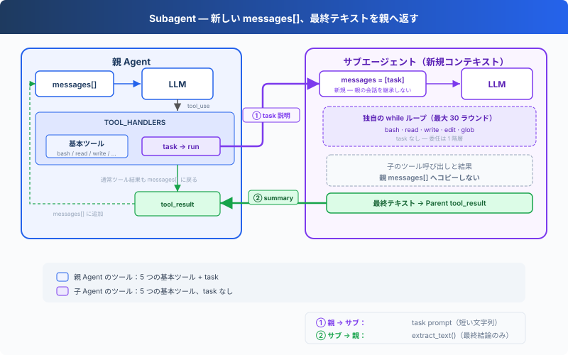

# s06: Subagent — 大きなタスクを分割、それぞれがクリーンなコンテキストを取得

[English](README.md) · [中文](README.zh.md) · [日本語](README.ja.md)

s01 → s02 → s03 → s04 → s05 → `s06` → [s07](../s07_skill_loading/) → s08 → ... → s20 → s21

> *"大きなタスクは小さく、小さなタスクごとにクリーンなコンテキスト"* — Subagent は独立した messages[] を使い、メイン会話を汚染しない。
>
> **Harness レイヤー**: サブエージェント — コンテキストの隔離、注意の散漫を防ぐ。

---

## 課題

Agent がバグを修正している。呼び出しチェーンを追跡するために 30 のファイルを読み、途中で 60 ラウンドやり取りした。messages リストは 120 件に膨らみ、その大部分は「呼び出しチェーンの追跡」という中間過程 — 「バグ修正」という最終目標とは無関係。

この中間過程がコンテキストの席を占め、Agent はますます「健忘」になる — 最初の問題が何だったか覚えていられない。

別の見方をすると：バグを修正するとき、あなたは「新しいターミナルを開いて」呼び出しチェーンを追跡するだろう。追跡が終わったらターミナルを閉じ、結果をメモに書き、元のターミナルに戻ってバグ修正を続ける。Agent にもこの能力が必要 — **独立したサブプロセスを開き、独立したメッセージリストを与え、一つのことに集中させる。**

---

## ソリューション



前章の最小フック構造と `todo_write` ツールを保持し、本章は新規の `task` ツールに注目する。呼び出されると、サブエージェントを spawn する。新しい `messages[]` を持ち、自分自身のループを実行し、終了後に要約テキストのみをメイン Agent に返す。会話コンテキストは破棄されるが、ファイルシステムの副作用（書き込み、編集、コマンド実行）は作業ディレクトリに残る。

サブエージェントのツールは制限される：bash/read/write/edit/glob を持つが、task はない。再帰 spawn を防止する。サブエージェントのツール呼び出しも権限フックを経由する。コンテキスト分離は権限のバイパスではない。

---

## 仕組み

**spawn_subagent**、サブエージェントに新しいメッセージリストを与え、自分自身のループを実行し、結論のみを返す：

```python
def spawn_subagent(description: str) -> str:
    # サブエージェントのツール：基本ツールのみ、task なし（再帰禁止）
    sub_tools = [...]
    messages = [{"role": "user", "content": description}]  # 新規 messages[]

    for _ in range(30):  # safety limit
        response = client.messages.create(
            model=MODEL, system=SUB_SYSTEM,
            messages=messages, tools=sub_tools, max_tokens=8000,
        )
        messages.append({"role": "assistant", "content": response.content})
        if response.stop_reason != "tool_use":
            break
        results = []
        for block in response.content:
            if block.type == "tool_use":
                blocked = trigger_hooks("PreToolUse", block)
                if blocked:
                    results.append({... "content": str(blocked)})
                    continue
                handler = SUB_HANDLERS.get(block.name)
                output = handler(**block.input) if handler else f"Unknown"
                trigger_hooks("PostToolUse", block, output)
                results.append({... "content": output})
        messages.append({"role": "user", "content": results})

    # 最後のテキスト結論のみを返す、中間過程はすべて破棄
    return extract_text(messages[-1]["content"])
```

メイン Agent の呼び出しは、他のツールと同じ：

```python
TOOLS = [
    {"name": "bash", ...},
    {"name": "read_file", ...},
    {"name": "write_file", ...},
    {"name": "edit_file", ...},
    {"name": "glob", ...},
    {"name": "todo_write", ...},
    # s06: 新規 task ツール
    {"name": "task",
     "description": "Launch a subagent to handle a complex subtask. Returns only the final conclusion.",
     "input_schema": {"type": "object", "properties": {"description": {"type": "string"}}, "required": ["description"]}},
]

TOOL_HANDLERS["task"] = spawn_subagent
```

三つの重要な設計決定：

| 決定 | 選択 | 理由 |
|------|------|------|
| コンテキスト隔離 | 新規 `messages[]` | サブエージェントの中間過程がメイン Agent のコンテキストを汚染しない |
| 結論のみ返却 | `extract_text(last_message)` | messages リスト全体を返すのではない |
| 再帰禁止 | サブエージェントに task ツールなし | サブエージェントがさらにサブエージェントを spawn するのを防止 |
| セキュリティのバイパスなし | サブエージェントのツール呼び出しも PreToolUse フックを経由 | コンテキスト分離は権限分離ではない |

ディスパッチ機構は変わらず、task ツールは `TOOL_HANDLERS[block.name]` を経由する。サブエージェントは独立した `SUB_SYSTEM` プロンプトを持ち、「タスクを完了し、さらに委託しない」と明示される。

---

## s05 からの変更

| コンポーネント | 変更前 (s05) | 変更後 (s06) |
|--------------|-------------|-------------|
| ツール数 | 6 (bash, read, write, edit, glob, todo_write) | 7 (+task) |
| 新規関数 | — | spawn_subagent（独立 messages[] + 30 ラウンド安全制限） |
| コンテキスト隔離 | すべてメイン会話内 | サブエージェントが新規 messages[] を使用 |
| ループ | 不変 | ディスパッチは不変、サブエージェントに独立した SUB_SYSTEM とフック保護されたループ |

---

## 試してみよう

```sh
cd learn-claude-code
python s06_subagent/code.py
```

以下のプロンプトを試してみよう：

1. `Use a subtask to find what testing framework this project uses`（サブエージェントがファイルを読み、メイン Agent は結論のみ受け取る）
2. `Delegate: read all .py files in agents/ and summarize what each one does`
3. `Use a task to create s06_subagent/example/string_tools.py with a slugify(text: str) function, then verify it from the parent agent`

観察のポイント：`[Subagent spawned]` / `[Subagent done]` が表示されるか？ サブエージェントのツール呼び出しが `[sub] ...` として出力されるか？ 親 Agent はサブエージェントが返した要約だけを受け取って続行するか？

---

## 次へ

Agent はタスクを分割できるようになった。しかし各タスクに必要な知識は異なる。フロントエンドコンポーネントの変更には React 規約が必要で、SQL を書くにはテーブル構造を知る必要がある。これらの知識をすべて system prompt に詰め込むと、コンテキストが溢れてしまう。

→ s07 Skill Loading：スキルをオンデマンドで注入する。system prompt にドキュメントを積み上げるのではなく、必要なときだけ読み込む。ファイルを読むのと同じくらい自然に。


<!-- translation-sync: zh@v1, en@v1, ja@v1 -->
