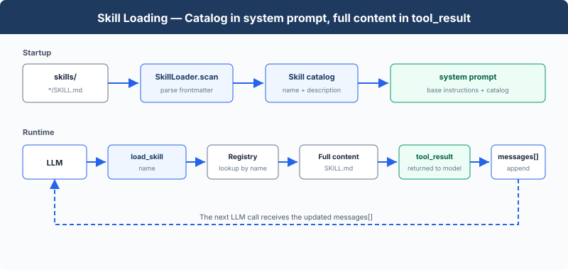

# s07: Skill Loading — Load Only When Needed

[English](README.md) · [中文](README.zh.md) · [日本語](README.ja.md)

s01 → s02 → s03 → s04 → s05 → s06 → `s07` → [s08](../s08_context_compact/) → s09 → ... → s18 → s19
> *"Load when needed, don't stuff the prompt"* — Inject via tool_result, not system prompt.
>
> **Harness Layer**: Knowledge — load on demand, don't fill the context.

---

## The Problem

Your project has a React component spec, a SQL style guide, and an API design doc. You want the Agent to follow these specs automatically. The most straightforward idea — stuff them all into the system prompt:

```python
SYSTEM = (
    f"You are a coding agent. "
    + open("docs/react-style.md").read()       # 2000 lines
    + open("docs/sql-style.md").read()         # 1500 lines
    + open("docs/api-design.md").read()        # 3000 lines
)
```

6500 lines of system prompt. The Agent carries these docs on every LLM call — whether it's changing a CSS color or fixing a SQL query. 99% of the content is irrelevant to the current task, burning tokens for nothing.

---

## The Solution



The minimal hook structure, `todo_write`, and sub-Agent from the previous chapter are preserved. This chapter focuses on the new `load_skill` tool. At startup, inject the skill catalog into the SYSTEM prompt; at runtime, register one more tool to load full content, spending tokens only when used.

Two-level design:

| Level | Location | Timing | Cost |
|-------|----------|--------|------|
| 1. Catalog | system prompt | Injected at startup (harness scans skills/) | ~100 tokens/skill, carried every turn |
| 2. Content | tool_result | When Agent calls load_skill; SKILL.md can guide later read_file/bash access to extra resources | ~2000 tokens/skill, on demand |

The dispatch mechanism is unchanged, `load_skill` auto-dispatches via `TOOL_HANDLERS[block.name]`.

---

## How It Works

**skills/ directory**, one subdirectory per skill, each containing a `SKILL.md` file:

```
skills/
  agent-builder/SKILL.md
  code-review/SKILL.md
  mcp-builder/SKILL.md
  pdf/SKILL.md
```

**Level 1: Inject catalog at startup**: the harness calls `_scan_skills()` at startup to scan the skills/ directory, parsing each SKILL.md's YAML frontmatter (`name`, `description`) into a `SKILL_REGISTRY` dictionary. `list_skills()` generates the catalog from the registry, injected into the SYSTEM prompt. The Agent sees "which skills I have available" every turn, with no extra API calls:

```python
SKILL_REGISTRY: dict[str, dict] = {}

def _scan_skills():
    if not SKILLS_DIR.exists():
        return
    for d in sorted(SKILLS_DIR.iterdir()):
        if not d.is_dir():
            continue
        manifest = d / "SKILL.md"
        if manifest.exists():
            raw = manifest.read_text()
            meta, body = _parse_frontmatter(raw)
            name = meta.get("name", d.name)
            desc = meta.get("description", raw.split("\n")[0].lstrip("#").strip())
            SKILL_REGISTRY[name] = {"name": name, "description": desc, "content": raw}

_scan_skills()  # runs once at startup

def list_skills() -> str:
    return "\n".join(f"- **{s['name']}**: {s['description']}" for s in SKILL_REGISTRY.values())

def build_system() -> str:
    catalog = list_skills()
    return (
        f"You are a coding agent at {WORKDIR}. "
        f"Skills available:\n{catalog}\n"
        "Use load_skill to get full details when needed."
    )

SYSTEM = build_system()
```

**Level 2: load_skill**: the Agent decides "I need the SQL style guide" and calls `load_skill("sql-style")`. Lookup goes through the registry, not file paths, eliminating path traversal risk. The SKILL.md content is injected via `tool_result`, and can include later access to referenced `references/`, `scripts/`, or `assets/` through the existing file and bash tools.

```python
def load_skill(name: str) -> str:
    skill = SKILL_REGISTRY.get(name)
    if not skill:
        return f"Skill not found: {name}"
    return skill["content"]
```

The key distinction: skill content is not part of the system prompt. It enters the current messages as a tool result. Subsequent calls carry it along with the history until context compaction, truncation, or session end. This naturally connects to s08's compact: on-demand loading solves "don't carry what you shouldn't", compact solves "how to drop what you should."

---

## Changes from s06

| Component | Before (s06) | After (s07) |
|-----------|-------------|-------------|
| Tool count | 7 (bash, read, write, edit, glob, todo_write, task) | 8 (+load_skill) |
| Knowledge loading | None | Two-level: startup catalog in SYSTEM + runtime load_skill; SKILL.md may guide later resource access |
| SYSTEM prompt | Static string | Startup scan of skills/ injects catalog |
| Skill registry | None | SKILL_REGISTRY (populated at startup, prevents path traversal) |
| Loop | Unchanged | Unchanged (skill tool auto-dispatches) |

---

## Try It

```sh
cd learn-claude-code
python s07_skill_loading/code.py
```

Try these prompts:

1. `What skills are available?`
2. `Load the code-review skill and follow its instructions`
3. `I need to do a code review -- load the relevant skill first`

What to watch for: Does the Agent know available skills from the SYSTEM catalog? Does `[HOOK] load_skill` appear when full instructions are needed? Does the answer use the loaded skill's instructions?

---

## What's Next

On-demand loading solved "don't carry what you shouldn't." But another problem looms: after the Agent works for 30 minutes, the messages list fills up with intermediate process. Old tool_results, stale file contents, occupying context but adding no value.

→ s08 Context Compact: A four-layer compaction strategy. Cheap layers run first, expensive layers run last.


<!-- translation-sync: zh@v2, en@v2, ja@v2 -->
