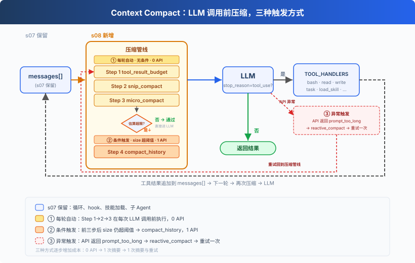
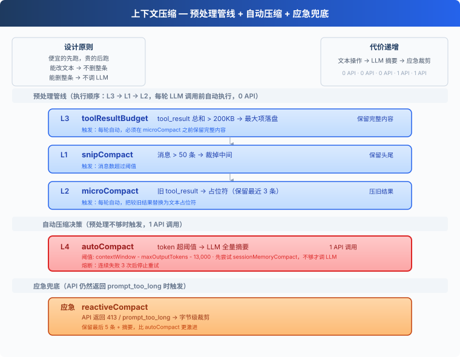
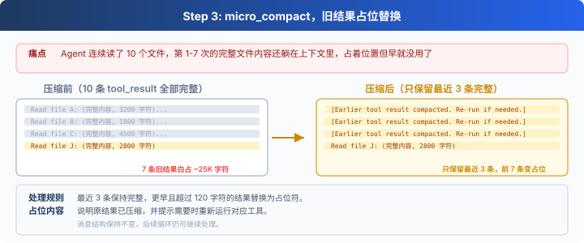
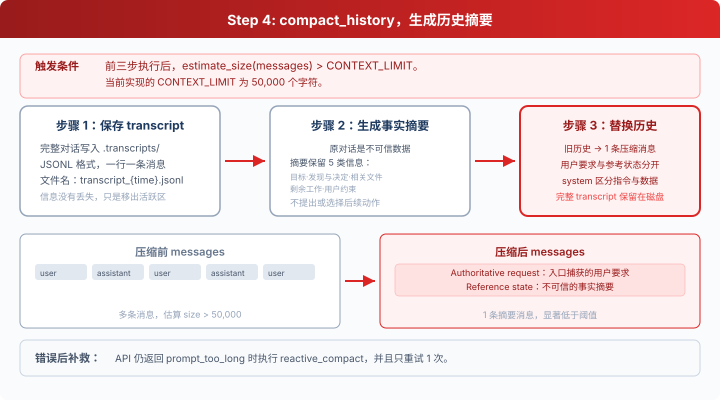

# s08: Context Compact — 上下文总会满，要有办法腾地方

[English](README.md) · [中文](README.zh.md) · [日本語](README.ja.md)

s01 → s02 → s03 → s04 → s05 → s06 → s07 → `s08` → [s09](../s09_memory/) → s10 → ... → s20 → s21
> *"上下文总会满, 要有办法腾地方"* — 四层压缩策略, 便宜的先跑贵的后跑。
>
> **Harness 层**: 压缩 — 干净的记忆, 无限的会话。

---

## 问题

Agent 跑着跑着，不动了。

手里有 bash、有 read、有 write，能力是够的。但它读了一个 1000 行的文件（~4000 token），又读了 30 个文件，跑了 20 条命令。每条命令的输出、每个文件的内容，全都堆在 `messages` 列表里。

上下文窗口是有限的。满了之后，API 直接拒绝：`prompt_too_long`。

不压缩，Agent 根本没法在大项目里干活。

---

## 解决方案



保留 s07 的 hook 结构、技能加载、子 Agent 等骨架，省略部分工具细节以聚焦压缩。核心变动：每轮 LLM 调用前插入三层预处理器（0 API），token 仍超阈值时触发 LLM 摘要（1 API），API 报错时应急裁剪。

核心设计：便宜的先跑，贵的后跑。

> **与 s09 的边界：** s08 管理当前会话有限的上下文，压缩时允许丢失细节；s09 另建持久存储，只保留需要跨压缩、跨会话存在的信息。两章解决的是不同故障，因此不合并。

---

## 工作原理



### L1: snip_compact — 裁掉无关的旧对话

Agent 跑了 80 轮对话，`messages` 攒了 160 条。最前面的"帮我创建 hello.py"和当前工作几乎无关了，但全占着位置。

消息数超过 50 条 → 保留头部 3 条（初始上下文）和尾部 47 条（当前工作），中间裁掉；唯一额外边界条件是，不能把 `assistant(tool_use)` 和后面的 `user(tool_result)` 拆开：

```python
def snip_compact(messages, max_messages=50):
    if len(messages) <= max_messages:
        return messages
    head_end, tail_start = 3, len(messages) - (max_messages - 3)
    if head_end > 0 and _message_has_tool_use(messages[head_end - 1]):
        while head_end < len(messages) and _is_tool_result_message(messages[head_end]):
            head_end += 1
    if (tail_start > 0 and tail_start < len(messages)
            and _is_tool_result_message(messages[tail_start])
            and _message_has_tool_use(messages[tail_start - 1])):
        tail_start -= 1
    snipped = tail_start - head_end
    placeholder = {"role": "user", "content": f"[snipped {snipped} messages from conversation middle]"}
    return messages[:head_end] + [placeholder] + messages[tail_start:]
```

裁掉的是消息本身，只是在切口处多做一步保护；剩下的消息里 `tool_result` 内容仍在累积。第 34 条消息里可能躺着 30KB 的旧文件内容。→ L2。

### L2: micro_compact — 旧工具结果占位



Agent 连续读了 10 个文件。第 1-7 次的完整内容还躺在上下文里，早就不需要了，但占着大量空间。

只保留最近 3 条 `tool_result` 的完整内容，更旧的替换为一行占位符：

```python
KEEP_RECENT_TOOL_RESULTS = 3

def micro_compact(messages):
    tool_results = collect_tool_result_blocks(messages)
    if len(tool_results) <= KEEP_RECENT_TOOL_RESULTS:
        return messages
    for _, _, block in tool_results[:-KEEP_RECENT_TOOL_RESULTS]:
        if len(block.get("content", "")) > 120:
            block["content"] = "[Earlier tool result compacted. Re-run if needed.]"
    return messages
```

旧结果清掉了，但单条新结果可能就有 500KB。一次 `cat` 大文件的输出就能打满上下文。→ L3。

### L3: tool_result_budget — 大结果落盘


模型一次读了 5 个大文件，单条 user 消息里所有 `tool_result` 加起来 500KB。

统计最后一条 user 消息里所有 `tool_result` 的总大小。超过 200KB → 按大小排序，从最大的开始落盘到 `.task_outputs/tool-results/`，上下文里只留 `<persisted-output>` 标记 + 前 2000 字符预览。模型看到标记后知道完整内容在磁盘上，需要时可以重新读。

```python
def tool_result_budget(messages, max_bytes=200_000):
    last = messages[-1]
    blocks = [(i, b) for i, b in enumerate(last["content"])
              if b.get("type") == "tool_result"]
    total = sum(len(str(b.get("content", ""))) for _, b in blocks)
    if total <= max_bytes:
        return messages
    ranked = sorted(blocks, key=lambda p: len(str(p[1].get("content", ""))), reverse=True)
    for idx, block in ranked:
        if total <= max_bytes:
            break
        block["content"] = persist_large_output(block["tool_use_id"], str(block["content"]))
        total = recalculate_total(blocks)
    return messages
```

前三层都是纯文本/结构操作，0 API 调用，但也无法"理解"对话内容。上下文可能仍然太大。→ L4。

### L4: compact_history — LLM 全量摘要



前三层全跑完了，但在超大项目中连续工作 30 分钟后，token 仍然超过阈值。

三步流程：

1. **保存 transcript**：完整对话写入 `.transcripts/`，JSONL 格式。transcript 保留完整记录；消息列表只保留摘要，原始细节不再进入后续模型调用。
2. **LLM 生成摘要**：把对话历史发给 LLM，要求保留当前目标、重要发现、已改文件、剩余工作、用户约束等关键信息。
3. **替换消息列表**：所有旧消息被替换为一条摘要。

```python
def compact_history(messages):
    transcript_path = write_transcript(messages)  # 先保存完整对话
    summary = summarize_history(messages)          # LLM 生成摘要
    return [{"role": "user",
             "content": f"[Compacted]\n\n{summary}"}]
```

**熔断器**：连续失败 3 次后停止重试，防止死循环浪费 API 调用。

### 应急: reactive_compact

有时候 API 还是返回 `prompt_too_long`（413），上下文增长速度快于压缩触发速度时。

这时触发 **reactive_compact**：触发方式比 compact_history 更激进（API 报错后的应急手段），但压缩策略更温和，保留最近约 5 条原始消息，只总结较早历史。同样避免留下孤立 `tool_result`。

```python
def reactive_compact(messages):
    transcript = write_transcript(messages)
    tail_start = max(0, len(messages) - 5)
    if (tail_start > 0 and tail_start < len(messages)
            and _is_tool_result_message(messages[tail_start])
            and _message_has_tool_use(messages[tail_start - 1])):
        tail_start -= 1
    summary = summarize_history(messages[:tail_start])
    return [{"role": "user",
             "content": f"[Reactive compact]\n\n{summary}"}, *messages[tail_start:]]
```

reactive compact 有重试上限（默认 1 次）。再失败就抛出异常，不无限循环。完整的错误恢复逻辑留给 s11。

### 合起来跑

```python
def agent_loop(messages):
    reactive_retries = 0
    while True:
        # 三个预处理器（0 API 调用）
        # 顺序：budget 先跑，确保大内容落盘后再做占位和裁剪
        messages[:] = tool_result_budget(messages)    # L3: 大结果落盘
        messages[:] = snip_compact(messages)          # L1: 裁中间
        messages[:] = micro_compact(messages)         # L2: 旧结果占位

        # 还不够？LLM 摘要（1 API 调用）
        if estimate_token_count(messages) > THRESHOLD:
            messages[:] = compact_history(messages)

        try:
            response = client.messages.create(...)
        except PromptTooLongError:
            if reactive_retries < MAX_REACTIVE_RETRIES:
                messages[:] = reactive_compact(messages)  # 应急
                reactive_retries += 1
                continue
            raise  # 超过重试上限，抛出异常
        # ... 工具执行 ...

        # compact 工具：模型主动调用时触发 compact_history
        if block.name == "compact":
            messages[:] = compact_history(messages)
            results.append({..., "content": "[Compacted. History summarized.]"})
            messages.append({"role": "user", "content": results})
            break  # 结束当前 turn，用压缩后的上下文开始新一轮
```

**顺序不能换。** L3（budget）在 L2（micro）前面，因为 micro 会把旧的大 `tool_result` 替换成一行占位符，budget 必须在那之前保存完整内容。

---

## 相对 s07 的变更

| 组件 | 之前 (s07) | 之后 (s08) |
|------|-----------|-----------|
| 上下文管理 | 无（上下文无限膨胀） | 四层压缩管线 + 应急 |
| 新函数 | — | snip_compact, micro_compact, tool_result_budget, compact_history, reactive_compact |
| 工具 | bash, read, write, edit, glob, todo_write, task, load_skill (8) | 8 + compact (9) |
| 循环 | LLM 调用 → 工具执行 | 每轮前跑三层预处理器 + 阈值触发 compact_history |
| 设计原则 | — | 便宜的先跑，贵的后跑 |

---

## 试一下

```sh
cd learn-claude-code
python s08_context_compact/code.py
```

试试这些 prompt：

1. `Read the file README.md, then read code.py, then read s01_agent_loop/README.md`（连续读多个文件，观察 L2 压缩旧结果）
2. `Read every file in s08_context_compact/`（一次性读大量内容，观察 L3 落盘）
3. 反复对话 20+ 轮，观察是否出现 `[auto compact]` 或 `[reactive compact]`

观察重点：每次工具执行后，旧 tool_result 是否被压缩？连续对话后 token 超阈值时，是否自动触发了摘要？

---

## 接下来

上下文压缩让 Agent 能跑很久不会崩。但每次压缩后，用户之前告诉它的偏好、约束也跟着丢了。能不能让 Agent 有选择地记住重要的事？

s09 Memory → 三个子系统：选择记什么、提取关键信息、整理巩固。跨压缩、跨会话。


<!-- translation-sync: zh@v2, en@v2, ja@v2 -->
