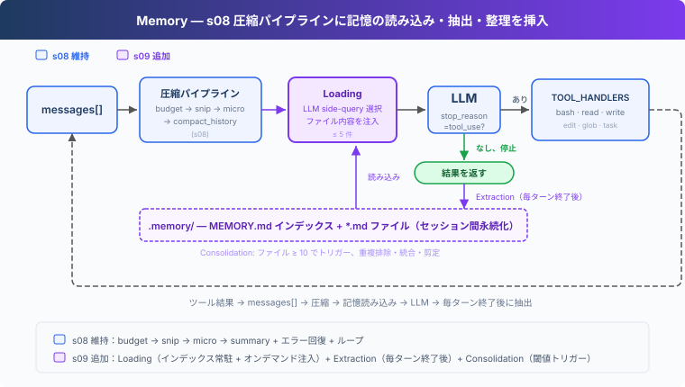
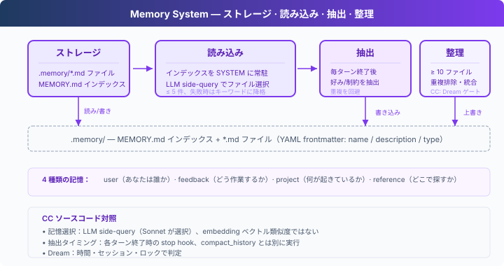

# s09: Memory — 圧縮は詳細を失う、失わない層が必要

[English](README.md) · [中文](README.zh.md) · [日本語](README.ja.md)

s01 → ... → s07 → s08 → `s09` → [s10](../s10_system_prompt/) → s11 → ... → s20 → s21
> *"圧縮は詳細を失う、失わない層が必要"* — ファイルストア + インデックス + オンデマンド読み込み。圧縮を越え、セッションを越えて。
>
> **Harness レイヤー**: 記憶 — 圧縮とセッションを越える知識の蓄積。

---

## 課題

s08 の autoCompact は現在の目標、残りの作業、ユーザーの制約をサマリに保持するが、詳細は失われる：「タブでインデント、スペース不可」が「ユーザーにコードスタイルの好みあり」と簡略化される。そして新しいセッションを開始すると、サマリすらない。

LLM には永続状態がなく、すべての情報はコンテキストウィンドウ内にある。コンテキストが満杯になれば圧縮され、圧縮は非可逆。圧縮に参加せず、セッションを越えて保持されるストレージ層が必要。

---

## ソリューション



s08 の圧縮パイプラインを維持し、記憶に焦点を当てる。ストレージにはファイルシステムを採用：`.memory/` ディレクトリに各記憶を `.md` ファイルとして保存、YAML frontmatter（`name` / `description` / `type`）付き。ファイルが増えたらインデックスが必要：`MEMORY.md` に 1 行 1 リンクを記録し、SYSTEM に注入。

重要な設計：インデックスは SYSTEM prompt に常駐（prompt cache でキャッシュ可能）、ファイル内容はオンデマンド注入（filename/description で現在の会話にマッチ、cache を破壊しない）。書き込みは 2 つのパス：ユーザーが明示的に「覚えて」と言うか、毎ターン終了後にバックグラウンドで抽出。ファイルが蓄積されたら、定期的に整理して重複排除。

> **s08 との境界：** 圧縮は引き続き現在の会話と token 予算を担当する。記憶は圧縮を置き換えず、選んだ事実を会話の外に保存し、後から必要に応じて呼び戻す。

4 種類の記憶、それぞれ異なる質問に答える：

| タイプ | 何に答えるか | 例 |
|--------|-------------|-----|
| user | あなたは誰か | "タブでスペース不可" |
| feedback | どう作業するか | "DB をモックしない" |
| project | 何が起きているか | "auth 書き直しはコンプライアンス主導" |
| reference | どこで探すか | "パイプラインのバグは Linear INGEST" |

---

## 仕組み



### ストレージ：Markdown ファイル + インデックス

各記憶は `.md` ファイル、YAML frontmatter でメタデータを記録：

```markdown
---
name: user-preference-tabs
description: User prefers tabs for indentation
type: user
---

User prefers using tabs, not spaces, for indentation.
**Why:** Consistency with existing codebase conventions.
**How to apply:** Always use tabs when writing or editing files.
```

`MEMORY.md` はインデックス、1 行に 1 リンク：

```markdown
- [user-preference-tabs](user-preference-tabs.md) — User prefers tabs for indentation
```

新しい記憶を書き込むとインデックスを自動再構築：

```python
def write_memory_file(name, mem_type, description, body):
    slug = name.lower().replace(" ", "-")
    filepath = MEMORY_DIR / f"{slug}.md"
    filepath.write_text(
        f"---\nname: {name}\ndescription: {description}\ntype: {mem_type}\n---\n\n{body}\n"
    )
    _rebuild_index()
```

### 読み込み：2 つのパス

**パス 1：インデックスを SYSTEM に常駐。** `build_system()` は各ユーザーリクエストの開始時に 1 回だけ `MEMORY.md` を読み込み、記憶カタログを SYSTEM prompt に注入。記憶の抽出と整理はターン終了時にだけ実行されるため、同じユーザーリクエスト内で SYSTEM を繰り返し再構築する必要はない。

**パス 2：関連記憶をオンデマンド注入。** 各ユーザーリクエストの開始時に、`load_memories()` は最近の会話と記憶カタログ（name + description）を LLM に軽量 side-query として送信し、関連するファイル名を選択、ファイル内容を読み込んで注入。上限 5 件でコストを制御。

```python
def select_relevant_memories(messages, max_items=5):
    files = list_memory_files()
    if not files:
        return []

    # Build catalog: "0: user-preference-tabs — User prefers tabs..."
    catalog = "\n".join(f"{i}: {f['name']} — {f['description']}" for i, f in enumerate(files))

    response = client.messages.create(model=MODEL, messages=[{"role": "user",
        "content": f"Select relevant memory indices. Return JSON array.\n\n"
                   f"Recent conversation:\n{recent}\n\nMemory catalog:\n{catalog}"}],
        max_tokens=200)
    indices = json.loads(re.search(r'\[.*?\]', response.content[0].text).group())
    return [files[i]["filename"] for i in indices if 0 <= i < len(files)]
```

side-query が失敗した場合（API エラー、JSON パース失敗）、name + description のキーワードマッチにフォールバック。

### 書き込み：毎ターン終了後の抽出

ユーザーが毎回「これを覚えて」と言うわけではない。好みは通常、通常の会話の中に散らばっている：「タブの方がスペースより良い」「これからはシングルクォートにしよう」。

`extract_memories()` は各ターン終了時に実行、モデルが tool_use なしで停止した場合にトリガー（会話が自然な区切りに達したことを示す）：

```python
# In agent_loop:
if response.stop_reason != "tool_use":
    extract_memories(messages)   # 最近の会話から新しい記憶を抽出
    consolidate_memories()       # 整理が必要かチェック
    return
```

抽出前に既存の記憶を確認し、重複を回避。抽出プロンプトは LLM に `{name, type, description, body}` の JSON 配列を要求、本当に新しい情報がある場合のみファイルに書き込む。

```python
def extract_memories(messages):
    dialogue = format_recent_messages(messages[-10:])
    existing = "\n".join(f"- {m['name']}: {m['description']}" for m in list_memory_files())

    prompt = (
        "Extract user preferences, constraints, or project facts.\n"
        "Return JSON array: [{name, type, description, body}].\n"
        "If nothing new or already covered, return [].\n\n"
        f"Existing memories:\n{existing}\n\nDialogue:\n{dialogue[:4000]}"
    )
    # ... parse response, write files ...
```

### 整理：低頻度の重複排除

記憶ファイルは蓄積される。`consolidate_memories()` はファイル数が閾値（デフォルト 10）に達した時にトリガー、LLM に重複排除、矛盾の統合、古い記憶の剪定を依頼：

```python
CONSOLIDATE_THRESHOLD = 10

def consolidate_memories():
    files = list_memory_files()
    if len(files) < CONSOLIDATE_THRESHOLD:
        return  # 少なすぎる、整理する価値なし
    # Send all memories to LLM, get back deduplicated list
    # Replace all files with consolidated results
```

### Memory に保存するもの

Memory はセッションを越えて有用な情報を保存する：ユーザーの好み、繰り返し出るフィードバック、プロジェクト背景、よく使う入口、調査の手がかりなど。「あとでまた使うもの」を対象にし、インデックス + オンデマンド読み込みで現在の会話に戻す。

session memory は 1 つのセッション内の連続性を扱う：compact 後も現在の会話に残すべき文脈を保持する。両者は役割が分かれている。Memory は長期知識を扱い、session memory は現在のセッションを compact 越しにつなぐ。

---

## s08 からの変更点

| コンポーネント | 変更前 (s08) | 変更後 (s09) |
|-----------|-------------|-------------|
| 記憶能力 | なし（圧縮後、好みはサマリと共に劣化） | ストレージ + 読み込み + 抽出 + 整理 |
| 新規関数 | — | write_memory_file, select_relevant_memories, load_memories, extract_memories, consolidate_memories |
| ストレージ | — | .memory/MEMORY.md インデックス + .memory/*.md ファイル |
| ツール | bash, read, write, edit, glob, todo_write, task, load_skill, compact (9) | bash, read_file, write_file, edit_file, glob, task (6) |
| ループ | 毎ターン圧縮のみ | 記憶注入 + 圧縮 + ターン終了後の抽出 + 定期整理 |

---

## 試してみよう

```sh
cd learn-claude-code
python s09_memory/code.py
```

以下のプロンプトを試してみてください（複数ターンに分けて入力し、記憶の蓄積と読み込みを観察）：

1. `I prefer using tabs for indentation, not spaces. Remember that.`
2. `Create a Python file called test.py`（Agent がタブを使用したか観察）
3. `What did I tell you about my preferences?`（Agent が覚えているか観察）
4. `I also prefer single quotes over double quotes for strings.`

観察のポイント：各ターン終了後に `[Memory: extracted N new memories]` が表示されるか？`.memory/` ディレクトリに `.md` ファイルが生成されたか？`MEMORY.md` インデックスが更新されたか？新しい会話で Agent が以前の記憶を自動的に読み込んだか？

---

## 次へ

記憶、圧縮、ツールはすべて揃った。しかし system prompt はまだハードコードされた文字列。新しいツールを追加するには手動で説明を書き、プロジェクトを変えるにはプロンプト全体を書き直す。プロンプトは実行時に組み立てられるべき。

s10 System Prompt → セグメント + 実行時組み立て。異なるプロジェクト、異なるツール、異なるプロンプト。


<!-- translation-sync: zh@v1, en@v1, ja@v1 -->
