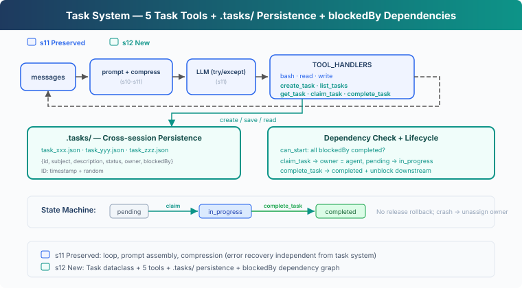

# s12: Task System — Break Big Goals into Small Tasks

[English](README.md) · [中文](README.zh.md) · [日本語](README.ja.md)

s01 → ... → s10 → s11 → `s12` → [s13](../s13_background_tasks/) → s14 → ... → s20 → s21

> *"Break big goals into small tasks, order them, persist"* — File-persisted task graph, the foundation for multi-agent collaboration.
>
> **Harness Layer**: Tasks — Persisted goals, recoverable progress.

---

## The Problem

The agent receives a project: set up a database, write APIs, add tests. It uses s05's TodoWrite to create a checklist, then starts writing the API first, gets halfway through and realizes there are no database tables, goes back to fix them; when adding tests, discovers the API interface signatures have changed again...

You can't build the roof before laying the foundation. Tasks have ordering. Task prerequisites can be represented as a Directed Acyclic Graph (DAG); this chapter records them with `blockedBy`.

s05's TodoWrite is an execution checklist for the current task, kept in session memory. What you need here is a **task system**: each task is a JSON file, tasks have `blockedBy` dependencies, and they persist across sessions on disk.

---

## The Solution



This chapter adds 5 task tools, persistence in the `.tasks/` directory, and `blockedBy` dependency checks.

TodoWrite vs Task System:

| | TodoWrite (s05) | Task System (s12) |
|---|---|---|
| Role | Execution checklist for the current task | Recoverable task system |
| Storage | In-process / session state | `.tasks/{id}.json` |
| Dependencies | None | `blockedBy` / `blocks` graph |
| Lifecycle | Current session / current task | Cross-session |
| Coordination | No task claiming | `owner` / claim |
| Status | pending / in_progress / completed | pending / in_progress / completed |
| Granularity | The agent's own steps | Tasks that can be claimed, tracked, and unblocked |
| Update contract | Replace the whole checklist | Create/get/update/list individual records |

---

## How It Works


### Task: Data Structure

Each task is a JSON file, stored in the `.tasks/` directory:

```python
@dataclass
class Task:
    id: str
    subject: str
    description: str
    status: str          # pending | in_progress | completed
    owner: str | None    # Agent name (multi-agent scenarios)
    blockedBy: list[str] # List of dependency task IDs
```

IDs are generated with `timestamp + random hex`.

### create_task: Create Tasks

```python
def create_task(subject: str, description: str = "",
                blockedBy: list[str] | None = None) -> Task:
    task = Task(
        id=f"task_{int(time.time())}_{random_hex(4)}",
        subject=subject, description=description,
        status="pending", owner=None,
        blockedBy=blockedBy or [],
    )
    save_task(task)
    return task
```

Automatically calls `save_task` on creation to write `.tasks/{id}.json`. `blockedBy` declares dependencies, for example "write API" has `blockedBy: ["task_schema"]`.

### can_start: Dependency Check

A task can only start after all its `blockedBy` dependencies are **completed**:

```python
def can_start(task_id: str) -> bool:
    task = load_task(task_id)
    for dep_id in task.blockedBy:
        if not _task_path(dep_id).exists():
            return False  # missing dependency = blocked
        dep = load_task(dep_id)
        if dep.status != "completed":
            return False
    return True
```

`can_start` is a prerequisite check for `claim_task`: if any `blockedBy` dependency is not completed, the task cannot be claimed. Missing dependencies are treated as blocked, avoiding crashes from referencing wrong IDs.

### claim_task: Claim a Task

When the agent starts working on a task, it calls `claim_task`: sets `owner`, changes status from `pending` → `in_progress`. The `owner` field records who is working on the task, preventing duplicate claims in multi-agent scenarios:

```python
def claim_task(task_id: str, owner: str = "agent") -> str:
    task = load_task(task_id)
    if task.status != "pending":
        return f"Task {task_id} is {task.status}, cannot claim"
    if not can_start(task_id):
        deps = [d for d in task.blockedBy
                if load_task(d).status != "completed"]
        return f"Blocked by: {deps}"
    task.owner = owner
    task.status = "in_progress"
    save_task(task)
    return f"Claimed {task_id} ({task.subject})"
```

If the task is already claimed by someone else (`status != "pending"`), or dependencies aren't met (`can_start` returns False), the claim is rejected.

### complete_task: Complete and Unblock

When a task is done, set it to `completed`. Simultaneously scan all other tasks to find downstream tasks that were **just unblocked**:

```python
def complete_task(task_id: str) -> str:
    task = load_task(task_id)
    task.status = "completed"
    save_task(task)
    # Find newly unblocked downstream tasks
    unblocked = [t.subject for t in list_tasks()
                 if t.status == "pending" and t.blockedBy
                 and can_start(t.id)]
    msg = f"Completed {task_id} ({task.subject})"
    if unblocked:
        msg += f"\nUnblocked: {', '.join(unblocked)}"
    return msg
```

After completing "schema", `can_start` returns True for "endpoints" and "docs"; they can begin.

### get_task: View Full Details

`list_tasks` only shows a one-line summary. `get_task` returns the full task JSON, including description and dependency details. When recovering across sessions, the agent needs to read the full description to continue work:

```python
def get_task(task_id: str) -> str:
    task = load_task(task_id)
    return json.dumps(asdict(task), indent=2)
```

### State Machine: Two Actions, Three States

```
pending ──claim──→ in_progress ──complete──→ completed
```

Here `claim` / `complete` are actions, while `pending` / `in_progress` / `completed` are states:

- **claim_task**: `pending` → `in_progress`. Sets owner, begins work.
- **complete_task**: `in_progress` → `completed`. Marks the task done and unblocks downstream.

### Putting It Together

```python
# Create tasks with dependencies
schema = create_task("setup database schema")
endpoints = create_task("create API endpoints", blockedBy=[schema.id])
tests = create_task("write tests", blockedBy=[endpoints.id])
docs = create_task("write docs", blockedBy=[schema.id])

# Agent claims the first available task
claim_task(schema.id)       # ✓ Claimed (no dependencies)
complete_task(schema.id)    # ✓ Completed → unblocks endpoints, docs

claim_task(endpoints.id)    # ✓ Claimed (schema completed)
complete_task(endpoints.id) # ✓ Completed → unblocks tests

claim_task(docs.id)         # ✓ Claimed (schema completed)
complete_task(docs.id)      # ✓ Completed

claim_task(tests.id)        # ✓ Claimed (endpoints completed)
complete_task(tests.id)     # ✓ Completed
```

Each `create_task` writes a JSON file, each `claim_task` / `complete_task` updates the file. Across sessions, the `.tasks/` directory persists — the agent reads the files to recover progress.

---

## Changes from s11

| Component | Before (s11) | After (s12) |
|-----------|-------------|-------------|
| Task management | None | Task dataclass + 5 tools |
| New types | — | Task (id, subject, description, status, owner, blockedBy) |
| Storage | No persistence | `.tasks/{id}.json` cross-session |
| Dependencies | None | `blockedBy` graph + `can_start` check |
| Tools | bash, read_file, write_file (3) | + create_task, list_tasks, get_task, claim_task, complete_task (8) |
| Lifecycle | — | pending → in_progress → completed (no release rollback) |

---

## Try It

```sh
cd learn-claude-code
python s12_task_system/code.py
```

Try these prompts:

1. `Create tasks: setup database schema, create API endpoints (depends on schema), write tests (depends on endpoints), write docs (depends on schema)`
2. `List all tasks and their statuses`
3. `Claim the first unblocked task and complete it`
4. `List tasks again — which ones are now unblocked?`

What to observe: Are JSON files generated in the `.tasks/` directory? After completing a task, are the blocked tasks unblocked?

---

## What's Next

The task graph is in place. But some tasks take a long time — like running full test suites or deploying to a server. The agent calls the LLM billed by token, it can't afford to wait on a slow operation.

s13 Background Tasks → Slow operations go to the background. The agent continues processing other tasks, and gets notified when the background work is done.


<!-- translation-sync: zh@v1, en@v1, ja@v1 -->
