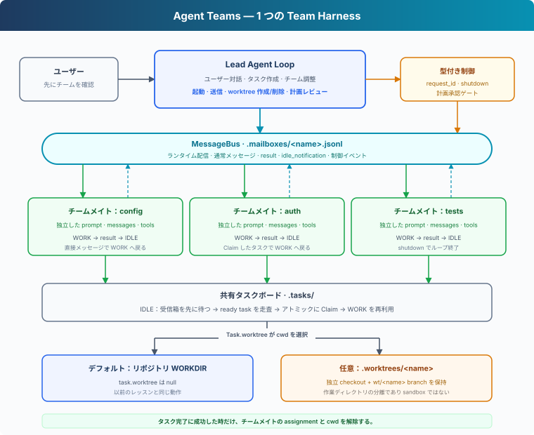
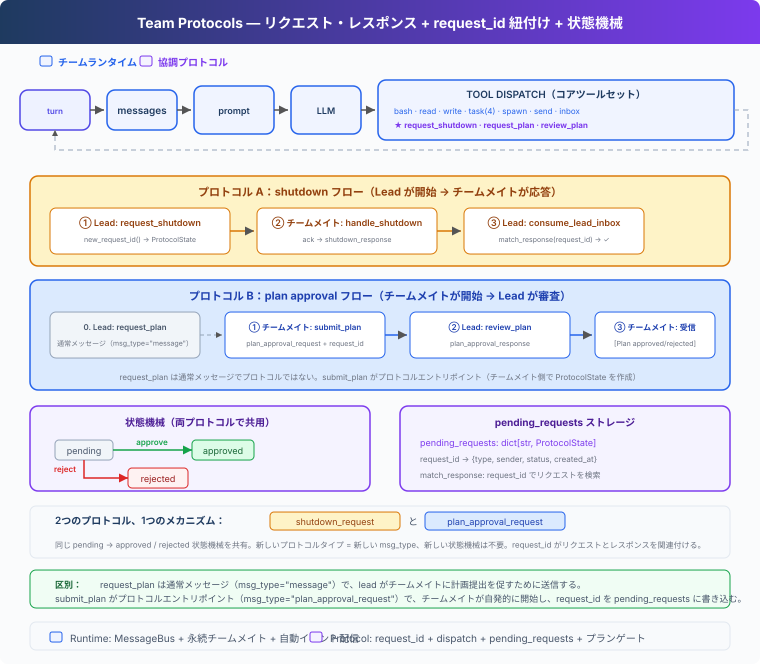

# s15: Agent Teams — チームランタイムと協調プロトコル

[English](README.md) · [中文](README.zh.md) · [日本語](README.ja.md)

s01 → ... → s13 → s14 → `s15` → [s16](../s16_autonomous_agents/) → s17 → s18 → s19 → s20 → s21

> *「1 つの Agent だけでは扱いきれないなら、チームメイトで分担する。」* — 永続チームメイト、メッセージ配信、協調プロトコル。
>
> **Harness レイヤー**：チーム — 複数 Agent を並行動作させながら制御を保つ。

---

## 問題

Agent にバックエンド全体のリファクタリングを頼む場合、設定読み込み、認証、テストを同時に扱うことになる。1 つの Agent が順番に処理することもできるが、時間がかかり、初期の詳細は徐々にコンテキストから抜けていく。

このような仕事は並列化に向いている。しかし、通常のユーザーはチーム構成ではなく目的だけを伝える：

```text
このサンプルバックエンドをリファクタリングしてください。
設定読み込み、認証ロジック、テストを整理し、
既存インターフェースを保ったままテストを通してください。
```

そのため Harness は、単に Agent を増やすだけでなく、次の 4 点を解決する必要がある：

1. 並列化が有効かを誰が判断し、追加 Agent の起動を誰が確認するか。
2. チームメイトが複数の依頼にまたがって、どう身元とコンテキストを保つか。
3. モデルに受信箱を繰り返し確認させず、結果をどう Lead へ戻すか。
4. 終了と計画承認を、どう追跡可能で強制可能なプロトコルにするか。

---

## 解決策



s15 は単一 Agent の Harness の外側に、Lead が管理するチームランタイムを追加する：

- **Lead** はユーザーとの会話を維持し、分担案を提示して確認を待つ。
- **チームメイト** は独立した Agent Loop をバックグラウンドスレッドで実行し、作業後は IDLE になる。
- **MessageBus** はファイル受信箱を通して、通常メッセージ、結果、制御イベントを運ぶ。
- **ランタイム配信** は Lead の受信箱を消費し、チームイベントを次のターンへ注入する。
- **協調プロトコル** は `type`、`request_id`、状態遷移で終了と計画承認を扱う。
- **計画ゲート** は、必要な計画が承認されるまで `bash` と `write_file` を遮断する。

モデルはタスクを理解して分担を決める。コードは配信、ライフサイクル、プロトコル制約を担う。

---

## 仕組み

### 1. Lead はチーム案を示し、確認を待つ

チームメイトの起動は、コスト、並行度、ワークスペースを書き換える主体を変える。この境界を通常のツール呼び出しの中に隠してはいけない。Lead の system prompt は次のように定める：

```python
"When parallel work would help, first propose a small team with clear "
"responsibilities and wait for the user's confirmation. Do not call "
"spawn_teammate before the user confirms."
```

最初の依頼に対して、Lead はまず分担案だけを返す：

```text
次の 3 方向で並行処理することを提案します。
- config：設定読み込みの整理
- auth：認証ロジックのリファクタリング
- tests：回帰テストの追加

確認後にチームメイトを起動します。
```

ユーザーが「始めてください」と返した後で、Lead は `spawn_teammate` を呼ぶ。ユーザーが目的を示し、Lead がチームを設計し、ユーザーが実行境界を確認する。

### 2. 各チームメイトは独立したループを持つ

s06 の Subagent は 1 回限りの呼び出しだが、チームメイトは永続する実行単位である：

| | s06 Subagent | s15 チームメイト |
|---|---|---|
| ライフサイクル | 1 回の呼び出し後に終了 | 終了要求まで `WORK → IDLE → WORK` |
| コンテキスト | 1 つのタスクだけ | 複数の依頼をまたいで保持 |
| 通信 | 1 回だけ結果を返す | メッセージを受け取り、イベントを送る |
| 協調 | 一方向の委任 | Lead との双方向協調 |

`spawn_teammate_thread()` はチームメイトごとに system prompt、messages、ツールを作り、daemon thread でループを実行する。Lead はチームメイトの終了を待たずに、別の依頼や結果を調整できる。

### 3. MessageBus は通信をモデルのコンテキスト外に置く

Lead とチームメイトが同じ messages 配列を共有すると、あるチームメイトのツール結果が別のチームメイトの推論へ混ざる。`MessageBus` は各 Agent に `.mailboxes/<name>.jsonl` 受信箱を与える：

```python
class MessageBus:
    def send(self, from_agent, to_agent, content,
             msg_type="message", metadata=None):
        msg = {
            "from": from_agent,
            "to": to_agent,
            "content": content,
            "type": msg_type,
            "metadata": metadata or {},
        }
        with self._changed:
            append_jsonl(self._path(to_agent), msg)
            self._changed.notify_all()

    def wait_for_messages(self, agent):
        with self._changed:
            while not self.peek(agent):
                self._changed.wait()
            return self._read_unlocked(agent)
```

ロックは複数スレッドによる受信箱ファイルの破損を防ぐ。`Condition` により、IDLE のチームメイトはポーリングせずイベント到着まで待機できる。

### 4. 受信イベントはランタイムが自動配信する

`read_inbox()` はメッセージを読み、受信箱ファイルを削除する。そのため Lead の消費入口は `consume_lead_inbox()` だけにする：

```python
def consume_lead_inbox():
    messages = BUS.read_inbox("lead")
    for message in messages:
        if message["type"].endswith("_response"):
            match_response(...)
    return messages
```

メインループのイベントスレッドは、新しいメッセージが届くと Lead を起こす：

```text
MessageBus → consume_lead_inbox
           → プロトコル状態を更新
           → [Team events] を history へ注入
           → Lead の次ターンを開始
```

`check_inbox` はモデルのツールではない。メッセージの到着はランタイムの責務であり、モデルはコンテキストへ配信済みのイベントだけを処理する。

### 5. 結果と IDLE は別のイベント

チームメイトが 1 件の作業を終えると、ランタイムは次の順序で 2 つのイベントを送る：

```text
result:            "認証をリファクタリングし、関連テストが通りました。"
idle_notification: "Waiting for more work."
```

`result` は「今回の作業で何が得られたか」、`idle_notification` は「新しい仕事を受けられるか」を表す。1 つの曖昧な「done」では両者を区別できない。

IDLE になったチームメイトは終了しない。通常メッセージで WORK に戻り、`shutdown_request` で終了ハンドシェイクを始める。

### 6. 制御メッセージには型と request_id を使う

通常の協調は自由文でよいが、終了と承認を意図の推測に任せてはいけない。制御イベントは構造化する：



```python
@dataclass
class ProtocolState:
    request_id: str
    type: str
    sender: str
    target: str
    status: str
    payload: str


pending_requests: dict[str, ProtocolState] = {}
```

終了プロトコルは次の経路を通る：

```text
Lead が pending の shutdown request を作る
  → shutdown_request(request_id) をチームメイトへ送る
  → チームメイトが現在の手順を終える
  → shutdown_response(request_id) を Lead へ返す
  → request_id で元の要求を特定する
  → pending が approved になり、チームメイトループが終了する
```

ID は要求と応答を対応付け、型は誤った応答による状態変更を防ぎ、状態は重複応答の再適用を防ぐ。

### 7. 計画承認は実行も制約する

計画プロトコルは逆方向に流れる：

```text
Lead → plan_request
チームメイト → plan_approval_request(request_id, plan)
Lead → plan_approval_response(request_id, approve, feedback)
```

「承認まで待つ」と伝えるだけでは確実なゲートにならない。そこでツール dispatch が計画状態を検査する：

```python
def _run_teammate_tool(name, block, handlers):
    gate = plan_gates.get(name, "not_required")
    if block.name in {"bash", "write_file"} and gate not in {
        "not_required", "approved"
    }:
        return f"Blocked: plan status is {gate}."
    return handlers[block.name](**block.input)
```

状態が `required`、`pending`、`rejected` の間、チームメイトはファイルを読み、計画を提出または修正できるが、Shell 実行やファイル書き込みはできない。承認応答で `approved` になった後にだけツールが解放される。

---

## 一連の実行例

```text
s15 >> このサンプルバックエンドをリファクタリングしてください。
       設定読み込み、認証、テストを整理し、
       既存インターフェースを保ってテストを通してください。

Lead: config、auth、tests の 3 方向で並行処理することを提案します。
      チームを開始しますか？

s15 >> 始めてください

[teammate] config spawned
[teammate] auth spawned
[teammate] tests spawned
[bus] auth → lead (result) ...
[bus] auth → lead (idle_notification) ...
[wake: 2 team events → new turn]
Lead: 認証の結果を受け取りました。残りの作業も調整します。
```

端末には、ユーザー要求、Lead の分担、起動、メッセージ、結果、IDLE、終了イベントが表示される。ユーザーが Lead を指名したり、受信箱の確認を頼んだりする必要はない。

---

## s14 からの変更

| コンポーネント | s14 | s15 |
|---|---|---|
| Agent | 1 つ | 1 つの Lead + 永続チームメイト |
| ユーザーフロー | 依頼を直接実行 | チーム案を提示してから起動を確認 |
| 通信 | なし | ファイル受信箱 + 自動イベント配信 |
| ライフサイクル | 1 つのループ | チームメイトの `WORK / IDLE / shutdown` |
| 結果通知 | 現在の Agent の出力 | `result` と `idle_notification` を分離 |
| 制御 | なし | 終了と計画承認プロトコル |
| 強制 | チーム制約なし | 必須計画が変更系ツールをゲート |

---

## 試してみる

```sh
cd learn-claude-code
python s15_agent_teams/code.py
```

まず通常の依頼を入力する：

```text
このサンプルバックエンドをリファクタリングしてください。
設定読み込み、認証ロジック、テストを整理し、
既存インターフェースを保ったままテストを通してください。
```

Lead がチーム案を示したら、次のように返す：

```text
始めてください
```

`spawned`、`result`、`idle_notification`、`plan_approval_*`、`shutdown_*` の各イベントと、`.mailboxes/` のファイルが生成・消費される流れを確認する。

---

## 次へ

s15 では、Lead が各チームメイトへ明示的に仕事を割り当てる。次のセッションでは共有タスクボードを IDLE のチームメイトに公開し、実行可能な仕事を自ら見つけて claim できるようにする。

次へ：[s16 Autonomous Agents](../s16_autonomous_agents/)。

<!-- translation-sync: zh@v2, en@v2, ja@v2 -->
