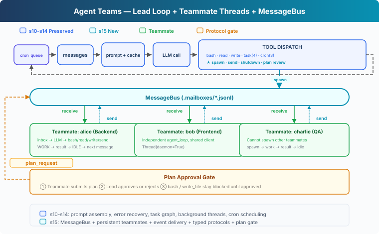
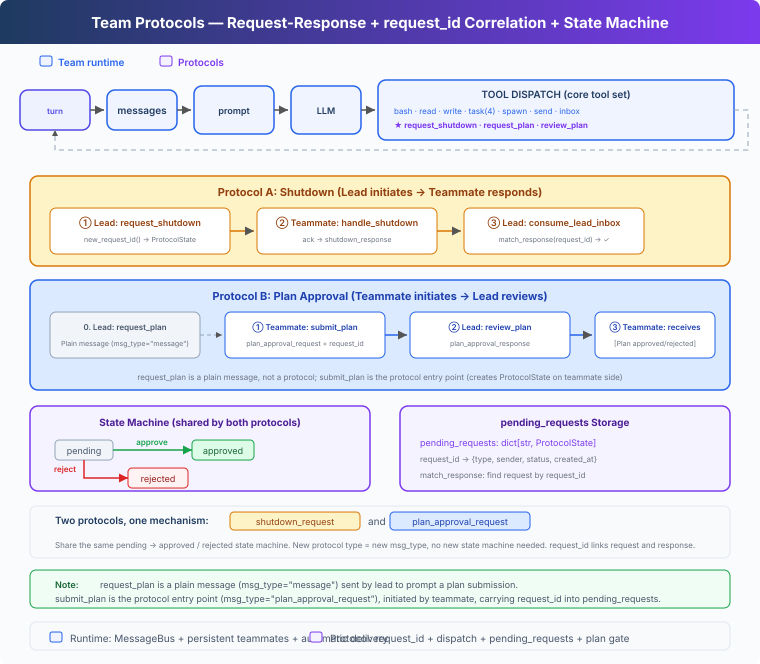

# s15: Agent Teams — Runtime and Coordination Protocols

[English](README.md) · [中文](README.zh.md) · [日本語](README.ja.md)

s01 → ... → s13 → s14 → `s15` → [s16](../s16_mcp_plugin/) → s17 → s18 → s19

> *"When one agent cannot hold the whole job, let teammates divide the work."* — Persistent teammates, shared task selection, optional worktrees, and coordination protocols.
>
> **Harness layer**: Team — how multiple agents divide work, share state, and stay under Lead's control.

---

## The Problem

Suppose we ask an agent to refactor an entire backend. The work may cover configuration loading, authentication, and tests. One agent can process those areas sequentially, but it takes longer and earlier details gradually leave its context.

This is a good candidate for parallel work, yet users normally describe the goal rather than design the team:

```text
Refactor this sample backend. Clean up configuration loading,
authentication, and tests, preserve the existing interfaces,
and make sure the tests pass.
```

The harness has to answer a connected set of questions:

1. Who decides that parallel work is useful, and who confirms the extra agents?
2. How does each teammate keep its identity and context across assignments?
3. How do results return to Lead without asking the model to poll an inbox?
4. Can an idle teammate pick up ready work without waiting for another assignment?
5. Which directory should a task use when parallel edits may conflict?
6. How do shutdown and plan approval become traceable, enforceable protocols?

---

## The Solution



s15 adds one Lead-managed team runtime around the single-agent harness:

- **Lead** owns the user conversation, proposes a division of work, and waits for confirmation.
- **Teammates** run independent agent loops and alternate between WORK and IDLE.
- **MessageBus** carries ordinary messages, results, and control events through file-backed mailboxes.
- **Runtime delivery** consumes Lead's mailbox and injects team events into the next turn.
- **The shared task board** lets idle teammates find ready work and claim it under a lock.
- **Optional worktrees** bind a task to another working directory when the work needs it. Unbound tasks use the normal repository directory.
- **Typed protocols and a plan gate** make shutdown and approval state explicit and block mutating tools until a required plan is approved.

These are all parts of the Team harness layer. Teammates do not need a separate loop for task discovery, and a worktree does not create a new kind of agent.

---

## How It Works

### 1. Lead proposes a team and waits for user confirmation

Starting teammates changes cost, concurrency, and the set of actors that may edit the workspace. Lead's system prompt keeps that boundary visible:

```python
"When parallel work would help, first propose a small team with clear "
"responsibilities and wait for the user's confirmation. Do not call "
"spawn_teammate before the user confirms."
```

For the first request, Lead only proposes a split:

```text
I suggest three parallel areas:
- config: clean up configuration loading
- auth: refactor authentication
- tests: add regression coverage

I will start the teammates after you confirm.
```

After the user says "Go ahead," Lead can call `spawn_teammate`. The user states the goal, Lead designs the team, and the user confirms the execution boundary.

### 2. Every teammate owns an independent loop

An s06 subagent is a one-shot call. A teammate is a persistent execution unit:

| | s06 Subagent | s15 Teammate |
|---|---|---|
| Lifecycle | Ends after one call | `WORK → IDLE → WORK` until shutdown |
| Context | Exists for one task | Persists across assignments |
| Communication | Returns one result | Receives messages and emits events |
| Coordination | One-way delegation | Two-way collaboration with Lead |

`spawn_teammate_thread()` gives each teammate its own system prompt, messages, tools, and current working-directory state, then runs its loop in a daemon thread. Lead can keep coordinating while teammates work. The names `lead` and `agent` are reserved for runtime identities, while `MessageBus` still accepts `lead` as the coordinator mailbox.

### 3. MessageBus keeps communication outside model context

Lead and teammates cannot share one messages array. Otherwise one teammate's tool results would leak into another teammate's reasoning. `MessageBus` gives each agent a `.mailboxes/<name>.jsonl` inbox:

```python
class MessageBus:
    def send(self, from_agent, to_agent, content,
             msg_type="message", metadata=None):
        msg = {
            "from": from_agent,
            "to": to_agent,
            "content": content,
            "type": msg_type,
            "metadata": metadata or {},
        }
        with self._changed:
            with open(self._path(to_agent), "a") as f:
                f.write(json.dumps(msg) + "\n")
            self._changed.notify_all()

    def wait_for_messages(self, agent, timeout=None):
        deadline = None if timeout is None else time.monotonic() + timeout
        with self._changed:
            while not self.peek(agent):
                remaining = (None if deadline is None
                             else deadline - time.monotonic())
                if remaining is not None and remaining <= 0:
                    return []
                self._changed.wait(remaining)
            return self._read_unlocked(agent)
```

A lock protects mailbox files from concurrent access. A `Condition` lets the runtime wake a teammate for a message and also supports the short timeout used while IDLE.

### 4. The runtime delivers inbox events

`read_inbox()` consumes messages by reading and deleting the mailbox file, so Lead keeps a single consumer, `consume_lead_inbox()`:

```python
def consume_lead_inbox():
    messages = BUS.read_inbox("lead")
    for message in messages:
        if message["type"].endswith("_response"):
            match_response(...)
    return messages
```

An event thread beside the main loop wakes Lead when a new message arrives:

```text
MessageBus → consume_lead_inbox
           → update protocol state
           → inject [Team events] into history
           → start another Lead turn
```

`check_inbox` is not a model tool. Message arrival belongs to the runtime; the model handles events after the runtime has delivered them into its context.

### 5. Result and IDLE are separate events

When a teammate finishes one assignment, the runtime sends two events in order:

```text
result:            "Authentication refactored; related tests pass."
idle_notification: "Waiting for more work."
```

`result` answers "What did this assignment produce?" `idle_notification` answers "Can this teammate accept more work?" One vague "done" cannot represent both facts.

An idle teammate does not exit. A direct message or a ready task returns it to WORK; a `shutdown_request` starts a graceful shutdown handshake.

### 6. IDLE checks the mailbox before looking for ready tasks

IDLE gives messages priority, then checks the shared task board:

```python
while True:
    inbox = BUS.wait_for_messages(name, IDLE_SCAN_INTERVAL)
    if inbox:
        should_stop = handle_messages(inbox)
        if should_stop or messages[-1]["role"] == "user":
            break
        continue

    task = claim_next_task(name)
    if task:
        messages.append({
            "role": "user",
            "content": f"[Auto-claimed task {task.id}] {task.subject}",
        })
        break
```

Shutdown, plan approval, and direct instructions from Lead should arrive before opportunistic work. If there is no message and no ready task, the teammate remains IDLE. A blocked task may become ready after another teammate completes its prerequisite.

### 7. Discovery and claim are separate, and claim is atomic

Scanning only finds candidates:

```python
def scan_unclaimed_tasks() -> list[Task]:
    return [
        task for task in list_tasks()
        if task.status == "pending"
        and task.owner is None
        and can_start(task.id)
    ]
```

The list is a snapshot. Another teammate may see the same task, so ownership changes happen inside `claim_task()` under `task_lock`:

```python
def claim_task(task_id: str, owner: str) -> str:
    with task_lock:
        task = load_task(task_id)
        if task.status != "pending" or task.owner is not None:
            return "Task is no longer available"
        if _owner_in_progress(owner):
            return "Owner must complete its current task first"
        if not can_start(task_id):
            return "Task is blocked"
        cwd, error = task_worktree_cwd(task)
        if error:
            return f"Cannot claim {task_id}: {error}"
        task.owner = owner
        task.status = "in_progress"
        save_task(task)
        teammate_assignments[owner] = {"task_id": task.id, "cwd": cwd}
        return f"Claimed {task.id}"
```

Many teammates may discover the same candidate, but only one claim can move it to `in_progress`. A teammate must also finish its current task before claiming another, and a broken worktree binding fails closed rather than falling back to the repository directory.

### 8. Claimed work reuses the same WORK loop

After a successful claim, the runtime injects the task ID, subject, and description into the teammate's messages:

```text
ready task appears
  → IDLE teammate discovers it
  → claim_task writes owner and in_progress
  → task enters teammate messages
  → WORK
  → complete_task
  → result + idle_notification
  → IDLE
```

The teammate uses the same model call, file tools, Shell, plan gate, result reporting, and shutdown protocol as a direct Lead assignment. Task discovery is another entry into the existing WORK loop.

### 9. The task selects the tools' working directory

`Task.worktree` is optional:

```python
@dataclass
class Task:
    id: str
    subject: str
    description: str
    status: str
    owner: str | None
    blockedBy: list[str]
    worktree: str | None = None
```

Lead can create and bind a worktree when separate directories will help:

```python
create_worktree(name="auth-refactor", task_id="task_1234")
```

`create_worktree` is a Lead-only tool. It accepts a pending, unowned, unbound task, validates the name, path, branch, and Git registry, creates the checkout, then writes the task binding. If Git reports failure after leaving a branch or registered checkout, the runtime reports a partial operation, leaves the task unbound, and preserves those artifacts for manual recovery. Teammates only see task and file tools.

Claiming the task stores its resolved directory in `teammate_assignments`; that teammate's `bash`, `read_file`, and `write_file` wrappers read the directory from the assignment. A task with no worktree resolves to `WORKDIR`, so worktrees remain opt-in:

```python
cwd, error = task_worktree_cwd(task)
if not error:
    teammate_assignments[owner] = {
        "task_id": task.id,
        "cwd": cwd,
    }
```

`complete_task(task_id, owner)` checks that the caller owns the in-progress task. It clears the assignment only after completion succeeds. A failed completion leaves the task directory selected so the teammate can fix the task and try again. The task keeps its `worktree` binding until that checkout is removed.

> A worktree separates Git working directories and branches. It is not a sandbox: Shell commands can still access paths and resources allowed to the parent process.

### 10. Worktree cleanup preserves work by default

The model-facing `remove_worktree(name)` tool refuses to remove a worktree while its bound task is `pending` or `in_progress`. After the task is completed, it still treats tracked, untracked, and ignored files as uncommitted data, then asks Git to remove only a clean checkout without `--force`.

The lower-level Python helper retains `discard_changes=True` for host code that has already obtained explicit user confirmation, but that parameter is not present in the model's tool schema. A dirty worktree is left for the user to inspect. Either removal path retains the `wt/<name>` branch, including clean local commits with no upstream. A successful removal clears the task's worktree binding because the checkout no longer exists.

```text
clean worktree   → remove directory, retain wt/<name> branch
changed worktree → model tool refuses; user decides how to preserve or discard it
pending/running task → refuse removal
```

Task completion also stays separate from worktree cleanup. `complete_task` records the task result; Lead can inspect, merge, keep, or remove the worktree afterward.

### 11. Control messages use types and request IDs

Free-form text works for ordinary collaboration, but shutdown and approval should not depend on guessing intent. They use structured messages:



```python
@dataclass
class ProtocolState:
    request_id: str
    type: str
    sender: str
    target: str
    status: str
    payload: str


pending_requests: dict[str, ProtocolState] = {}
```

The shutdown path is:

```text
Lead creates a pending shutdown request
  → shutdown_request(request_id) enters the teammate inbox
  → the teammate finishes its current step
  → shutdown_response(request_id) returns to Lead
  → request_id locates the original request
  → pending becomes approved and the teammate loop exits
```

The ID correlates one reply with one request, the type prevents a mismatched reply from changing state, and the status prevents duplicate responses from being applied twice.

### 12. Plan approval constrains execution

The plan protocol runs in the opposite direction:

```text
Lead → plan_request
teammate → plan_approval_request(request_id, plan)
Lead → plan_approval_response(request_id, approve, feedback)
```

Tool dispatch enforces the gate:

```python
def _run_teammate_tool(name, block, handlers):
    gate = plan_gates.get(name, "not_required")
    if block.name in {"bash", "write_file"} and gate not in {
        "not_required", "approved"
    }:
        return f"Blocked: plan status is {gate}."
    return handlers[block.name](**block.input)
```

While the state is `required`, `pending`, or `rejected`, the teammate can read files and submit or revise a plan, but it cannot run Shell commands or write files. The tools are released after an approval response changes the state to `approved`.

---

## One Complete Run

```text
s15 >> Put the backend refactor on a shared task board. Clean up
       configuration, authentication, and tests in parallel where possible.
       Use a worktree for authentication, preserve existing interfaces,
       and make sure the tests pass.

Lead: I suggest config, auth, and tests as three areas.
      Shall I start the team?

s15 >> Go ahead.

[task] config created
[task] auth created → worktree auth-refactor
[task] tests created
[teammate] alice spawned
[teammate] bob spawned
[claim] alice → config (cwd: repository)
[claim] bob → auth (cwd: .worktrees/auth-refactor)
[complete] auth
[bus] bob → lead (result) ...
[bus] bob → lead (idle_notification) ...
[wake: 2 team events → new turn]
Lead: I received the authentication result and will coordinate the rest.
```

The terminal exposes the user request, Lead's proposal, task state, claims, selected directories, results, IDLE transitions, and control events. The user does not have to name a Lead or ask it to check an inbox.

---

## What Changed from s14

| Component | s14 | s15 |
|---|---|---|
| Agents | One agent | One Lead plus persistent teammates |
| User flow | Execute the request | Propose a team, then confirm startup |
| Communication | None | File mailboxes plus runtime delivery |
| Lifecycle | One loop | Teammate `WORK / IDLE / shutdown` |
| Shared work | Lead's existing task tools | IDLE scan plus atomic teammate claims |
| Working directory | Repository `WORKDIR` | `WORKDIR` by default, optional task worktree |
| Reporting | Current agent output | Separate `result` and `idle_notification` |
| Control | None | Typed shutdown and plan approval protocols |
| Enforcement | No team constraint | Required plans gate mutating tools |

---

## Try It

```sh
cd learn-claude-code
python s15_agent_teams/code.py
```

Start with an ordinary request:

```text
Put the backend refactor on a shared task board. Complete configuration,
authentication, and tests in parallel where dependencies allow. Use a
worktree for authentication, preserve existing interfaces, and summarize
the result.
```

After Lead proposes the team, reply:

```text
Go ahead.
```

Watch `.tasks/` move from `pending` to `in_progress` and `completed`, `.mailboxes/` deliver `result` and `idle_notification`, and `.worktrees/` appear only for the bound task. Also check that direct messages beat task-board scans and that a failed `complete_task` does not reset the teammate's working directory.

---

## Next

The team runtime now covers delegation, shared task selection, and optional working directories. Its tools are still defined directly in Python.

The next lesson connects external tools through a standard discovery and invocation protocol.

Next: [s16 MCP Tools](../s16_mcp_plugin/).

<!-- translation-sync: zh@v3, en@v3, ja@v3 -->
