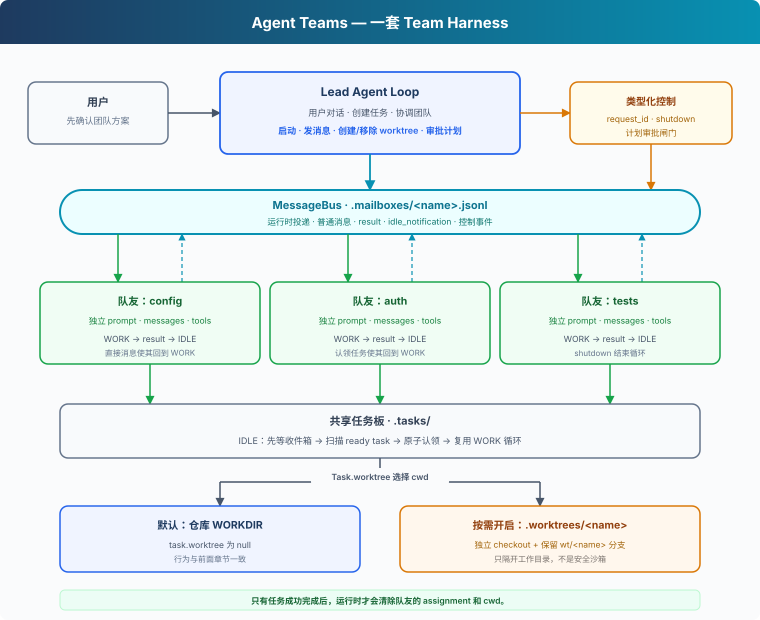
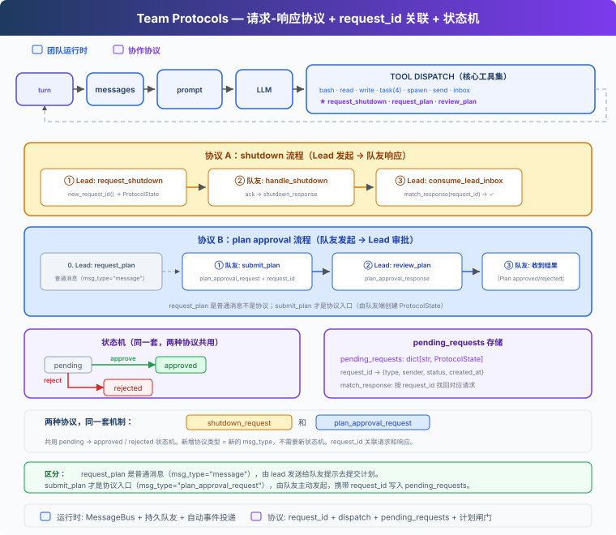

# s15: Agent Teams — 团队运行时与协作协议

[English](README.md) · [中文](README.zh.md) · [日本語](README.ja.md)

s01 → ... → s13 → s14 → `s15` → [s16](../s16_autonomous_agents/) → s17 → s18 → s19 → s20 → s21

> *"一个 Agent 顾不过来，就让队友分工协作。"* — 持久队友、消息投递与协作协议。
>
> **Harness 层**：团队 — 多个 Agent 如何并行工作，又如何保持可控。

---

## 问题

当我们需要 Agent 帮助我们重构整个后端时，任务可能同时涉及配置加载、认证逻辑和测试。一个 Agent 依次处理所有模块，不但耗时更长，早期细节也会逐渐退出上下文。

这类任务适合拆给多个 Agent，但用户通常只会描述需求，不会先设计一套团队：

```text
请重构这个示例后端，分别整理配置加载、认证逻辑和测试，
保持现有接口兼容，并确保测试通过。
```

因此，Harness 需要连续解决四个问题：

1. 谁判断任务是否值得并行，以及如何征得用户确认？
2. 队友如何保留自己的身份和上下文，持续接收工作？
3. 队友的结果如何自动回到 Lead，而不是依赖模型反复检查邮箱？
4. 关机与计划审批如何变成可追踪、可执行的协议？

---

## 解决方案



s15 在单 Agent Harness 外增加一个由 Lead 管理的团队运行时：

- **Lead** 保持用户对话，判断是否需要团队，提出分工并等待确认。
- **队友** 在独立线程中运行自己的 Agent Loop，完成工作后进入空闲。
- **MessageBus** 用文件邮箱传递普通消息、结果和控制事件。
- **运行时投递** 自动消费 Lead 的邮箱，把团队事件注入下一轮上下文。
- **协作协议** 用 `type`、`request_id` 和状态机处理关机与计划审批。
- **计划闸门** 在计划未批准时拦截队友的 `bash` 和 `write_file`。

模型负责理解任务与分工，代码负责消息投递、生命周期和协议约束。

---

## 工作原理

### 1. Lead 先提出团队，再等待用户确认

是否创建团队会改变成本、并发度和可写入范围，不应该被隐藏在一次普通工具调用里。Lead 的 system prompt 明确规定：

```python
"When parallel work would help, first propose a small team with clear "
"responsibilities and wait for the user's confirmation. Do not call "
"spawn_teammate before the user confirms."
```

第一次输入需求时，Lead 只需要说明建议的拆分：

```text
我建议分成三个方向并行处理：
- config：整理配置加载
- auth：重构认证逻辑
- tests：补齐回归测试

确认后我会启动队友并协调结果。
```

用户回复“开始吧”后，Lead 才调用 `spawn_teammate`。用户表达目标，Lead 设计团队，用户确认执行边界；三者的职责不会混在一起。

### 2. 每个队友拥有独立循环

s06 的子 Agent 是一次性调用，返回结果后就结束。队友则是持久执行单元：

| | s06 子 Agent | s15 队友 |
|---|---|---|
| 生命周期 | 完成一次调用后结束 | `WORK → IDLE → WORK`，直到收到关机请求 |
| 上下文 | 只服务当前任务 | 在多轮协作中保留 |
| 通信 | 返回一次结果 | 持续接收消息并上报事件 |
| 协调 | 主 Agent 单向委派 | Lead 与队友双向协作 |

`spawn_teammate_thread()` 为队友创建独立的 system prompt、messages 和工具集，并把循环放入 daemon 线程。Lead 不必等待某个队友结束，仍可继续派发任务或处理其他结果。

### 3. MessageBus 把通信放在上下文之外

Lead 和队友不能共享同一份 messages，否则一个队友的工具结果会混入另一个队友的推理。`MessageBus` 为每个 Agent 建立 `.mailboxes/<name>.jsonl`：

```python
class MessageBus:
    def send(self, from_agent, to_agent, content,
             msg_type="message", metadata=None):
        msg = {
            "from": from_agent,
            "to": to_agent,
            "content": content,
            "type": msg_type,
            "metadata": metadata or {},
        }
        with self._changed:
            append_jsonl(self._path(to_agent), msg)
            self._changed.notify_all()

    def wait_for_messages(self, agent):
        with self._changed:
            while not self.peek(agent):
                self._changed.wait()
            return self._read_unlocked(agent)
```

锁保证同一进程中的多个队友不会同时破坏邮箱文件，`Condition` 让空闲队友等待事件，而不是持续轮询。

### 4. 收件箱由运行时自动投递

`read_inbox()` 是消费式读取：读出后删除邮箱文件。因此，Lead 只保留一个消费入口 `consume_lead_inbox()`：

```python
def consume_lead_inbox():
    messages = BUS.read_inbox("lead")
    for message in messages:
        if message["type"].endswith("_response"):
            match_response(...)
    return messages
```

主循环旁的事件线程发现新消息后，会唤醒 Lead：

```text
MessageBus → consume_lead_inbox
           → 更新协议状态
           → [Team events] 注入 history
           → Lead 开始新一轮
```

`check_inbox` 不再是模型工具。消息何时到达属于运行时职责；模型只需要处理已经送入上下文的事件。

### 5. 结果与空闲是两个不同事件

队友完成一项工作时，运行时依次发送：

```text
result:            "认证逻辑已重构，相关测试通过。"
idle_notification: "Waiting for more work."
```

`result` 回答“这次工作产出了什么”，`idle_notification` 表示“这个队友现在可以接新任务”。如果把两者合成一个模糊的“done”，Lead 就无法区分任务结果和资源状态。

队友进入 IDLE 后不会退出。新普通消息会让它回到 WORK；`shutdown_request` 则让它完成关机握手并结束线程。

### 6. 控制消息使用类型和 request_id

普通消息可以交给模型理解，关机和审批不能依赖自由文本猜测。它们使用结构化消息：



```python
@dataclass
class ProtocolState:
    request_id: str
    type: str
    sender: str
    target: str
    status: str
    payload: str


pending_requests: dict[str, ProtocolState] = {}
```

关机协议的完整路径是：

```text
Lead 创建 shutdown 请求，状态为 pending
  → shutdown_request(request_id) 发给队友
  → 队友完成当前步骤并回复 shutdown_response(request_id)
  → Lead 用 request_id 找到原请求
  → pending 变为 approved，队友线程退出
```

`request_id` 负责关联请求与回复，`type` 防止错误类型的回复修改状态，`status` 防止重复响应被再次处理。

### 7. 计划审批不仅传消息，还约束执行

计划协议沿相反方向流动：

```text
Lead → plan_request
队友 → plan_approval_request(request_id, plan)
Lead → plan_approval_response(request_id, approve, feedback)
```

只告诉队友“请等待批准”并不可靠，所以工具分发器检查计划状态：

```python
def _run_teammate_tool(name, block, handlers):
    gate = plan_gates.get(name, "not_required")
    if block.name in {"bash", "write_file"} and gate not in {
        "not_required", "approved"
    }:
        return f"Blocked: plan status is {gate}."
    return handlers[block.name](**block.input)
```

当状态为 `required`、`pending` 或 `rejected` 时，队友仍可读取文件、提交或修改计划，但不能执行 Shell 或写文件。批准消息到达后，状态变为 `approved`，工具才会放行。

---

## 一次完整运行

```text
s15 >> 请重构这个示例后端，分别整理配置加载、认证逻辑和测试，
       保持现有接口兼容，并确保测试通过。

Lead: 建议由 config、auth、tests 三个方向并行处理，是否开始？

s15 >> 开始吧

[teammate] config spawned
[teammate] auth spawned
[teammate] tests spawned
[bus] auth → lead (result) ...
[bus] auth → lead (idle_notification) ...
[wake: 2 team events → new turn]
Lead: 已收到认证部分结果，继续等待并协调其他队友。
```

终端中显示的是用户需求、Lead 分工、队友启动、消息流、结果、空闲和关机事件。用户不需要在提示词里指定谁是 Lead，也不需要手动要求检查邮箱。

---

## 相对 s14 的变化

| 组件 | s14 | s15 |
|---|---|---|
| Agent 数量 | 一个 Agent | 一个 Lead + 多个持久队友 |
| 用户交互 | 直接执行任务 | 先提出团队方案，再确认启动 |
| 通信 | 无 | 文件邮箱 + 自动事件投递 |
| 生命周期 | 单循环 | 队友 `WORK / IDLE / shutdown` |
| 结果上报 | 当前 Agent 输出 | `result` 与 `idle_notification` 分离 |
| 控制协议 | 无 | 关机与计划审批 |
| 执行约束 | 无团队约束 | 未批准计划会拦截写入类工具 |

---

## 试一下

```sh
cd learn-claude-code
python s15_agent_teams/code.py
```

先输入一个自然需求：

```text
请重构这个示例后端，分别整理配置加载、认证逻辑和测试，
保持现有接口兼容，并确保测试通过。
```

看到 Lead 给出分工后，再回复：

```text
开始吧
```

观察终端中的 `spawned`、`result`、`idle_notification`、`plan_approval_*` 和 `shutdown_*` 事件，以及 `.mailboxes/` 中消息写入和消费的过程。

---

## 接下来

s15 中，Lead 仍然要明确告诉每个队友做什么。下一章把共享任务看板交给空闲队友，让它们自己发现并认领可执行任务。

下一章：[s16 Autonomous Agents](../s16_autonomous_agents/)。

<!-- translation-sync: zh@v2, en@v2, ja@v2 -->
