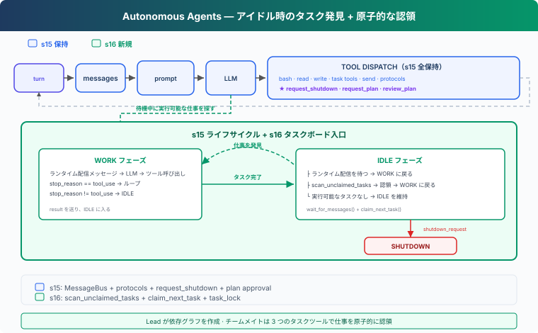

# s16: Autonomous Agents — ボードを見て、自分で Claim する

[English](README.md) · [中文](README.zh.md) · [日本語](README.ja.md)

s01 → ... → s14 → s15 → `s16` → [s17](../s17_worktree_isolation/) → s18 → s19 → s20 → s21

> *「IDLE はメッセージを待つだけでなく、開始可能な仕事を探す時間でもある。」* — 共有タスクボード、自動発見、原子的な Claim。
>
> **Harness レイヤー**：自律 — Lead は目標を管理し、チームメイトは共有状態から次の仕事を見つける。

---

## 問題

s15 のチームメイトは作業後に IDLE へ入り、Lead から次の依頼を待つ。タスクボードに 10 件の pending task があっても、Lead はチームメイトを選び、メッセージを送り、結果を待つ操作を 10 回繰り返す必要がある。

仕事がすでに分解され、依存関係もタスクボードに記録されているなら、次の ready task の割り当てに毎回モデル判断は要らない。IDLE のチームメイト自身が共有状態を読み、前提条件を満たした仕事を Claim できる。

---

## 解決策



s16 は s15 のチームライフサイクルを変えず、IDLE の動作だけを拡張する：

```text
s15: WORK → result → IDLE → メッセージを待つ
s16: WORK → result → IDLE → メッセージを待つ
                            └→ ボード走査 → Claim → WORK
```

追加する関数は 2 つ：

- `scan_unclaimed_tasks()`：現在開始できるタスクを探す。
- `claim_next_task(name)`：候補の 1 件を原子的に Claim する。

チームメイトのツールにも `list_tasks`、`claim_task`、`complete_task` を加え、同じループ内で作業を完了できるようにする。

---

## 仕組み

### 1. 発見と所有権を分離する

走査は状態を変更せず、読み取りだけを行う：

```python
def scan_unclaimed_tasks() -> list[Task]:
    return [
        task for task in list_tasks()
        if (
            task.status == "pending"
            and task.owner is None
            and can_start(task.id)
        )
    ]
```

候補は `pending` で、owner がなく、すべての `blockedBy` が完了していなければならない。

ただし候補一覧は一時点のスナップショットにすぎない。直後に別のチームメイトが同じタスクを Claim する可能性があるため、「発見した」と「所有した」を同じ意味にしてはいけない。

### 2. Claim はロック内で読み取り、確認、書き込みを行う

`claim_task()` は状態遷移全体を `task_lock` で保護する：

```python
def claim_task(task_id: str, owner: str) -> str:
    with task_lock:
        task = load_task(task_id)
        if task.status != "pending" or task.owner:
            return "Task is no longer available"
        if not can_start(task_id):
            return "Task is blocked"

        task.owner = owner
        task.status = "in_progress"
        save_task(task)
        return f"Claimed {task.id}"
```

`claim_next_task()` は成功する候補が見つかるまで順に試す：

```python
def claim_next_task(name: str) -> Task | None:
    for task in scan_unclaimed_tasks():
        result = claim_task(task.id, owner=name)
        if result.startswith("Claimed "):
            return load_task(task.id)
    return None
```

複数のチームメイトが同時にボードを観察しても、最終的な owner は Claim 関数によって 1 人に決まる。

### 3. メッセージを優先し、その後にタスクを探す

IDLE に入ったチームメイトは、まず短時間だけ受信イベントを待つ：

```python
while True:
    inbox = BUS.wait_for_messages(name, IDLE_SCAN_INTERVAL)
    if inbox:
        handle_messages(inbox)
        break

    task = claim_next_task(name)
    if task:
        messages.append({
            "role": "user",
            "content": (
                f"[Auto-claimed task {task.id}] "
                f"{task.subject}\n{task.description}"
            ),
        })
        break
```

この順序にする理由は明確だ：

- shutdown、計画承認、Lead からの直接メッセージにはすぐ応答する。
- メッセージがない IDLE 時間だけを、共有タスクの探索に使う。

メッセージも ready task もなければ IDLE を続ける。候補が空なのは、依存タスクがまだ完了していないだけかもしれない。

### 4. Claim 後は同じ WORK ループを再利用する

Claim に成功すると、ランタイムはタスク ID、件名、説明をチームメイトの messages へ追加する。ファイルツール、Shell、計画ゲート、結果通知、終了プロトコルはすべて s15 の仕組みをそのまま使う。

```text
ready task が現れる
  → IDLE のチームメイトが発見
  → claim_task が owner と in_progress を記録
  → タスクが messages に入る
  → WORK
  → complete_task
  → result + idle_notification
  → 再び走査
```

自律のために別の Agent Loop を作る必要はない。既存ループへ共有状態から入る入口を追加すればよい。

---

## この設計を選ぶ理由

**Lead が毎回割り当てないのはなぜか。**

`status`、`owner`、`blockedBy` が実行可能性をすでに表している。同じ状態を Lead に毎回解釈させても、調整ターンが増えるだけである。

**走査時に owner を設定しないのはなぜか。**

走査は並行実行され得る。所有権変更を 1 つのロック付き関数に集めれば、すべての呼び出し元が同じ規則に従う。

**ready task がない時に終了しないのはなぜか。**

依存タスクが完了すれば、後続タスクが ready になる。IDLE を維持すれば、その瞬間に次の仕事を引き継げる。

---

## s15 からの変更

| コンポーネント | s15 | s16 |
|---|---|---|
| IDLE | チームメッセージを待つ | メッセージ待機後にボードを走査 |
| 割り当て | Lead が明示的に送る | チームメイトが自動 Claim 可能 |
| 所有権 | 呼び出し元が Claim | `task_lock` で Claim を原子的にする |
| チームメイトツール | ファイル、Shell、メッセージ、計画 | list / claim / complete task を追加 |
| 結果と終了 | `result`、`idle_notification`、shutdown protocol | 変更なし |

---

## 試してみる

```sh
cd learn-claude-code
python s16_autonomous_agents/code.py
```

通常の要求を入力する：

```text
バックエンド改修を共有タスクボードへ分解し、依存関係が許す範囲で
設定、認証、テストを並行実行してください。既存インターフェースを
維持し、最後に結果をまとめてください。
```

Lead がチーム案を示したら、次のように返す：

```text
始めてください
```

`.tasks/` のタスクが `pending`、`in_progress`、`completed` と変化する様子を確認する。2 人の IDLE チームメイトは別々のタスクを Claim し、`blockedBy` のあるタスクは前提完了後にだけ候補になるはずだ。

---

## 次へ

チームメイトは仕事を自分で見つけられるようになったが、まだ同じディレクトリでファイルを変更する。次のセッションではタスク所有権を分離された作業ディレクトリへ結び付ける。

次へ：[s17 Worktree Isolation](../s17_worktree_isolation/)。

<!-- translation-sync: zh@v3, en@v3, ja@v3 -->
