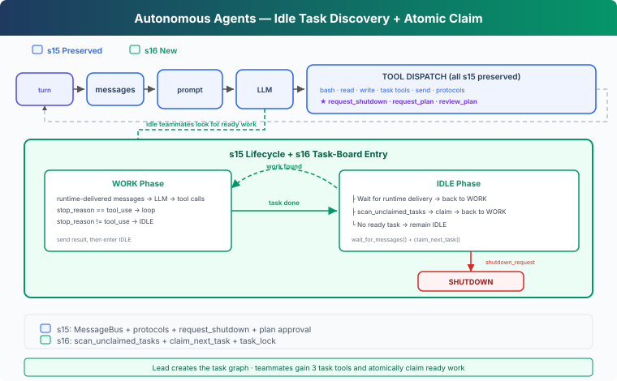

# s16: Autonomous Agents — Check the Board, Claim the Work

[English](README.md) · [中文](README.zh.md) · [日本語](README.ja.md)

s01 → ... → s14 → s15 → `s16` → [s17](../s17_worktree_isolation/) → s18 → s19 → s20 → s21

> *"Idle does not only mean waiting for a message; it can also mean looking for ready work."* — Shared task board, automatic discovery, and atomic claims.
>
> **Harness layer**: Autonomy — Lead owns the goal while teammates discover the next step from shared state.

---

## The Problem

In s15, a teammate enters IDLE after finishing an assignment and waits for Lead to send more work. If the task board already contains ten pending tasks, Lead still has to choose a teammate, send a message, and wait for a result ten times.

Once work has been decomposed and dependencies are recorded on the task board, assigning the next ready task does not always need another model decision. An idle teammate can read shared state and claim work whose prerequisites are complete.

---

## The Solution



s16 keeps the s15 team lifecycle and extends only the IDLE state:

```text
s15: WORK → result → IDLE → wait for a message
s16: WORK → result → IDLE → wait for a message
                            └→ scan board → claim → WORK
```

It adds two functions:

- `scan_unclaimed_tasks()` finds tasks that can start now.
- `claim_next_task(name)` attempts to claim one candidate atomically.

Teammates also receive `list_tasks`, `claim_task`, and `complete_task`, allowing the claimed work to close inside the same loop.

---

## How It Works

### 1. Discovery and ownership are separate steps

Scanning reads state without changing it:

```python
def scan_unclaimed_tasks() -> list[Task]:
    return [
        task for task in list_tasks()
        if (
            task.status == "pending"
            and task.owner is None
            and can_start(task.id)
        )
    ]
```

A candidate must be `pending`, have no owner, and have every `blockedBy` dependency completed.

The resulting list is only a snapshot. Another teammate may claim the same task immediately afterward, so "discovered" must never mean "owned."

### 2. Claim performs read, validation, and write under one lock

`claim_task()` protects the full state transition with `task_lock`:

```python
def claim_task(task_id: str, owner: str) -> str:
    with task_lock:
        task = load_task(task_id)
        if task.status != "pending" or task.owner:
            return "Task is no longer available"
        if not can_start(task_id):
            return "Task is blocked"

        task.owner = owner
        task.status = "in_progress"
        save_task(task)
        return f"Claimed {task.id}"
```

`claim_next_task()` tries candidates until one claim succeeds:

```python
def claim_next_task(name: str) -> Task | None:
    for task in scan_unclaimed_tasks():
        result = claim_task(task.id, owner=name)
        if result.startswith("Claimed "):
            return load_task(task.id)
    return None
```

Many teammates may observe the board at once, but the claim function gives each task one final owner.

### 3. Messages take priority over board scans

In IDLE, a teammate first waits briefly for mailbox events:

```python
while True:
    inbox = BUS.wait_for_messages(name, IDLE_SCAN_INTERVAL)
    if inbox:
        handle_messages(inbox)
        break

    task = claim_next_task(name)
    if task:
        messages.append({
            "role": "user",
            "content": (
                f"[Auto-claimed task {task.id}] "
                f"{task.subject}\n{task.description}"
            ),
        })
        break
```

This ordering matters:

- Shutdown, plan approval, and direct Lead messages should be handled promptly.
- Only otherwise idle time is used to look for shared work.

If there is neither a message nor a ready task, the teammate stays idle. An empty scan is not a reason to exit because a blocked task may become ready later.

### 4. A claimed task reuses the same WORK loop

After a successful claim, the runtime injects the task ID, subject, and description into the teammate's messages. The existing file tools, Shell, plan gate, result reporting, and shutdown protocol all remain unchanged.

```text
ready task appears
  → idle teammate discovers it
  → claim_task writes owner and in_progress
  → task enters teammate messages
  → WORK
  → complete_task
  → result + idle_notification
  → scan again
```

Autonomy does not require another agent loop. It adds a shared-state entry point to the loop that already exists.

---

## Why This Design

**Why not ask Lead to assign every task?**

The task's `status`, `owner`, and `blockedBy` already encode whether it can run. Reinterpreting that same state through Lead adds coordination turns without adding judgment.

**Why not set the owner during scanning?**

Scans may overlap. Keeping ownership changes in one locked function gives every caller the same rule.

**Why keep teammates alive when no task is ready?**

An empty candidate list may only mean that prerequisites are still running. IDLE teammates can pick up downstream work as soon as it becomes ready.

---

## What Changed from s15

| Component | s15 | s16 |
|---|---|---|
| IDLE behavior | Wait for team messages | Wait for messages, then scan the board |
| Assignment | Lead sends work explicitly | Teammates may auto-claim |
| Ownership | Caller initiates claim | `task_lock` makes claim atomic |
| Teammate tools | Files, Shell, messages, plans | Adds list / claim / complete task |
| Result and shutdown | `result`, `idle_notification`, shutdown protocol | Unchanged |

---

## Try It

```sh
cd learn-claude-code
python s16_autonomous_agents/code.py
```

Enter an ordinary request:

```text
Put the backend refactor on a shared task board. Complete configuration,
authentication, and tests in parallel where dependencies allow, preserve
existing interfaces, and summarize the result.
```

After Lead proposes a team, reply:

```text
Go ahead.
```

Watch tasks move from `pending` to `in_progress` and `completed` under `.tasks/`. Two idle teammates should claim different tasks, and a task with `blockedBy` should become a candidate only after its prerequisites finish.

---

## Next

Teammates can now discover work, but they still edit files in the same directory. The next lesson binds task ownership to isolated working directories.

Next: [s17 Worktree Isolation](../s17_worktree_isolation/).

<!-- translation-sync: zh@v3, en@v3, ja@v3 -->
