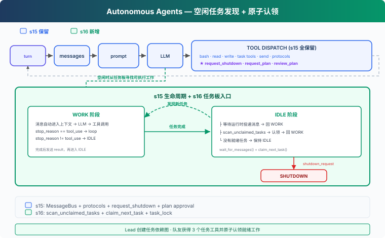

# s16: Autonomous Agents — 自己看板，自己认领

[English](README.md) · [中文](README.zh.md) · [日本語](README.ja.md)

s01 → ... → s14 → s15 → `s16` → [s17](../s17_worktree_isolation/) → s18 → s19 → s20 → s21

> *"空闲时不只等消息，也主动寻找可以开始的工作。"* — 共享任务板、自动发现与原子认领。
>
> **Harness 层**：自治 — Lead 管目标，队友从任务状态中发现下一步。

---

## 问题

s15 的队友会在完成一项工作后进入 IDLE，等待 Lead 继续派发。如果任务板上已经有十个待办任务，Lead 仍然要逐个选择队友、发送消息，再等待结果。

当任务已经被拆分，并且依赖关系也写进了任务板，谁来执行下一项工作不一定需要 Lead 再做一次模型决策。空闲队友可以直接读取共享状态，找到已经满足条件的任务并认领它。

---

## 解决方案



s16 不改变 s15 的团队生命周期，只扩展 IDLE 状态：

```text
s15: WORK → result → IDLE → 等待消息
s16: WORK → result → IDLE → 等待消息
                            └→ 扫描任务板 → 认领 → WORK
```

新增两个函数：

- `scan_unclaimed_tasks()`：找出当前可以开始的任务。
- `claim_next_task(name)`：尝试原子认领其中一个任务。

队友工具集同时增加 `list_tasks`、`claim_task` 和 `complete_task`，让认领后的工作能在同一个循环中闭合。

---

## 工作原理

### 1. 发现任务和认领任务是两步

扫描只读取状态，不修改任务：

```python
def scan_unclaimed_tasks() -> list[Task]:
    return [
        task for task in list_tasks()
        if (
            task.status == "pending"
            and task.owner is None
            and can_start(task.id)
        )
    ]
```

一个任务必须同时满足三个条件：

- 状态是 `pending`；
- 还没有 `owner`；
- `blockedBy` 中的任务都已经完成。

扫描得到的只是候选列表。另一个队友可能在下一瞬间认领同一任务，因此不能把“扫描到”当成“已经拥有”。

### 2. claim 在锁内完成读、检查和写入

`claim_task()` 使用同一把 `task_lock` 包住完整的读改写过程：

```python
def claim_task(task_id: str, owner: str) -> str:
    with task_lock:
        task = load_task(task_id)
        if task.status != "pending" or task.owner:
            return "Task is no longer available"
        if not can_start(task_id):
            return "Task is blocked"

        task.owner = owner
        task.status = "in_progress"
        save_task(task)
        return f"Claimed {task.id}"
```

`claim_next_task()` 依次尝试候选任务。某次认领失败时，它会继续尝试下一个，而不是把失败误当成成功：

```python
def claim_next_task(name: str) -> Task | None:
    for task in scan_unclaimed_tasks():
        result = claim_task(task.id, owner=name)
        if result.startswith("Claimed "):
            return load_task(task.id)
    return None
```

扫描负责发现，claim 负责所有权。把两者分开后，多个队友可以同时观察任务板，但每个任务只能有一个最终 owner。

### 3. 消息优先，任务扫描其次

队友进入 IDLE 后，先等待一小段时间的收件箱事件：

```python
while True:
    inbox = BUS.wait_for_messages(name, IDLE_SCAN_INTERVAL)
    if inbox:
        handle_messages(inbox)
        break

    task = claim_next_task(name)
    if task:
        messages.append({
            "role": "user",
            "content": (
                f"[Auto-claimed task {task.id}] "
                f"{task.subject}\n{task.description}"
            ),
        })
        break
```

这样安排有两个原因：

- 关机、计划审批和 Lead 的直接消息应该尽快响应；
- 没有消息时，空闲时间才用于寻找共享任务。

如果既没有消息也没有可认领任务，队友继续保持 IDLE，不会因为一次扫描为空就退出。

### 4. 自动认领后复用同一个 WORK 循环

认领成功后，运行时把任务 ID、标题和描述写入队友 messages。对模型来说，它只是收到了一项新工作；文件、Shell、计划闸门、结果上报都继续使用 s15 的机制。

```text
任务板出现 ready task
  → 空闲队友扫描到候选
  → claim_task 写入 owner 和 in_progress
  → 任务进入队友 messages
  → WORK
  → complete_task
  → result + idle_notification
  → 再次扫描
```

自治不是再造一个 Agent Loop，而是给既有循环增加一个由共享状态触发的入口。

---

## 为什么这样设计

**为什么不是 Lead 每次分配？**

任务依赖已经编码在 `status`、`owner` 和 `blockedBy` 中。让 Lead 反复解释同一状态，只会增加协调轮次。

**为什么不是扫描时直接改 owner？**

扫描可能并发发生。把认领集中到带锁的函数中，所有调用方共享同一个所有权规则。

**为什么不在没有任务时关闭队友？**

暂时没有 ready task 可能只是因为依赖尚未完成。保持 IDLE 后，前置任务完成时队友可以自动接上后续工作。

---

## 相对 s15 的变化

| 组件 | s15 | s16 |
|---|---|---|
| IDLE 行为 | 等待团队消息 | 先等消息，再扫描任务板 |
| 任务分配 | Lead 明确派发 | 队友可自动认领 |
| 任务所有权 | 调用方发起 claim | `task_lock` 保证认领原子性 |
| 队友工具 | 文件、Shell、消息、计划 | 增加 list / claim / complete task |
| 结果与关机 | `result`、`idle_notification`、shutdown 协议 | 保持不变 |

---

## 试一下

```sh
cd learn-claude-code
python s16_autonomous_agents/code.py
```

输入一个自然需求：

```text
请把后端改造拆到共享任务板，按依赖关系并行完成配置、认证和测试，
保持现有接口兼容，并在最后汇总结果。
```

Lead 提出团队方案后回复：

```text
开始吧
```

观察 `.tasks/` 中任务如何从 `pending` 进入 `in_progress` 和 `completed`，以及两个空闲队友是否会认领不同任务。带 `blockedBy` 的任务应该只在前置任务完成后出现为候选。

---

## 接下来

队友已经能自己找到任务，但仍然在同一个工作目录里修改文件。下一章把任务所有权和工作目录绑定起来，让并行工作彼此隔离。

下一章：[s17 Worktree Isolation](../s17_worktree_isolation/)。

<!-- translation-sync: zh@v3, en@v3, ja@v3 -->
