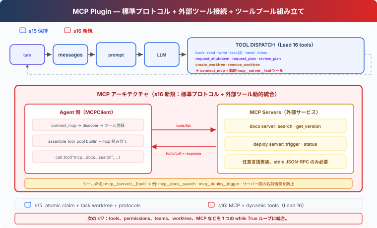

# s16: MCP Tools — 外部ツール、標準プロトコル

[English](README.md) · [中文](README.zh.md) · [日本語](README.ja.md)

[s15](../s15_agent_teams/) → `s16` → [s17](../s17_integrated_harness/) → s18 → s19

> *"外部ツール、標準プロトコル"* — 発見、組み立て、呼び出し。Agent はツールを誰が書いたか知る必要がない。
>
> **Harness 層**: プラグイン — 外部能力を標準プロトコルで接続。

---

## 課題

s01 から s15 まで、Agent の全ツールは手書き — bash、read、write、task、worktree。入力検証、実行ロジック、エラーハンドリング、全て一行ずつ書いた。

今、統合したい外部サービスが 3 つある：社内の Jira API（issue 検索、ticket 作成）、独自のデプロイシステム（deploy トリガー、ログ閲覧）、チームの Notion ナレッジベース（ドキュメント検索、ページ作成）。各サービスのためにツールコードを書き直したくない。

標準プロトコルが必要 — 外部サービスがこのプロトコルを実装していれば、サービスが何の言語で書かれていても、Agent は直接そのツールを呼び出せる。

---

## ソリューション



MCP（Model Context Protocol）は、Agent が外部ツールを発見・呼び出しする方法を定義。核心概念：

| 概念 | 目的 |
|------|------|
| MCPClient | Agent 側のクライアント — server に接続、ツールを発見、ツールを呼び出し |
| MCP Server | 外部サービス側 — `tools/list` + `tools/call` を実装 |
| assemble_tool_pool | 組み込みツールと MCP ツールを一つのツールプールに組み立てる |
| mcp\_\_server\_\_tool 命名 | 異なる server 間のツール名衝突を防止 |

s15 の Team runtime を土台にし、idle 時の atomic task claim、restart 後も復元できる task-worktree binding、current assignment だけに結び付く plan approval を引き継ぐ。background bash は非ゼロ終了を failure として報告し、作業終了時に command の元の process group を停止する。durable な一回限り cron job は、先に pending delivery として永続化してから queue へ入れ、その prompt を含む model call が成功するまで保持する。本章では `connect_mcp` ツールを追加し、サービスへの接続、ツール発見、ツールプールへの追加を行う。

task-bound worktree はチームメイトのファイルツールに対するデフォルト作業ディレクトリを変更するだけであり、セキュリティサンドボックスではない。

Worktree 削除はモデルに公開しない。user または host が task、assignment、background process、Git state を確認してから cleanup helper を呼ぶ。変更の破棄は、user が手動で行う Git 操作、または明示的な確認後に host が行う操作のままである。

本章はプロセス内の server handler を登録し、発見から呼び出しまでをオフラインで実行する。各 handler はクライアントが必要とする `tools/list` と `tools/call` を提供する。

---

## 仕組み

### MCPClient：発見 + 呼び出し

```python
class MCPClient:
    def __init__(self, name: str):
        self.name = name
        self.tools: list[dict] = []
        self._handlers: dict[str, callable] = {}

    def register(self, tool_defs, handlers):
        """Simulates tools/list discovery."""
        self.tools = tool_defs
        self._handlers = handlers

    def call_tool(self, tool_name: str, args: dict) -> str:
        """Simulates tools/call."""
        handler = self._handlers.get(tool_name)
        if not handler:
            return f"MCP error: unknown tool '{tool_name}'"
        return handler(**args)
```

登録した Python 関数が、`tools/call` から呼ばれる server 側のツール実装になる。

### connect_mcp：接続 + 発見

```python
def connect_mcp(name: str) -> str:
    if name in mcp_clients:
        return f"MCP server '{name}' already connected"
    factory = MOCK_SERVERS.get(name)
    if not factory:
        return f"Unknown server '{name}'. Available: ..."
    mcp_client = factory()
    mcp_clients[name] = mcp_client
    return f"Connected to '{name}'. Discovered: ..."
```

接続後、server が提供するツールが即座に利用可能。

### normalize_mcp_name：名前の正規化

```python
_DISALLOWED_CHARS = re.compile(r'[^a-zA-Z0-9_-]')

def normalize_mcp_name(name: str) -> str:
    return _DISALLOWED_CHARS.sub('_', name)
```

`[a-zA-Z0-9_-]` 以外の全文字を `_` に置換。server 名やツール名の特殊文字による名前衝突やインジェクション問題を防止。

### assemble_tool_pool：ツールプールの組み立て

```python
def assemble_tool_pool() -> tuple[list[dict], dict]:
    tools = list(BUILTIN_TOOLS)
    handlers = dict(BUILTIN_HANDLERS)
    for server_name, mcp_client in mcp_clients.items():
        safe_server = normalize_mcp_name(server_name)
        for tool_def in mcp_client.tools:
            safe_tool = normalize_mcp_name(tool_def["name"])
            prefixed = f"mcp__{safe_server}__{safe_tool}"
            tools.append(...)
            handlers[prefixed] = (
                lambda *, c=mcp_client, t=tool_def["name"], **kw:
                    c.call_tool(t, kw))
    return tools, handlers
```

プレフィックス `mcp__{server}__{tool}` で server ごとのツールを分離し、名前は `normalize_mcp_name` で正規化する。異なる元の名前が同じプレフィックスになる可能性があるため、`assemble_tool_pool()` は先に登録された handler を暗黙に上書きせず、衝突を拒否する。

MCP ツールの description に `(readOnly)` または `(destructive)` を付け、読み取りと変更の区別をツールメタデータ上で明示する。

### キャッシュなし：ツールプールが変われば、プロンプトも変わる

s10-s15 の agent loop は prompt cache で再シリアライズを回避。s16 はキャッシュを削除：

```python
def agent_loop(messages, context):
    tools, handlers = assemble_tool_pool()     # 毎回再構築
    system = assemble_system_prompt(context)    # 毎回再生成
    ...
    if any(b.name == "connect_mcp" ...):
        tools, handlers = assemble_tool_pool()  # 接続後に再構築
        system = assemble_system_prompt(context)
```

`connect_mcp` の後には `mcp__docs__search` などがツールプールへ加わる。古いシリアライズ済みツール一覧を再利用するとモデルから新しいツールが見えないため、接続後にツールプールと system prompt を再構築する。

### MCP ツールは Lead のみ利用可能

`connect_mcp` は Lead のツールであり、`assemble_tool_pool` も Lead の agent loop に使われる。チームメイトはタスク、ファイル、メッセージ、プランの各ツールを保持する。Lead は外部サービスを呼び出して得た仕事を共有 task board に置き、idle のチームメイトが atomic に claim する。

---

## s15 からの変更

| コンポーネント | 変更前 (s15) | 変更後 (s16) |
|--------------|------------|------------|
| ツールソース | 全て手書き builtin | 手書き + MCP 外部ツール動的発見 |
| ツールプール | 固定 BUILTIN_TOOLS | assemble_tool_pool が動的に mcp\_\_ プレフィックスツールを組み立てる |
| 名前の安全性 | なし | normalize_mcp_name 正規化 |
| 新規タイプ | — | MCPClient クラス（tools/list + tools/call をシミュレート） |
| 名前空間 | — | mcp\_\_server\_\_tool 衝突防止 |
| ツール説明 | アノテーションなし | (readOnly)/(destructive) アノテーション |
| プロンプトキャッシュ | あり（s10 から） | 削除 — ツールプールが動的、キャッシュが陳腐化 |
| 既存 runtime | task、cron、background bash、team、worktree | 全て維持 |
| Lead ツール | cron、background、worktree・チームツール | + connect_mcp と動的に発見した MCP ツール |
| チームメイトツール | タスク、ファイル、メッセージ、プランのツール | 変更なし |
| 拡張方法 | ツール追加のコードを書く | 標準プロトコル、任意言語で server を実装 |

---

## 試してみる

```sh
cd learn-claude-code
python s16_mcp_plugin/code.py
```

以下のプロンプトを試してください：

1. `ドキュメントから worktree のクリーンアップ方針を調べてください。`
2. `現在のプロジェクトをデプロイし、結果を報告してください。`
3. `現在実行できるドキュメント操作とデプロイ操作を教えてください。`

観察ポイント：MCP server 接続後、ツール名に `mcp__docs__` や `mcp__deploy__` プレフィックスが付いているか？両方の server のツールが同時に利用可能か？MCP ツールの description に (readOnly)/(destructive) アノテーションが付いているか？

---

## 次の章

Agent は標準プロトコルで外部ツールに接続できるようになった。前 16 章では、各境界を観察できるように仕組みを一つずつ追加してきた。

tools、permissions、hooks、todo、task graph、memory、compact、background work、cron、teams、worktree、MCP は、別々の例ではなく同じ loop に接続されるべきです。

[s17 Integrated Harness](../s17_integrated_harness/) → s01-s16 の仕組みを 1 つの harness に統合。仕組みは多く、loop は 1 つ。


<!-- translation-sync: zh@v7, en@v7, ja@v7 -->
