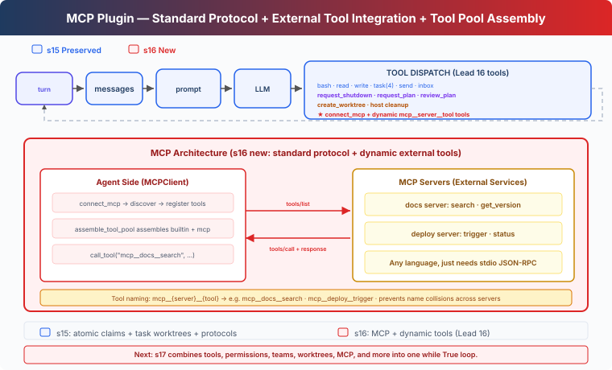

# s16: MCP Tools — External Tools, Standard Protocol

[English](README.md) · [中文](README.zh.md) · [日本語](README.ja.md)

[s15](../s15_agent_teams/) → `s16` → [s17](../s17_integrated_harness/) → s18 → s19

> *"External tools, standard protocol"* — Discover, assemble, invoke. Agent doesn't need to know who wrote them.
>
> **Harness layer**: Plugins — External capabilities via a standard protocol.

---

## The Problem

From s01 through s15, every tool the agent uses was hand-written — bash, read, write, task, worktree. Input validation, execution logic, error handling — all written line by line.

Now you have 3 external services to integrate: the company's Jira API (query issues, create tickets), an in-house deployment system (trigger deploys, view logs), and the team's Notion knowledge base (search docs, create pages). You don't want to rewrite tool code for every service.

You need a standard protocol — as long as an external service implements it, the agent can call its tools directly, regardless of what language the service is written in.

---

## The Solution



MCP (Model Context Protocol) defines how agents discover and invoke external tools. Core concepts:

| Concept | Purpose |
|------|------|
| MCPClient | The agent-side client — connects to servers, discovers tools, invokes tools |
| MCP Server | The external service — implements `tools/list` + `tools/call` |
| assemble_tool_pool | Assembles built-in tools and MCP tools into one tool pool |
| mcp\_\_server\_\_tool naming | Prevents tool name collisions across different servers |

Builds on s15's team runtime: atomic idle task claiming, safe task-bound worktrees, and coordination protocols. It also retains cron scheduling, the background bash lifecycle, and completion notifications that automatically wake the Lead. This chapter adds the `connect_mcp` tool, which connects to a service, discovers its tools, and adds them to the tool pool.

A task-bound worktree changes the teammate file tools' default working directory; it is not a security sandbox.

The model-facing `remove_worktree` tool accepts only `name`, so it can remove only a clean checkout. Discarding changes remains a manual Git operation for the user, or a host action that follows explicit confirmation; the model cannot opt into the lower-level force path itself.

The chapter registers in-process server handlers so the full discovery and invocation flow runs offline. Each handler exposes the two operations the client needs: `tools/list` and `tools/call`.

---

## How It Works

### MCPClient: Discovery + Invocation

```python
class MCPClient:
    def __init__(self, name: str):
        self.name = name
        self.tools: list[dict] = []
        self._handlers: dict[str, callable] = {}

    def register(self, tool_defs, handlers):
        """Simulates tools/list discovery."""
        self.tools = tool_defs
        self._handlers = handlers

    def call_tool(self, tool_name: str, args: dict) -> str:
        """Simulates tools/call."""
        handler = self._handlers.get(tool_name)
        if not handler:
            return f"MCP error: unknown tool '{tool_name}'"
        return handler(**args)
```

The registered Python functions provide the server-side tool implementations used by `tools/call`.

### connect_mcp: Connect + Discover

```python
def connect_mcp(name: str) -> str:
    if name in mcp_clients:
        return f"MCP server '{name}' already connected"
    factory = MOCK_SERVERS.get(name)
    if not factory:
        return f"Unknown server '{name}'. Available: ..."
    mcp_client = factory()
    mcp_clients[name] = mcp_client
    return f"Connected to '{name}'. Discovered: ..."
```

After connecting, the server's tools are immediately available.

### normalize_mcp_name: Name Normalization

```python
_DISALLOWED_CHARS = re.compile(r'[^a-zA-Z0-9_-]')

def normalize_mcp_name(name: str) -> str:
    return _DISALLOWED_CHARS.sub('_', name)
```

All non-`[a-zA-Z0-9_-]` characters are replaced with `_`. Prevents special characters in server or tool names from causing naming conflicts or injection issues.

### assemble_tool_pool: Assemble Tool Pool

```python
def assemble_tool_pool() -> tuple[list[dict], dict]:
    tools = list(BUILTIN_TOOLS)
    handlers = dict(BUILTIN_HANDLERS)
    for server_name, mcp_client in mcp_clients.items():
        safe_server = normalize_mcp_name(server_name)
        for tool_def in mcp_client.tools:
            safe_tool = normalize_mcp_name(tool_def["name"])
            prefixed = f"mcp__{safe_server}__{safe_tool}"
            tools.append(...)
            handlers[prefixed] = (
                lambda *, c=mcp_client, t=tool_def["name"], **kw:
                    c.call_tool(t, kw))
    return tools, handlers
```

The prefix `mcp__{server}__{tool}` separates tools across servers, and names are normalized through `normalize_mcp_name`. Because different raw names can normalize to the same prefix, `assemble_tool_pool()` rejects a collision instead of silently replacing the earlier handler.

MCP tool descriptions include `(readOnly)` or `(destructive)` labels, making the distinction visible in the tool metadata.

### No Cache: Tool Pool Changes, Prompt Changes Too

s10-s15's agent loop used prompt caching to avoid re-serialization. s16 removes the cache:

```python
def agent_loop(messages, context):
    tools, handlers = assemble_tool_pool()     # Rebuild every time
    system = assemble_system_prompt(context)    # Regenerate every time
    ...
    if any(b.name == "connect_mcp" ...):
        tools, handlers = assemble_tool_pool()  # Rebuild after connection
        system = assemble_system_prompt(context)
```

After `connect_mcp`, the tool pool gains entries such as `mcp__docs__search`. Reusing the old serialized tool list would hide those entries from the model, so the loop rebuilds the pool and system prompt after every connection.

### MCP Tools: Lead Only

`connect_mcp` belongs to the Lead, and `assemble_tool_pool` serves the Lead's agent loop. Teammates keep their task, file, message, and plan tools; the Lead invokes external services and puts resulting work on the shared task board, where idle teammates can claim it atomically.

---

## Changes from s15

| Component | Before (s15) | After (s16) |
|------|-----------|-----------|
| Tool source | All hand-written built-in | Hand-written + MCP external tools with dynamic discovery |
| Tool pool | Fixed BUILTIN_TOOLS | assemble_tool_pool dynamically assembles mcp\_\_ prefixed tools |
| Name safety | None | normalize_mcp_name normalization |
| New type | — | MCPClient class (simulates tools/list + tools/call) |
| Namespace | — | mcp\_\_server\_\_tool prevents collisions |
| Tool descriptions | No annotations | (readOnly)/(destructive) annotations |
| Prompt cache | Yes (since s10) | Removed — tool pool is dynamic, cache goes stale |
| Existing runtime | Tasks, cron, background bash, teams, and worktrees | All retained |
| Lead tools | Cron, background, worktree, and team tools | + connect_mcp and dynamically discovered MCP tools |
| Teammate tools | Task, file, message, and plan tools | Unchanged |
| Extension method | Write code to add tools | Standard protocol, implement servers in any language |

---

## Try It Out

```sh
cd learn-claude-code
python s16_mcp_plugin/code.py
```

Try these prompts:

1. `Search the docs for the worktree cleanup policy.`
2. `Deploy the current project and report the result.`
3. `What documentation and deployment actions can you perform?`

What to observe: After connecting to an MCP server, do tool names have `mcp__docs__` or `mcp__deploy__` prefixes? Are both servers' tools available simultaneously? Do MCP tool descriptions include (readOnly)/(destructive) annotations?

---

## What's Next

The Agent can now connect external tools through a standard protocol. The first 16 chapters introduced these mechanisms one at a time so each boundary stayed visible.

Tools, permissions, hooks, todo, task graph, memory, compact, background work, cron, teams, worktrees, and MCP should all attach to the same loop, not live in separate examples.

[s17 Integrated Harness](../s17_integrated_harness/) → Combine the mechanisms from s01-s16 into one harness. Many mechanisms, one loop.


<!-- translation-sync: zh@v4, en@v4, ja@v4 -->
