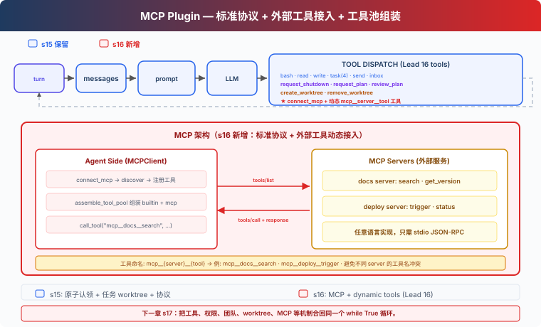

# s16: MCP Tools — 外接工具，标准协议

[English](README.md) · [中文](README.zh.md) · [日本語](README.ja.md)

[s15](../s15_agent_teams/) → `s16` → [s17](../s17_integrated_harness/) → s18 → s19

> *"外接工具, 标准协议"* — 发现、组装、调用，Agent 不需要知道工具是谁写的。
>
> **Harness 层**: 插件 — 外部能力通过标准协议接入。

---

## 问题

s01 到 s15，Agent 的所有工具都是手写的，包括 bash、read、write、task 和 worktree。每个工具的输入验证、执行逻辑、错误处理，都是你一行行写的。

现在你有 3 个外部服务想接入：公司的 Jira API（查 issue、建 ticket）、自建的部署系统（触发 deploy、看日志）、团队的 Notion 知识库（搜文档、建页面）。你不想为每个服务重写一套工具代码。

你需要一个标准协议。外部服务只要实现它，Agent 就能直接调用，不管服务用什么语言写的。

---

## 解决方案



MCP（Model Context Protocol）定义了 Agent 如何发现和调用外部工具。核心概念：

| 概念 | 作用 |
|------|------|
| MCPClient | Agent 端的客户端，连接 server、发现工具、调用工具 |
| MCP Server | 外部服务，实现 `tools/list` + `tools/call` |
| assemble_tool_pool | 把内置工具和 MCP 工具组装成一个工具池 |
| mcp\_\_server\_\_tool 命名 | 避免不同 server 的工具名冲突 |

本章建立在 s15 团队运行时之上，沿用 idle 阶段的原子任务认领、可在重启后恢复的 task-worktree 绑定，以及只对当前 assignment 生效的计划审批。后台 bash 会把非零退出报告为失败，并在任务结束时停止命令原来的进程组；durable 的一次性 cron 任务会先持久化为待投递，再进入队列，并一直保留到包含该 prompt 的模型调用成功。新增的 `connect_mcp` 工具用于连接服务、发现工具并加入工具池。

task-bound worktree 只会改变队友文件工具的默认工作目录，并不是安全沙箱。

Worktree 移除不对模型开放。用户或宿主先检查任务、assignment、后台进程和 Git 状态，再调用清理函数。丢弃改动仍是用户手动执行的 Git 操作，或者宿主在明确确认后执行的操作。

本章注册进程内 server handler，让工具发现和调用流程可以离线运行。每个 handler 都提供客户端需要的 `tools/list` 和 `tools/call` 两个操作。

---

## 工作原理

### MCPClient：发现 + 调用

```python
class MCPClient:
    def __init__(self, name: str):
        self.name = name
        self.tools: list[dict] = []
        self._handlers: dict[str, callable] = {}

    def register(self, tool_defs, handlers):
        """Simulates tools/list discovery."""
        self.tools = tool_defs
        self._handlers = handlers

    def call_tool(self, tool_name: str, args: dict) -> str:
        """Simulates tools/call."""
        handler = self._handlers.get(tool_name)
        if not handler:
            return f"MCP error: unknown tool '{tool_name}'"
        return handler(**args)
```

注册的 Python 函数提供 `tools/call` 所调用的 server 端工具实现。

### connect_mcp：连接 + 发现

```python
def connect_mcp(name: str) -> str:
    if name in mcp_clients:
        return f"MCP server '{name}' already connected"
    factory = MOCK_SERVERS.get(name)
    if not factory:
        return f"Unknown server '{name}'. Available: ..."
    mcp_client = factory()
    mcp_clients[name] = mcp_client
    return f"Connected to '{name}'. Discovered: ..."
```

连接后，server 提供的工具立即可用。

### normalize_mcp_name：名称规范化

```python
_DISALLOWED_CHARS = re.compile(r'[^a-zA-Z0-9_-]')

def normalize_mcp_name(name: str) -> str:
    return _DISALLOWED_CHARS.sub('_', name)
```

所有非 `[a-zA-Z0-9_-]` 的字符替换为 `_`。防止 server 名或工具名中包含特殊字符导致命名冲突或注入问题。

### assemble_tool_pool：组装工具池

```python
def assemble_tool_pool() -> tuple[list[dict], dict]:
    tools = list(BUILTIN_TOOLS)
    handlers = dict(BUILTIN_HANDLERS)
    for server_name, mcp_client in mcp_clients.items():
        safe_server = normalize_mcp_name(server_name)
        for tool_def in mcp_client.tools:
            safe_tool = normalize_mcp_name(tool_def["name"])
            prefixed = f"mcp__{safe_server}__{safe_tool}"
            tools.append(...)
            handlers[prefixed] = (
                lambda *, c=mcp_client, t=tool_def["name"], **kw:
                    c.call_tool(t, kw))
    return tools, handlers
```

前缀 `mcp__{server}__{tool}` 用于分隔不同 server 的工具，名称再经过 `normalize_mcp_name` 规范化。不同原始名称仍可能得到同一个前缀，因此 `assemble_tool_pool()` 会拒绝冲突，而不是静默覆盖先注册的 handler。

MCP 工具的 description 带 `(readOnly)` 或 `(destructive)` 标注，让只读操作和修改操作在工具元数据中直接可见。

### 无缓存：工具池变了，prompt 也变

s10-s15 的 agent loop 用 prompt cache 避免重复序列化。s16 去掉了缓存：

```python
def agent_loop(messages, context):
    tools, handlers = assemble_tool_pool()     # 每次重新构建
    system = assemble_system_prompt(context)    # 每次重新生成
    ...
    if any(b.name == "connect_mcp" ...):
        tools, handlers = assemble_tool_pool()  # 连接后重建
        system = assemble_system_prompt(context)
```

`connect_mcp` 之后，工具池会新增 `mcp__docs__search` 等条目。继续复用旧的序列化工具列表，模型就看不到这些工具，所以每次连接后都要重建工具池和 system prompt。

### MCP 工具只有 Lead 可用

`connect_mcp` 属于 Lead，`assemble_tool_pool` 也服务于 Lead 的 agent loop。Teammate 保留任务、文件、消息和计划工具；Lead 调用外部服务后把工作放入共享任务板，idle 队友再进行原子认领。

---

## 相对 s15 的变更

| 组件 | 之前 (s15) | 之后 (s16) |
|------|-----------|-----------|
| 工具来源 | 全部手写 builtin | 手写 + MCP 外部工具动态发现 |
| 工具池 | 固定 BUILTIN_TOOLS | assemble_tool_pool 动态组装 mcp\_\_ 前缀工具 |
| 名称安全 | 无 | normalize_mcp_name 规范化 |
| 新类型 | — | MCPClient 类（模拟 tools/list + tools/call） |
| 命名空间 | — | mcp\_\_server\_\_tool 避免冲突 |
| 工具描述 | 无标注 | (readOnly)/(destructive) 标注 |
| prompt 缓存 | 有（s10 起） | 去掉，因为工具池动态变化后缓存失效 |
| 已有运行时 | task、cron、后台 bash、团队与 worktree | 全部保留 |
| Lead 工具 | cron、后台、worktree 与团队工具 | + connect_mcp 和动态发现的 MCP 工具 |
| Teammate 工具 | 任务、文件、消息与计划工具 | 不变 |
| 扩展方式 | 写代码加工具 | 标准协议，任意语言实现 server |

---

## 试一下

```sh
cd learn-claude-code
python s16_mcp_plugin/code.py
```

试试这些 prompt：

1. `查一下文档里的 worktree 清理策略。`
2. `部署当前项目，并告诉我结果。`
3. `你现在可以执行哪些文档和部署操作？`

观察重点：连接 MCP server 后，工具名是否带 `mcp__docs__` 或 `mcp__deploy__` 前缀？两个 server 的工具是否同时可用？MCP 工具的 description 是否带 (readOnly)/(destructive) 标注？

---

## 接下来

现在 Agent 可以通过标准协议接入外部工具了。前 16 章逐个引入这些机制，让每个边界都能单独观察。

工具、权限、hooks、todo、任务图、记忆、压缩、后台、cron、团队、worktree、MCP 这些机制应该挂在同一个循环上，而不是分散在不同示例里。

[s17 Agent Harness 集成](../s17_integrated_harness/) → 把 s01-s16 的机制合回同一个 harness。机制很多，循环一个。


<!-- translation-sync: zh@v7, en@v7, ja@v7 -->
