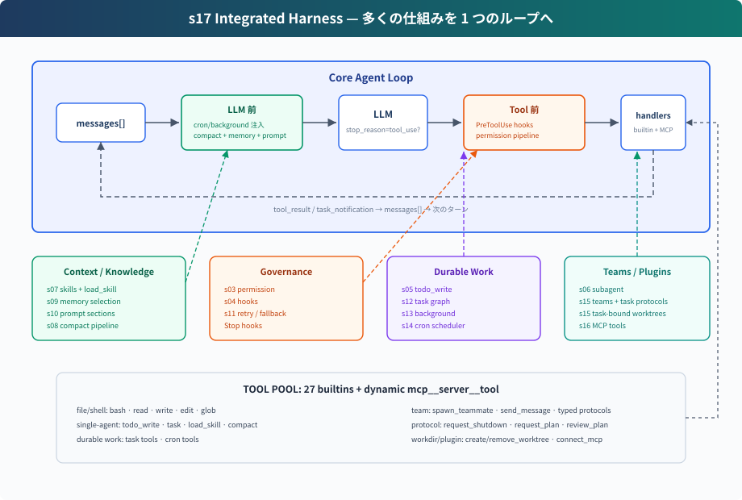

# s17: Integrated Harness — 多くの仕組みを 1 つのループへ

[English](README.md) · [中文](README.zh.md) · [日本語](README.ja.md)

s01 → ... → s15 → [s16](../s16_mcp_plugin/) → `s17` → [s18](../s18_workflow_runtime/) → s19

> *"仕組みは多い、ループは 1 つ"* — tools、permissions、memory、tasks、teams、plugins はすべて同じ `while True` に接続される。
>
> **Harness レイヤー**: 統合 — s01-s16 の仕組みを 1 つの実行可能なシステムへ戻す。

---

## 問題

前 16 章では、各境界を観察できるように仕組みを一つずつ追加した。本章では、それらを一つのランタイムへ接続する。

長時間動く coding agent には、同時に次のものが必要になる：

- tool dispatch と permission boundary
- hook extension point
- todo plan と task graph
- skill、memory、runtime system prompt assembly
- compaction と error recovery
- background task と cron scheduling
- team、protocol、autonomous claiming
- task-bound worktree
- MCP external tool integration

難しいのは機能を積み上げることではない。それぞれの仕組みが loop のどこに接続されるかを見抜くことだ。S17 は統合チェックポイントであり、これまでの component を 1 つの harness に戻してから、s18-s19 が編成と目標完了を外側に追加する。

---

## 解決策



S17 は新しい mechanism を追加せず、前章までの component を同じ harness に統合する：

```text
user input
  → UserPromptSubmit hooks
  → cron/background notification injection
  → context compact
  → memory + skills + MCP state で system prompt を組み立てる
  → LLM
  → has tool_use block?
      no  → Stop hooks → return
      yes → PreToolUse hooks + permission
          → TOOL_HANDLERS / MCP handlers / background dispatch
          → PostToolUse hooks
          → tool_result / task_notification を messages へ戻す
          → next round
```

loop 自体は同じ構造のままだ。model を呼び、response に `tool_use` block があるかを見て、tool を実行し、結果を `messages` に戻す。tool 実行を続けるかどうかは、実際の `tool_use` block の有無で決まる。

---

## 各 Component の位置

| 位置 | Component | 役割 |
|------|-----------|------|
| user input 周辺 | `UserPromptSubmit` hooks | user input の記録、注入、監査 |
| LLM 前 | cron queue | scheduled prompt を `messages` へ注入 |
| LLM 前 | background notifications | 完了した background work を `<task_notification>` として注入 |
| LLM 前 | compaction pipeline | 大きな出力を予算化し、履歴を切り、古い tool_result を圧縮し、必要なら要約 |
| LLM 前 | memory / skills / MCP state | current capabilities と long-term context を system prompt に組み込む |
| LLM call | error recovery | 429/529 retry、`max_tokens` escalation、prompt-too-long compact |
| tool 実行前 | `PreToolUse` hooks + permission | 危険な command、範囲外 write、destructive MCP tool を止める |
| tool dispatch | `assemble_tool_pool` | built-in tools と dynamic MCP tools を組み立てる |
| tool 実行中 | background dispatch | 遅い bash work を daemon thread に逃がし、placeholder result を返す |
| tool 実行後 | `PostToolUse` hooks | large-output warning、log、後処理 |
| loop へ戻る | tool_result | 1 つの `tool_use` に 1 つの `tool_result`、そして次の model round |
| tool_use がない round / stop 時 | `Stop` hooks | 統計、cleanup、audit |

---

## code.py に含まれるもの

### Tools と Dispatch

built-in tool pool には 25 個の tool がある：

```text
bash, read_file, write_file, edit_file, glob
todo_write, task, load_skill, compact
create_task, list_tasks, get_task, claim_task, complete_task
schedule_cron, list_crons, cancel_cron
spawn_teammate, send_message
request_shutdown, request_plan, review_plan
create_worktree, remove_worktree
connect_mcp
```

`assemble_tool_pool()` は毎 round で次を組み立てる：

```text
BUILTIN_TOOLS + connected MCP tools
BUILTIN_HANDLERS + mcp__server__tool handlers
```

`connect_mcp("docs")` のあと、次の round では `mcp__docs__search` のような tool が出現する。

### Permission と Hooks

permission は tool 実行行に直接埋め込まない。`PreToolUse` hook として扱う：

```python
blocked = trigger_hooks("PreToolUse", block)
if blocked:
    results.append(tool_result(block.id, blocked))
    continue
```

これにより permission、logging、audit が同じ hook point に接続できる。Lead、one-shot subagent、teammate の tool はすべて先に `PreToolUse` を通り、許可された call は handler 実行後に `PostToolUse` を通る。

MCP tool では discovery metadata を確認し、`(readOnly)` と示された tool はそのまま実行する。mutating または分類されていない tool は先に user へ確認する。

### Plan と Task

S17 には 2 層の plan がある：

- `todo_write`: current session 用の軽量 plan。メモリに保持。
- task graph: cross-session、dependency-aware、claimable な task file。`.tasks/task_*.json` に保存。

前者は単独 agent の drift を防ぐ。後者は team coordination の土台になる。

目的は近いが実装は別である。`todo_write` は現在のセッションのチェックリスト全体を置き換え、task record は安定 ID と個別のライフサイクル更新を持つ。次節の独立した `task` ツールは「隔離 subagent を一度派遣する」意味であり、Task System ではない。

### Subagent と Team

S17 には 2 種類の delegation がある：

- `task`: one-shot subagent。独立した `messages[]` を使い、中間 context を捨て、final summary だけ返す。
- `spawn_teammate`: persistent teammate thread。固定の tool round 上限なしで `WORK → result → IDLE` を続ける。model または dispatch の失敗は `error` を送り、thread cleanup は未完了 assignment を task board へ戻す。idle 中はまず `MessageBus` を待ち、timeout 後だけ ready task を scan して最大 1 件を atomic に claim する。

one-shot subagent は context isolation を解決する。persistent teammate は長期並列協作を解決する。

### Memory、Skills、Prompt

`assemble_system_prompt(context)` は毎 round 次を組み立てる：

- identity と tool guidance
- workspace
- skills catalog
- `.memory/MEMORY.md`
- connected MCP servers

skills は system prompt には catalog だけ置く。全文は `load_skill(name)` で必要な時に読む。

### Compaction と Recovery

LLM call の前に compaction pipeline を走らせる：

```text
tool_result_budget → snip_compact → micro_compact → compact_history
```

model call は recovery で包む：

- 429: exponential backoff retry
- 529: exponential backoff、連続失敗時は fallback model へ切替可能
- `max_tokens`: max tokens を上げ、その後 continuation を要求
- prompt too long: reactive compact 後に retry

### Background と Cron

遅い bash work は main loop を止めない：

```text
should_run_background → start_background_task → placeholder tool_result
background done → task_notification → next round injects messages
```

cron scheduler は daemon thread として動き、1 秒ごとに確認する。CLI は `cron_queue`、Lead inbox、完了済み background work を監視し、どの event からでも Agent を 1 turn 自動で起動する。

### Worktree と MCP

s15 から継承した task-scoped worktree は working directory を管理する：

- pending かつ unowned の task は main workspace のままでもよく、`create_worktree(name, task_id)` で別々の branch と directory に紐付けることもできる
- 作成前に task、name、path、branch、Git registry を検証する。Git command が失敗した後も registry と branch state を照合し、部分的に作成された checkout は未紐付けのまま manual recovery 用に保持する
- idle teammate は ready task を 1 つ atomic に claim し、assignment は `task_id` と effective `cwd` の両方を保持する
- teammate のすべての file tool はその `cwd` を使い、task owner だけが task を complete して assignment を解除できる
- モデル向けの `remove_worktree(name)` tool は unfinished task の binding を拒否し、clean checkout だけを削除する。tracked、untracked、ignored file はすべて削除を止める。破壊的な削除は host の操作として別途 user confirmation を必要とする。成功後は binding を解除して branch を保持し、checkout 削除後の unbind 永続化が失敗した場合は manual recovery 用の partial success を返す

worktree は tool の default working directory を変更して working copy を分離するだけで、sandbox ではない。

MCP は external capability を担当する：

- `connect_mcp(name)` が mock server に接続する
- `assemble_tool_pool()` が MCP tools を tool pool に組み立て、正規化後の名前衝突を拒否する
- tool name は `mcp__server__tool` 形式に統一する

---

## s16 からの変化

| Component | s16 MCP | s17 Integrated Harness |
|-----------|-----|-----|
| tool pool | built-in + MCP | built-in + MCP、s01-s15 の mechanism を補完 |
| permission | s16 の focus 外 | `PreToolUse` hook で実行 |
| hooks | s16 の focus 外 | UserPromptSubmit / PreToolUse / PostToolUse / Stop |
| todo | s16 の focus 外 | `todo_write` + reminder |
| skill | s16 の focus 外 | system prompt の catalog + `load_skill` |
| compact | s16 の focus 外 | LLM 前 compaction + `compact` tool + reactive compact |
| error recovery | simple try/except | retry / max_tokens / prompt too long |
| background | s16 の focus 外 | slow-operation thread + task notification |
| cron | s16 の focus 外 | daemon scheduler + durable jobs |
| multi-agent | s15 から継承 | atomic task ownership と task-scoped `cwd` を維持 |
| worktree | task の optional binding | safe create/remove semantics を維持 |
| MCP | 新規 | integrated tool pool の一部として維持 |

---

## 試す

```sh
cd learn-claude-code
python s17_integrated_harness/code.py
```

試す prompt：

1. `このリポジトリを調べ、重要な Python ファイルを教えてください。`
2. `接続済みのドキュメントから agent loop の説明を探してください。`
3. `認証モジュールとログインページを隔離した worktree で並行してリファクタリングし、編集前にそれぞれのプランを見せてください。`
4. `3 分後に会議を知らせてください。`
5. `依存関係をバックグラウンドでインストールしながら README.md を読んでください。`

見るポイント：

- tool call の前に hooks/permission を通るか
- `connect_mcp` 後の次 round で MCP tool が出るか
- 遅い operation が background placeholder を返すか
- cron が時刻到達時に自動で reminder を返すか
- teammate が plan を提出し、approval 前に停止するか
- idle teammate が ready task を 1 つだけ atomic に claim するか
- teammate のすべての file tool が claimed task の `cwd` へ切り替わるか
- task owner だけが complete して assignment を解除できるか

---

## 終わりは始まり

s01 から s17 まで、コードの能力は増えていく。しかし中心は変わらない：

```python
while True:
    response = LLM(messages, tools)
    if not has_tool_use(response.content):
        return
    results = execute_tools(response.content)
    messages.append(tool_results)
```

成熟した harness の複雑さは model 周辺の協調機構から生まれる。model は判断と action selection を担当し、harness は environment、tools、permissions、memory、teams、external capabilities を整理する。

これは本コースの統合チェックポイントだ：仕組みは多い、ループは 1 つ。

次へ：[s18 Workflow Runtime](../s18_workflow_runtime/) — 編成の形が固定なら、多数の会話ターンではなく、決定的で再開可能なコードへ移す。

<!-- translation-sync: zh@v3, en@v3, ja@v3 -->
