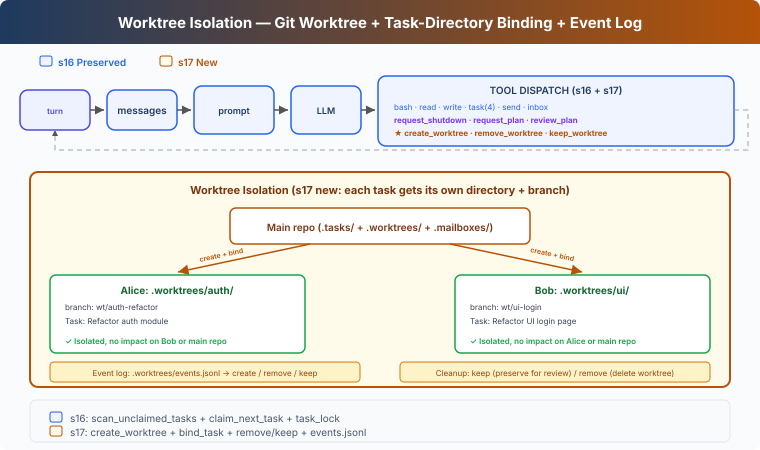

# s17: Worktree Isolation — Separate Directories, No Conflicts

[English](README.md) · [中文](README.zh.md) · [日本語](README.ja.md)

s01 → ... → s15 → s16 → `s17` → [s18](../s18_mcp_plugin/) → s19 → s20 → s21

> *"Separate directories, no conflicts"* — Tasks own the goal, worktrees own the directory, bound by ID.
>
> **Harness Layer**: Isolation — Parallel execution in separate directories.

---

## The Problem

In s16, Alice and Bob both work in the same directory. Alice's task is "refactor auth module", Bob's task is "refactor UI login page".

Alice calls `write_file("config.py", ...)`. Bob also calls `write_file("config.py", ...)`. Both edit the same file, overwriting each other. And there's no clean rollback — you can't tell whose changes are whose.

s15-s16 solved "who does what" (task system) and "how to communicate" (message bus), but not "where to work".

---

## The Solution



Git worktree lets you create multiple independent working directories in the same repo, each with its own branch. Alice works in `.worktrees/auth-refactor/`, Bob in `.worktrees/ui-login/` — no conflicts.

Carries forward s16's MessageBus, protocols, and autonomous claiming. This chapter adds:

| Capability | Purpose |
|------------|---------|
| create_worktree | Create isolated directory + branch for a task |
| bind_task_to_worktree | Bind task and directory (no status change) |
| remove_worktree / keep_worktree | Cleanup or preserve after completion |
| validate_worktree_name | Reject path traversal and illegal characters |

---

## How It Works

### Creation: Task-Worktree Binding

```python
def create_worktree(name: str, task_id: str = "") -> str:
    validate_worktree_name(name)       # Only [A-Za-z0-9._-]{1,64}
    path = WORKTREES_DIR / name
    ok, result = run_git(["worktree", "add", str(path), "-b", f"wt/{name}", "HEAD"])
    if not ok:
        return f"Git error: {result}"
    if task_id:
        bind_task_to_worktree(task_id, name)
    log_event("create", name, task_id)
    return f"Worktree '{name}' created at {path}"

def bind_task_to_worktree(task_id: str, worktree_name: str):
    task = load_task(task_id)
    task.worktree = worktree_name       # Write worktree field only
    save_task(task)                     # Status stays pending, waits for teammate claim
```

Binding rule: one task binds to one worktree. Binding does NOT change task status — the task stays `pending`, and advances to `in_progress` only when a teammate claims it. This way Lead can pre-create tasks and worktrees, and teammates naturally claim worktree-bound tasks during idle.

### Teammate Tool Cwd Switching

Each teammate keeps a `wt_ctx` dictionary with its current worktree path. When a teammate claims a task bound to a worktree, the runtime updates `wt_ctx`; that teammate's `bash`, `read_file`, and `write_file` calls then run in the worktree directory:

```python
# Inside teammate thread
wt_ctx = {"path": None}

def _run_claim_task(task_id):
    result = claim_task(task_id, owner=name)
    if "Claimed" in result:
        task = load_task(task_id)
        if task.worktree:
            wt_ctx["path"] = str(WORKTREES_DIR / task.worktree)
    return result

def _run_bash(command):
    return run_bash(command, cwd=wt_ctx["path"])  # Execute in worktree
```

### Cleanup: Keep or Remove

After task completion, two choices:

```python
def remove_worktree(name: str, discard_changes: bool = False) -> str:
    # Safety check: refuse by default if changes exist
    if not discard_changes:
        files, commits = _count_worktree_changes(path)
        if files > 0 or commits > 0:
            return "Has uncommitted changes. Use discard_changes=true to force, or keep_worktree"
    ok, _ = run_git(["worktree", "remove", str(path), "--force"])
    if not ok:
        return "Remove failed"
    run_git(["branch", "-D", f"wt/{name}"])
    log_event("remove", name)

def keep_worktree(name: str) -> str:
    log_event("keep", name)
    return f"Worktree '{name}' kept for review (branch: wt/{name})"
```

Keep = preserve branch for manual review and merge. Remove = refuse by default if uncommitted changes; requires `discard_changes=true` to confirm. Does NOT auto-complete task — task completion is triggered explicitly by the teammate's `complete_task`.

### Event Log: Auditable

Each lifecycle operation writes to a log for auditing:

```python
def log_event(event_type: str, worktree_name: str, task_id: str = ""):
    event = {"type": event_type, "worktree": worktree_name,
             "task_id": task_id, "ts": time.time()}
    # append to .worktrees/events.jsonl
```

Event types are `create`, `remove`, and `keep`. The log supports manual auditing; a recovery flow can rebuild the current set from `git worktree list`.

### run_git: Returns Success/Failure

```python
def run_git(args: list[str]) -> tuple[bool, str]:
    r = subprocess.run(["git"] + args, cwd=WORKDIR, ...)
    return r.returncode == 0, output
```

`create_worktree` and `remove_worktree` only write event logs after successful git commands, ensuring logs reflect actual state.

---

## Changes from s16

| Component | Before (s16) | After (s17) |
|-----------|-------------|-------------|
| Working directory | All agents share WORKDIR | Each task can bind to a git worktree |
| Task data | id/subject/status/owner/blockedBy | + worktree field |
| Teammate tool cwd | Always WORKDIR | Auto-switches when claiming worktree-bound task |
| New functions | — | create_worktree, bind_task_to_worktree, remove_worktree, keep_worktree, validate_worktree_name |
| Worktree safety | None | Name validation + refuse removal with changes |
| Event log | None | events.jsonl lifecycle auditing |
| Lead tools | Team and task tools | + create_worktree, remove_worktree, keep_worktree |
| Teammate tools | Task and file tools | Same tools; bash/read/write use the claimed worktree cwd |

---

## Try It

```sh
cd learn-claude-code
python s17_worktree_isolation/code.py
```

Try this prompt:

`Refactor the authentication module and the login page in parallel without letting the changes interfere with each other.`

What to observe: Do both worktrees show different branches in `git status`? After claiming a worktree-bound task, does the teammate's bash run in the worktree directory? Does `remove_worktree` refuse when there are changes? Is task status still `pending` after binding?

---

## What's Next

Agent teams can now self-organize in isolated workspaces. But Agent capabilities are limited to the tools we wrote — bash, read, write, task...

What if users already have their own tools? Like an internal Jira API, or a custom deployment system?

s18 MCP Plugin → Give Agent a plugin system. External tools connect via standard protocol; Agent doesn't need to know who wrote them.


<!-- translation-sync: zh@v1, en@v1, ja@v0 -->
