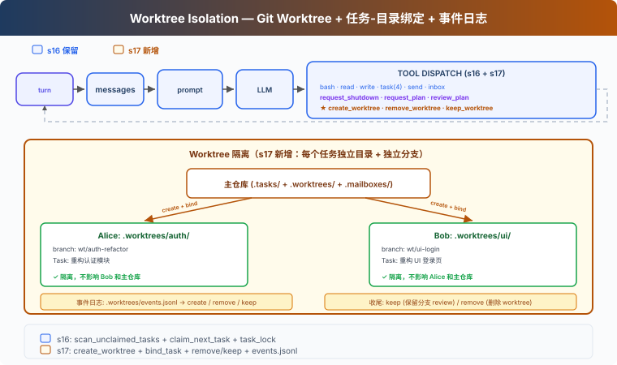

# s17: Worktree Isolation — 各干各的，互不干扰

[English](README.md) · [中文](README.zh.md) · [日本語](README.ja.md)

s01 → ... → s15 → s16 → `s17` → [s18](../s18_mcp_plugin/) → s19 → s20 → s21

> *"各干各的目录, 互不干扰"* — 任务管目标, worktree 管目录, 按 ID 绑定。
>
> **Harness 层**: 隔离 — 并行执行的目录隔离。

---

## 问题

s16 中，Alice 和 Bob 都在同一个目录下工作。Alice 的任务是"重构认证模块"，Bob 的任务是"重构 UI 登录页"。

Alice `write_file("config.py", ...)`。Bob 也 `write_file("config.py", ...)`。两个人改同一个文件，互相覆盖。而且无法干净地回滚——分不清哪些改动是谁的。

s15-s16 解决了"谁干什么"（任务系统）和"怎么通信"（消息总线），但没解决"在哪干"。

---

## 解决方案



Git worktree 让你在同一仓库中创建多个独立的工作目录，每个有自己的分支。Alice 在 `.worktrees/auth-refactor/` 下工作，Bob 在 `.worktrees/ui-login/` 下工作——互不干扰。

沿用 s16 的 MessageBus、协议和自治认领机制。本章新增：

| 能力 | 作用 |
|------|------|
| create_worktree | 为任务创建独立目录 + 独立分支 |
| bind_task_to_worktree | 把任务和工作目录绑定（不改状态） |
| remove_worktree / keep_worktree | 完成后清理或保留 |
| validate_worktree_name | 拒绝路径穿越和非法字符 |

---

## 工作原理

### 创建：任务-Worktree 绑定

```python
def create_worktree(name: str, task_id: str = "") -> str:
    validate_worktree_name(name)       # 只允许 [A-Za-z0-9._-]{1,64}
    path = WORKTREES_DIR / name
    ok, result = run_git(["worktree", "add", str(path), "-b", f"wt/{name}", "HEAD"])
    if not ok:
        return f"Git error: {result}"
    if task_id:
        bind_task_to_worktree(task_id, name)
    log_event("create", name, task_id)
    return f"Worktree '{name}' created at {path}"

def bind_task_to_worktree(task_id: str, worktree_name: str):
    task = load_task(task_id)
    task.worktree = worktree_name       # 只写 worktree 字段
    save_task(task)                     # 状态保持 pending，等队友 claim
```

绑定规则：一个任务绑定一个 worktree。绑定不改任务状态——任务仍是 `pending`，队友自动认领时才推进到 `in_progress`。这样 Lead 可以提前创建任务和 worktree，队友 idle 时自然认领带 worktree 的任务。

### 队友工具的 cwd 切换

每个队友都有一个 `wt_ctx` 字典，用来记录当前 worktree 路径。队友认领绑定了 worktree 的任务后，运行时会更新 `wt_ctx`；该队友的 `bash`、`read_file`、`write_file` 随后都在对应的 worktree 目录下执行：

```python
# 队友线程内部
wt_ctx = {"path": None}

def _run_claim_task(task_id):
    result = claim_task(task_id, owner=name)
    if "Claimed" in result:
        task = load_task(task_id)
        if task.worktree:
            wt_ctx["path"] = str(WORKTREES_DIR / task.worktree)
    return result

def _run_bash(command):
    return run_bash(command, cwd=wt_ctx["path"])  # 在 worktree 下执行
```

### 收尾：Keep 还是 Remove

任务完成后，两个选择：

```python
def remove_worktree(name: str, discard_changes: bool = False) -> str:
    # 安全检查：有改动时默认拒绝
    if not discard_changes:
        files, commits = _count_worktree_changes(path)
        if files > 0 or commits > 0:
            return "有未提交改动，使用 discard_changes=true 强制删除，或 keep_worktree 保留"
    ok, _ = run_git(["worktree", "remove", str(path), "--force"])
    if not ok:
        return "删除失败"
    run_git(["branch", "-D", f"wt/{name}"])
    log_event("remove", name)

def keep_worktree(name: str) -> str:
    log_event("keep", name)
    return f"Worktree '{name}' kept for review (branch: wt/{name})"
```

Keep = 留着分支，等人工 review 后合并到主分支。Remove = 有改动时默认拒绝，需要 `discard_changes=true` 确认。不自动 complete task——任务完成由队友的 `complete_task` 显式触发。

### 事件流：可审计

每次生命周期操作写入日志，方便排查：

```python
def log_event(event_type: str, worktree_name: str, task_id: str = ""):
    event = {"type": event_type, "worktree": worktree_name,
             "task_id": task_id, "ts": time.time()}
    # append to .worktrees/events.jsonl
```

事件类型包括 `create`（创建）、`remove`（删除）和 `keep`（保留）。日志用于人工排查；恢复流程可以通过 `git worktree list` 重建当前 worktree 集合。

### run_git：返回成功/失败

```python
def run_git(args: list[str]) -> tuple[bool, str]:
    r = subprocess.run(["git"] + args, cwd=WORKDIR, ...)
    return r.returncode == 0, output
```

`create_worktree` 和 `remove_worktree` 只在 git 命令成功后才写事件日志，保证日志反映真实状态。

---

## 相对 s16 的变更

| 组件 | 之前 (s16) | 之后 (s17) |
|------|-----------|-----------|
| 工作目录 | 所有 Agent 共享 WORKDIR | 每个任务可绑定独立 git worktree |
| Task 数据 | id/subject/status/owner/blockedBy | + worktree 字段 |
| 队友工具 cwd | 始终 WORKDIR | 认领带 worktree 的任务时自动切换 |
| 新函数 | — | create_worktree, bind_task_to_worktree, remove_worktree, keep_worktree, validate_worktree_name |
| worktree 安全 | 无 | name 校验 + 有改动时拒绝删除 |
| 事件日志 | 无 | events.jsonl 生命周期审计 |
| Lead 工具 | 团队与任务工具 | + create_worktree、remove_worktree、keep_worktree |
| 队友工具 | 任务与文件工具 | 工具不变，bash/read/write 使用已认领任务的 worktree cwd |

---

## 试一下

```sh
cd learn-claude-code
python s17_worktree_isolation/code.py
```

试试这个 prompt：

`请并行重构认证模块和登录页面，确保两部分改动不会互相干扰。`

观察重点：两个 worktree 的 `git status` 输出是否显示不同的分支？队友认领带 worktree 的任务后，bash 命令是否在 worktree 目录下执行？`remove_worktree` 对有改动的 worktree 是否拒绝？`.tasks/` 中的任务在绑定后状态是否仍为 `pending`？

---

## 接下来

Agent 团队能在隔离的工作空间中自组织了。但 Agent 的能力受限于我们给它写的工具——bash、read、write、task...

如果用户已经有了自己的工具怎么办？比如一个公司内部的 Jira API、一个自建的部署系统？

s18 MCP Plugin → 给 Agent 装一个插件系统。外部工具通过标准协议接入，Agent 不需要知道它们是谁写的。


<!-- translation-sync: zh@v1, en@v0, ja@v0 -->
