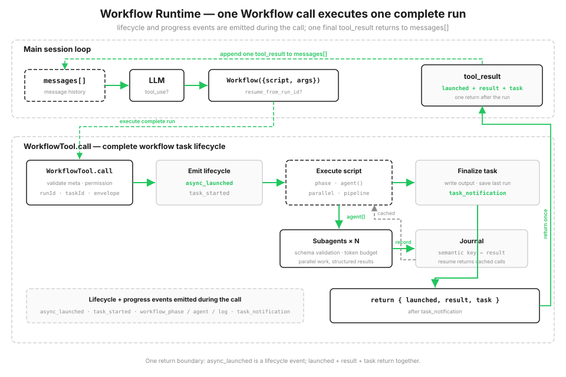

# s18: Workflow Runtime — モデルが単一 step を決め、script が orchestration を決める

[English](README.md) · [中文](README.zh.md) · [日本語](README.ja.md)

s01 → ... → s16 → [s17](../s17_integrated_harness/) → `s18` → [s19](../s19_goal_loop/)

> *「1 回の tool_use で、一式の orchestration を実行する」* — `Workflow` ツールが決定的で復元可能な script runtime を起動し、多数の subagent をまとめて送り出します。
>
> **Harness 層**: Orchestration — single-agent loop の上に、決定的な multi-agent script runtime を追加します。

---

s01 から s17 まで、loop は常にモデル駆動で 1 step ずつ進みました。各ラウンドでモデルが 1 つのツールを選び、結果を `messages[]` へ入れ、次のラウンドへ進みます。open-ended なタスクには最適です。次に何をするかを、モデルが context を見てその場で決められます。

しかし、複数の Agent を決定的に指揮したい仕事もあります。大きな変更の review を考えてください。10 の観点から並行して問題を探す → 各 finding へ別 Agent を送り adversarial verification を行う → 結果を集約して重複を除く → severity 順に並べる。この流れの形は固定されており、本当に必要なのは 3 つです。

- **並行性**: 1 件ずつ順番に待たないこと。
- **決定性**: 同じ入力から同じ結果構造が得られること。
- **復元可能性**: 途中で止まっても、完了済みの部分を最初からやり直さないこと。

この流れをモデルに main loop で 1 ラウンドずつ動かさせると、遅く、結果は不確定で、中断すれば最初からです。ここで必要なのは「もう 1 turn 話す」ことではなく、orchestration をそのままコードにすることです。

## 計画は chat のラウンドを重ねず、コードに書く

harness の tool pool に `Workflow` ツールを追加します。ユーザーまたはモデルが渡す script は、`agent() / parallel() / pipeline() / phase()` という少数の primitive を使い、orchestration を決定的なコードとして表します。

main loop から見えるのは 1 回の `tool_use` だけです。script の実行中、runtime は lifecycle event と progress event を出し、各 step をディスク上の journal へ記録します。script が終わると、この call は launch 情報、result、task state を返します。script の中間結果は変数に保存され、会話履歴の場所を取りません。`resume_from_run_id` で再開すると、変更されていない `agent()` は journal cache に当たり、以前の結果を直接使って checkpoint から続行します。



```python
SAMPLE_META = {"name": "review-changes", "description": "コード変更を review", "phases": ["Review", "Verify"]}

async def sample_workflow(ctx, args):
    ctx.phase("Review")
    results = await ctx.pipeline(DIMENSIONS, audit, verify)   # 各 dimension が独立して audit → verify を通る
    confirmed = [f for r in results if r for f in r["confirmed"]]
    ctx.log(f"{len(confirmed)} 件の実在する問題を確認")
    return {"confirmed": confirmed}
```

## Workflow ツール: 1 回の call で run 全体を実行する

`Workflow` は main Agent の tool pool にあります。ユーザーが保存済み workflow の実行を求めるか、タスクが既知の orchestration に一致したときにモデルがこのツールを選びます。どちらも 1 回の `Workflow(...)` tool call になります。

ツールは argument を parse し、meta 情報を検証し、permission check を通し、local workflow task を登録して、script の実行前に `async_launched` を出します。その後に progress event と最後の `task_notification` が続き、call は launch 情報、result、task state を返します。

```python
class WorkflowTool:
    async def call(self, meta, script_fn, args=None, resume_from_run_id=None):
        validate_meta(meta)
        check_permission(meta)
        run_id = resume_from_run_id or create_run_id(meta)
        task = LocalWorkflowTask(create_task_id(run_id), run_id, meta)
        task.event("async_launched", runId=run_id, taskId=task.task_id)
        ...
        result = await script_fn(ctx, args)
        task.event("task_notification", status=task.status)
        return {"launched": launched, "result": result, "task": task}
```

## Workflow metadata: 起動前に検証する

各 workflow は `name`、`description`、任意の `phases` を持つ metadata object を登録します。runtime は workflow code を実行する前に検証します。`name` と `description` は task と UI の表示に使い、`phases` は progress bar の group 名を定義します。

不正な入力はすぐ `WorkflowInputError` になり、登録時に止まります。s14 の cron 式検証と同じ考えです。不正な script が実行時まで進んでから壊れないようにします。

runtime は `meta.name` をローカル artifact のファイル名に使うため、英数字で始まり、英数字、`.`、`_`、`-` のみからなる 1-64 文字の安全な slug も要求する。

```python
def validate_meta(meta):
    if not isinstance(meta, dict):
        raise WorkflowInputError("meta は object literal でなければなりません")
    if not meta.get("name") or not meta.get("description"):
        raise WorkflowInputError("meta には name と description が必要です")
    if not isinstance(meta["name"], str) or not WORKFLOW_NAME_RE.fullmatch(meta["name"]):
        raise WorkflowInputError("meta.name は安全な 1-64 文字の slug が必要です")
    if "phases" in meta and (
        not isinstance(meta["phases"], list)
        or not all(isinstance(p, str) and p for p in meta["phases"])
    ):
        raise WorkflowInputError("meta.phases は空でない文字列だけを含む必要があります")
    return meta
```

## Orchestration primitive: この少数だけで、すべての flow を書ける

script は独立した context で動き、global variable として使えるのは少数の orchestration primitive だけです。script 自身はファイルを直接読み書きせず、shell も実行しません。実際のコード操作は、派遣された subagent が自分の tool permission で行います。primitive はすべて `ExecutionState` の method です。

| Primitive | 役割 |
|------|------|
| `agent(prompt, {schema, label, phase})` | 1 つの subagent を派遣 |
| `parallel(thunks)` | **barrier**: すべての task を並行実行し、全結果が戻るまで待つ |
| `pipeline(items, *stages)` | 各 item を **barrier なし**で stage ごとに実行し、終わった item から先へ進める |
| `phase(title)` | 現在の progress phase を記録し、progress bar を更新 |
| `log(message)` | progress log を 1 行出力 |
| `workflow(name, args)` | nested sub-workflow（1 階層だけ） |

既定では `pipeline` を使うべきです。各 item がすべての stage を独立して通り、item A が stage 3 にいる間、item B はまだ stage 1 かもしれません。次の stage へ進むために前 stage の全結果が本当に必要なときだけ、`parallel` barrier を使います。barrier は最も遅い task を待つため、不要なら置かないでください。

```python
async def pipeline(self, items, *stages):
    async def run_item(item, idx):
        value = item
        for stage in stages:                       # 各 item がすべての stage を独立して完走
            value = await stage(value, item, idx)
        return value
    return await asyncio.gather(*[run_item(it, i) for i, it in enumerate(items)])
```

## 構造化出力: Subagent に散文を返させない

`agent({schema})` は、schema に一致する JSON object を subagent に要求します。内部では structured output call を 1 回使い、runtime が結果を schema で検証し、不一致なら 1 回 retry します。下流コードが受け取るのは規則的な object であり、再 parse が必要な長文ではありません。

s05 では tool argument を全面的に信頼できないと説明しました。ここでは同じ教訓を逆向きに使います。subagent の出力も全面的には信頼できません。orchestration boundary で検証し、1 回 retry の機会を与え、不確実性を後続 flow の外へ止めます。

```python
result = self.runner.run(prompt, schema, label)
if schema is not None:
    ok, err = SimpleJsonSchema(schema).validate(result)
    if not ok:                                       # 1 回だけ注意して retry、それでも不正なら error
        result = self.runner.run(prompt + "\n\n有効な JSON を返してください。", schema, label)
        ok, err = SimpleJsonSchema(schema).validate(result)
        if not ok:
            raise WorkflowInputError(f"agent({{schema}}) の出力が不正です: {err}")
```

## Task state と progress event

`LocalWorkflowTask` は status と token usage を管理し、SDK style の event stream を外へ出します。`task_started` → phase change、subagent start、log を含む一連の `task_progress` → 完了または失敗に加え、output file、agent 数、token 数を含む最後の `task_notification` です。

demo はこれらの event を順番に表示し、最後の notification の後で task state を返します。

```python
class LocalWorkflowTask:
    def progress_event(self, ptype, **data):         # phase/subagent/log
        self.progress.append({"type": ptype, **data})
        print(f"  progress   {ptype} ...")
```

## 保存: Snapshot + journal で中断から再開する

runtime は各 run を `s18_workflow_runtime/.runtime/` に保存します。`<runId>.json` snapshot、`<runId>.output.json` output、`<runId>.journal.jsonl` journal です。snapshot と journal は安定した `runId` を共有し、resume 時に同じ run の状態と完了済み step を特定できるようにします。

journal は checkpoint resume の中心で、各 `agent()` の結果を 1 行ずつ記録します。

```python
class WorkflowJournal:
    def record(self, key, value):
        self._f.write(json.dumps({"key": key, "value": value}) + "\n")
        self._f.flush()
        self.cache[key] = value
```

## Resume: runId から続行し、変更のないものを再利用する

`resume_from_run_id` を渡して workflow を再度呼ぶと script を再実行しますが、各 `agent()` は決定的な semantic key を計算します。journal に key があれば、再実行せず cached result を返します。変更された call と、それに依存する後続 step だけが本当に動きます。

key は concurrency の完了順に依存してはいけません。`parallel` と `pipeline` の Agent は不定の順番で完了します。「何番目に完了したか」を key にすると、次回の cache が別の call へ対応してしまいます。そのため key は競合する counter ではなく、call の内容、つまり type、label、prompt、schema の stable hash です。

```python
def key(self, kind, label, prompt, schema):
    basis = f"{kind}|{label}|{prompt}|{json.dumps(schema, sort_keys=True)}"
    return f"{kind}-{_stable_hash(basis) % 10**10:010d}"

# agent() の内部:
cached = self.journal.cached(key)
if cached is not MISS:
    self.task.progress_event("workflow_agent", label=label, status="cached")
    return cached
```

## 決定性: Resume に意味を持たせる再現性

resume が動くには、workflow が再現可能でなければなりません。stable hash と決定的な runner は、同じ workflow + 同じ argument から同じ key を作ります。そのため workflow code は、制御されていない clock、randomness、filesystem state など、run ごとに key を変える入力を避けます。

## 実際に動かす

sample workflow `review-changes` は `pipeline` を使い、各 review dimension を独立して audit → verify へ通します。audit では schema 付き `agent()` が問題を探し、verify では `parallel()` が各 finding に別の adversarial verification subagent を送ります。実在すると確認された問題だけを残し、severity 順に並べます。

```python
async def sample_workflow(ctx, args):
    ctx.phase("Review")

    async def audit(_v, dimension, _i):
        out = await ctx.agent(f"変更されたコードに {dimension} 関連の問題がないか確認してください",
                              schema=FINDINGS_SCHEMA, label=f"audit:{dimension}", phase="Review")
        return {"dimension": dimension, "findings": out["findings"]}

    async def verify(audited, dimension, _i):
        ctx.phase("Verify")
        verdicts = await ctx.parallel([                       # 各 finding を独立して verify
            (lambda f=f: ctx.agent(f"この問題が実在するか adversarial に検証してください: {f['title']}",
                                   schema=VERDICT_SCHEMA, label=f"verify:{dimension}:{f['title']}"))
            for f in audited["findings"]])
        return {"dimension": dimension,
                "confirmed": [f for f, v in zip(audited["findings"], verdicts) if v and v["isReal"]]}

    results = await ctx.pipeline(DIMENSIONS, audit, verify)
    ...
```

## s17 からの変更点

| | s17 Integrated Harness | s18 Workflow Runtime |
|--|-----------|---------------------|
| loop | 1 つ、モデル駆動 | main loop は不変。その上に決定的 orchestration を追加 |
| 次の step を決めるもの | モデルが毎ラウンド判断 | script が orchestration flow を事前に定義 |
| multi-agent | s06 subagent を一度だけ派遣 | script 化された、再現可能で復元可能な一括 orchestration |
| 新しい仕組み | — | script DSL、task lifecycle、progress event、journal/resume、structured output、deterministic VM |

s18 は main loop を置き換えません。tool layer に `Workflow` を公開し、背後で local workflow runtime を起動します。1 つの workflow が N 個の Agent loop を決定的に駆動します。s06 の subagent はモデルがその場で 1 回派遣し、s18 は orchestration を replay 可能な script にします。

## 試してみる

```bash
python s18_workflow_runtime/code.py          # review-changes を起動し、event stream を確認
python s18_workflow_runtime/code.py resume   # 前回の runId から resume。すべての agent() が journal cache に当たる
```

1 回の起動から `async_launched`、phase change と subagent progress、最後の `task_notification` までを観察してください。結果は task object に保存されます。resume 時はすべて cache hit するため `agents=0 tokens=0` と表示され、結果は前回と 1 byte も違いません。

## 次へ

orchestration は Agent 能力の上にもう 1 層を加えます。main loop は個々の操作を管理し、script はチーム全体の flow を管理します。仕事が決定的で復元可能な script になると、モデルは「ラウンドごとの driver」から「script に schedule される実行 unit」へ変わります。同じ `agent()` を main loop でモデルがその場で呼ぶことも、workflow 内で script がまとめて編成することもできます。

次へ: [s19 Goal Loop](../s19_goal_loop/) — Orchestration は仕事を複数の agent へ fan-out します。次章は逆に、1 つの goal が control を main loop へ引き戻し、objective が達成されるまで turn の終了を認めません。

<!-- translation-sync: zh@v2, en@v2, ja@v2 -->
