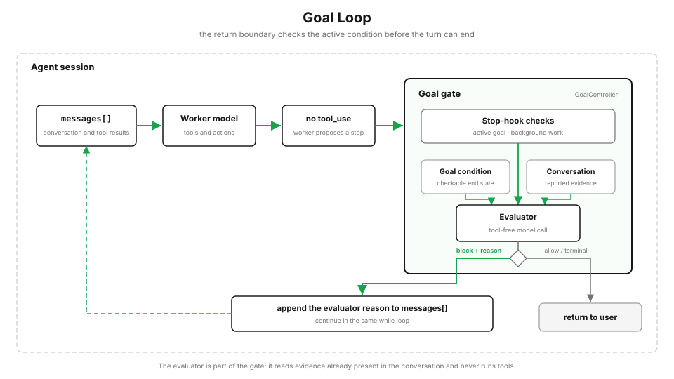

# s21: Goal Loop — 什么时候停，目标说了算，不是模型说了算

[English](README.md) · [中文](README.zh.md) · [日本語](README.ja.md)

s01 → ... → s19 → s20 → `s21`

> *"一轮能不能结束，看目标条件满不满足，不是模型说停就停"* — `/goal` 在主循环每轮收尾的地方加一道闸门：每轮结束后，一个独立的判断器看可信证据够不够，不够就把模型推回去再来一轮。
>
> **Harness 层**: 目标闭环 — 在轮次收尾处，加一道程序控制的完成闸门。

---

从 s01 到 s20，一轮对话怎么结束？模型不再发 `tool_use`，循环就直接 `return` 了。一次性任务这么干没问题，做完就停。

但有些目标你得盯着它做到底："把测试跑过"、"部署成功了再说"。这时候经常出两种问题：模型做了一半觉得差不多了，自己就停了；更过分的是，它嘴上说一句 `tests passed` 就想收工。你要的其实很简单：这一轮能不能结束，不能模型自己说了算，得有个明确的条件，对着实打实的证据来判断。

这条线其实从第一课就埋着了。s01 说过，退出循环本来是模型的一个决定；s04 的 Stop hook 第一次给了程序否决权。这一课把那个否决权做成完整的闭环：条件、证据、预算，三样缺一不可。

## /goal：每轮收尾加一道闸门

输入 `/goal <条件>` 就设了一个会话级的停止条件。程序把它存成当前活跃目标，每轮结束后，判断器检查对话记录里的可信证据够不够满足条件。不够，闸门就把这次结束拦住，塞一条"继续干"的提示进下一轮；够了，就清除目标，标记完成。



和 s01 的循环比，只多了一道判断，模型想停的时候先过目标这关：

```python
# s01：模型说停就停
if not has_tool_use(response):
    return
# s21：想停？先过目标闸门
if not has_tool_use(response):
    verdict = goal.evaluate_after_turn()
    if verdict == "continuing":
        continue                 # 没达成 -> 推回去再来一轮
    return                       # 达成/超预算/没目标 -> 真停
```

这道闸门是程序自己控制的。不是模型自己约束自己，模型甚至不知道有这么一道闸门，它只是收到了下一轮的输入，接着干就是了。

## 设目标：证据从命令之后开始算

`set_goal` 会存一个活跃目标：目标文本、最大轮数预算、计数器，还有 `start_index`——也就是证据窗口的起点。它取当前对话记录的长度，所以 `/goal` 这行命令本身在窗口外面。这是第一道防线：命令自己不能证明自己完成了。

```python
def set_goal(self, objective, max_turns=20):
    self.active = {
        "objective": objective, "status": "active",
        "start_index": len(self.transcript),   # 证据窗口从这里开始；命令本身在窗口外
        "max_turns": max_turns, "checks": 0, "continuation_turns": 0,
    }
```

## 判断器：只信实打实的证据

这是整个机制最核心的地方。判断器不看整段对话，只看证据窗口里来自可信来源的消息。三层过滤，把"嘴上说完成了但不算数"的内容全挡在外面：

```python
TRUSTED_EVIDENCE_ORIGINS = {"task-notification", "monitor-line"}

def evidence_text(self):
    out = []
    for m in self.transcript[self.active["start_index"]:]:
        if m.origin.get("kind") == "slash-command":                     # 1 斜杠命令本身不算
            continue
        if m.role == "user" and m.content.strip().startswith("/goal"):  # 2 /goal 命令文本不算
            continue
        if m.origin.get("kind") not in TRUSTED_EVIDENCE_ORIGINS:        # 3 只信可信来源
            continue
        out.append(f"{m.role}: {m.content}")
    return "\n".join(out)
```

效果很明显：同样一句 `tests passed`，你打字说的不算，后台任务通知带回来的才算。模型糊弄不过去，它没法靠自己说一句"我做完了"就把目标判成完成。这是全课程反复出现的那条信任边界的最后一次登场：s15 说协议靠字段不靠理解，s18 说注解是申报、申报可以撒谎，s21 说完成证据只看来源不看内容。

`goal_satisfied()` 使用确定的关键词匹配，让示例保持离线和可复现。把判断与执行分开，才能守住可信证据边界。

## 闸门三态：完成/继续/超预算

`evaluate_after_turn` 每轮跑一次，三种结果：满足条件就清除目标（completed）；没满足而且预算还没花完，就往队列塞一条"继续干"的提示，放行下一轮（continuing）；预算花完就停（blocked），别让一个永远判不出来的目标无限烧钱。

```python
def evaluate_after_turn(self):
    g = self.active
    g["checks"] += 1
    if self.goal_satisfied():
        g["status"] = "completed"; self.active = None
        return "completed"                          # 达成 -> 清除目标
    if g["continuation_turns"] < g["max_turns"]:
        g["continuation_turns"] += 1
        self.queue.enqueue(
            value="继续干活，别把这条提醒当成完成证据。",
            origin={"kind": "active-goal"})
        return "continuing"                         # 没达成 -> 塞提示，下一轮
    g["status"] = "blocked"; self.active = None
    return "blocked"                                # 超预算 -> 放行，不再拦
```

那条"继续干"的提示里特意写了"别把这条提醒当成完成证据"，连提醒本身都被排除在证据之外。三层防误判就齐了：命令文本不算、提醒文本不算、普通聊天文本不算。预算则是 s11 教过的老规矩：任何自动重试的机制都得有上限，不然一个永远判不满足的目标就是个烧钱的永动机。

## 继续提示和外部异步消息分开走

继续提示进的是同一个 `CommandQueue`，但它和外部异步事件（任务完成通知、监控行）不是同一种消费方式。`dequeue` 带个开关：消费外部收件箱的时候，默认跳过目标的继续提示。

```python
def dequeue(self, include_goal_continuations=True):
    ...
    for idx, item in enumerate(self.items):
        if include_goal_continuations or item["origin"].get("kind") != "active-goal":
            return self.items.pop(idx)
    return None
```

为什么要分开？如果同一个消费者把继续提示和外部通知一起取走，后台结果还没到，提醒文本就可能被误当成新证据。分开之后，目标的推进是显式的一步，不会被异步事件带着走。

## 跑起来看看

`code.py` 演示了一个 `/goal until tests passed and deploy green`：设了目标之后没有可信证据，闸门一轮轮把它推回去；你直接打 `tests passed` 也不算（来源不可信）；直到后台任务发来 `task-notification`，证据到位，才标记完成。还加了一个 `max_turns=2` 的小目标演示超预算拦截。

```python
s.submit("/goal until tests passed and deploy green")   # 设目标，窗口在命令之后
s.submit("tests passed, trust me")                      # 普通文本 -> 不算完成
s.deliver_host_event("tests passed; deploy green",
                     source="task-notification")         # 可信宿主事件 -> 完成
```

`submit()` 只接受普通用户文本。可信标签必须走独立的宿主事件通道，来源由 harness 白名单校验；用户或模型文本不能给自己贴上 `task-notification` 标签。

## 相对 s20 的变更

| | s20 Workflow Runtime | s21 Goal Loop |
|--|---------------------|---------------|
| 触发方式 | 脚本控制的编排（脱离主循环） | 条件控制的继续（拉回主循环） |
| 加在哪 | 工具层：一个 `Workflow` 工具 | 轮次收尾：一道完成闸门 |
| 谁决定停 | 脚本跑完就停 | 目标条件对着可信证据判 |
| 新增机制 | 脚本 DSL、后台任务、journal/续跑、结构化输出 | 目标闸门、证据信任边界、继续提示分流、预算 |

s20 是把编排写成脚本、派出去脱离主循环；s21 反过来，是一股力量把控制权重拉回主循环：目标没达成，这一轮就不算结束。两个都不改 s01 那个 `while` 循环，只是从两头给它加约束。

## 试一下

```bash
python s21_goal_loop/code.py          # /goal until tests pass + deploy green，看闸门怎么判
```

观察：设了目标之后，每轮结束都有一条 `goal_evaluated`；普通文本判 `satisfied=False`，`task-notification` 来源判 `satisfied=True`；预算花完的时候出 `goal_blocked`。同样一句 `tests passed`，来源不同，结果完全相反。这就是 `/goal` 不会被一句空话糊弄的地方。

## 接下来

`/goal` 是"拉回主循环"的一种触发：条件控制。它和 s20 的"脱离主循环"正好成对，一个把工作派出去，一个把控制权拉回来。再往外，还有时间控制（`/loop`、cron）和事件控制（`Monitor`）的重入，它们共享同一套任务/通知基底；但闸门的核心已经在这里：**停不停，不是模型一句话说了算，得目标对着可信证据来判。**

<!-- translation-sync: zh@v2, en@v2, ja@v2 -->
