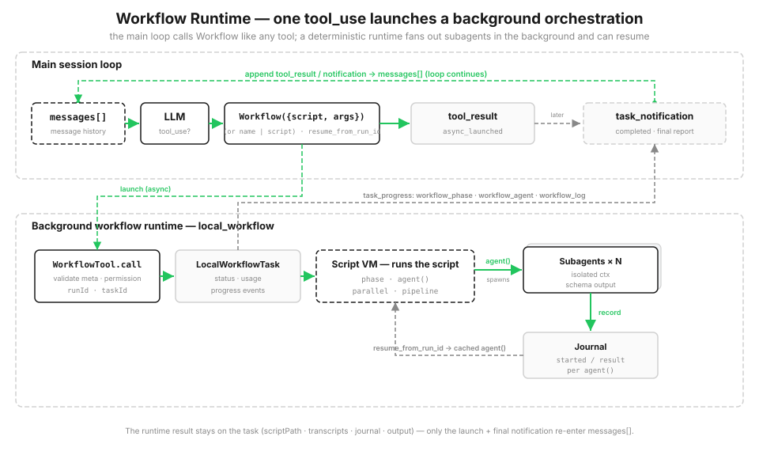

# s21: Workflow Runtime — 模型决定单步，脚本决定编排

[English](README.md) · [中文](README.zh.md) · [日本語](README.ja.md)

s01 → ... → s19 → s20 → `s21` → [s22](../s22_goal_loop/)

> *"一次 tool_use，后台跑完一整套编排"* — `Workflow` 工具启动一个确定、可恢复的脚本运行时，批量派出去一堆子 agent。
>
> **Harness 层**: 编排 — 在单 agent 循环之上，加一层确定的多 agent 脚本运行时。

> **来源边界：** 本章产品细节来自对 Claude Code 2.1.177 的 clean-room 行为重建。后续版本可能更改名称与限制；`code.py` 是离线教学模型，不是产品源码复制。
>
> 教学 CLI 会先发出 `async_launched`，随后在同一进程等待完成，以保证输出可复现。它演示的是生命周期与 journal，不是并发运行的主循环。

---

从 s01 到 s20，我们的循环一直是模型驱动、一步一步来的：每一轮模型挑一个工具，结果塞回 `messages[]`，再来一轮。开放式任务这么干最合适，下一步做什么，让模型看着上下文临场决定就好。

但有些活，你需要的是确定地指挥一群 agent 干活。比如审一个大改动：十个维度并行找问题 → 每条发现各自派一个 agent 做对抗性验证 → 结果汇总去重 → 按严重度排序。这种流程的形状是固定的，你要的其实是三样东西：

- **并行**，别一个一个串着等；
- **确定**，同样的输入跑出来同样的结果结构；
- **可恢复**，跑到一半断了，已经做完的部分别从头再来。

让模型在主循环里一步一步驱动这套流程，又慢、结果又不确定，断了还得从头跑。这时候你要的不是"再聊一轮"，而是把这套编排直接写成代码。

## 计划写在代码里，不是靠聊天一轮轮凑

Claude Code 在工具池里放了一个 `Workflow` 工具。你（或者模型在高强度模式下触发）给它一段脚本，脚本用 `agent() / parallel() / pipeline() / phase()` 这几个简单的原语，把编排写成确定的代码。

主循环这边只看到一次 `tool_use`，立刻拿到"已在后台启动"的返回：真正的执行在后台运行时里推进，实时上报进度，所有过程都写到磁盘的 journal 文件里。脚本里的中间结果存在变量里，不会塞进对话历史占地方。下次用 `resumeFromRunId` 重启时，没改过的 `agent()` 直接命中 journal 缓存，直接用之前的结果，断点续跑。



```python
SAMPLE_META = {"name": "review-changes", "description": "审查代码改动", "phases": ["Review", "Verify"]}

async def sample_workflow(ctx, args):
    ctx.phase("Review")
    results = await ctx.pipeline(DIMENSIONS, audit, verify)   # 每个维度独立走 审计 → 验证
    confirmed = [f for r in results if r for f in r["confirmed"]]
    ctx.log(f"确认了 {len(confirmed)} 个真实问题")
    return {"confirmed": confirmed}
```

## Workflow 工具：后台启动，主循环只看到一次调用

`Workflow`（别名 `RunWorkflow`）就在主 agent 的工具池里。触发可能来自你显式说"跑一下这个 workflow"、一个保存好的 `/命令`，或者模型自动进入高强度路径，这时候模型会发一个 `Workflow(...)` 的工具调用。

工具收到后会解析参数、校验 meta 信息、过权限检查、注册一个本地 workflow 任务，然后立刻返回"已异步启动"。主循环不阻塞，该干嘛干嘛；workflow 自己在后台跑。这其实就是 s13 后台任务那套"凭条模式"的放大版：先给你个取件条，结果好了再通知你。

```python
class WorkflowTool:
    async def call(self, meta, script_fn, args=None, resume_from_run_id=None):
        validate_meta(meta)
        check_permission(meta)
        run_id = resume_from_run_id or create_run_id(meta)
        task = LocalWorkflowTask(create_task_id(run_id), run_id, meta)
        task.event("async_launched", runId=run_id, taskId=task.task_id)   # 立刻返回
        ...                                                                # 剩下的后台慢慢跑
```

> 真实 Claude Code：工具会立刻返回 `{status:'async_launched', taskId, taskType:'local_workflow', runId, summary, transcriptDir, scriptPath}`，后台任务跑完了再通知。

## 脚本和 meta：第一行必须写对

脚本的第一行必须是 `export const meta = { name, description, phases }`，而且必须是纯字面量，不能有变量、函数调用、字符串拼接。运行时在执行任何代码之前先解析它：`name` 和 `description` 用来显示任务和 UI，`phases` 给进度条分组命名。

不对的输入直接抛 `WorkflowInputError`，注册的时候就拦住——这和 s14 校验 cron 表达式是一个思路：坏脚本别让它跑到执行的时候才炸。

教学运行时会把 `meta.name` 用在本地产物文件名中，因此还要求它是 1-64 个字符的安全 slug，只能包含字母、数字、`.`、`_`、`-`。

```python
def validate_meta(meta):
    if not isinstance(meta, dict):
        raise WorkflowInputError("meta 必须是对象字面量")
    if not meta.get("name") or not meta.get("description"):
        raise WorkflowInputError("meta 必须包含 name 和 description")
    if not isinstance(meta["name"], str) or not WORKFLOW_NAME_RE.fullmatch(meta["name"]):
        raise WorkflowInputError("meta.name 必须是 1-64 字符的安全 slug")
    if "phases" in meta and (
        not isinstance(meta["phases"], list)
        or not all(isinstance(p, str) and p for p in meta["phases"])
    ):
        raise WorkflowInputError("meta.phases 必须包含非空字符串")
    return meta
```

> 真实 Claude Code：`parseWorkflowScript` 强制 meta 必须是第一行且是纯字面量；教学版直接收一个 dict，简化了这部分。

## 编排原语：就这几个，够写所有流程

脚本跑在一个独立的上下文里，能用的全局变量就这几个编排原语。脚本本身不直接读写文件、不跑 shell，真正的代码操作都由派出去的子 agent 用它们自己的工具权限完成。这些原语都是 `ExecutionState` 上的方法：

| 原语 | 作用 |
|------|------|
| `agent(prompt, {schema, label, phase})` | 派一个子 agent 干活 |
| `parallel(thunks)` | **等齐屏障**：所有任务并行跑完，一起等结果回来 |
| `pipeline(items, *stages)` | 每个 item 分阶段跑，**不等齐**，跑完一个往下走一个 |
| `phase(title)` | 标记当前进度阶段（更新进度条） |
| `log(message)` | 打一行进度日志 |
| `workflow(name, args)` | 嵌套子工作流（只支持一层） |

`pipeline` 是你默认该用的：每个 item 独立穿过所有 stage，item A 跑到第 3 阶段的时候，item B 可能还在第 1 阶段；只有真的需要"拿到上一阶段所有结果才能往下走"的时候，才用 `parallel` 这个屏障。屏障的代价是等最慢的那个任务，没必要就别立。

```python
async def pipeline(self, items, *stages):
    async def run_item(item, idx):
        value = item
        for stage in stages:                       # 每个 item 独立跑完所有 stage
            value = await stage(value, item, idx)
        return value
    return await asyncio.gather(*[run_item(it, i) for i, it in enumerate(items)])
```

> 真实 Claude Code：同名原语由 VM 注入脚本上下文；还提供 `args`、`budget`（总预算/已花/剩余）、agent 数量上限（最多 1000 个）、并发信号量这些控制。

## 结构化输出：别让子 agent 回来写散文

`agent({schema})` 会强制子 agent 返回一个匹配 schema 的 JSON 对象（内部通过一次结构化输出调用实现），运行时会按 schema 校验结果，不对就重试一次。这样下游代码拿到的是规整的对象，不是需要再解析的一大段散文。

s05 就说过，工具的参数不能全信；这里是同一个道理反过来：子 agent 的输出也不能全信。加一层校验，不对就给一次机会重试，把不确定性挡在编排层外面。

```python
result = self.runner.run(prompt, schema, label)
if schema is not None:
    ok, err = SimpleJsonSchema(schema).validate(result)
    if not ok:                                       # 提醒一次重试，再不对就报错
        result = self.runner.run(prompt + "\n\n返回合法的 JSON。", schema, label)
        ok, err = SimpleJsonSchema(schema).validate(result)
        if not ok:
            raise WorkflowInputError(f"agent({{schema}}) 输出不合法: {err}")
```

> 真实 Claude Code：用 `SimpleJsonSchema` + `StructuredOutput` 工具 + schema 重试机制保证输出格式。

## 后台任务和进度事件

`LocalWorkflowTask` 维护状态和 token 用量，向外发一条 SDK 风格的事件流：`task_started` → 一串 `task_progress`（包含阶段切换、子 agent 启动、日志输出这些批次）→ 最后一个 `task_notification`（完成/失败/停止，带输出文件、token 数、工具调用数、耗时）。

主会话把这些当普通事件处理；只有最终的完成通知会重新进入主循环。

```python
class LocalWorkflowTask:
    def progress_event(self, ptype, **data):         # 阶段/子agent/日志
        self.progress.append({"type": ptype, **data})
        print(f"  进度   {ptype} ...")
```

> 真实 Claude Code：进度会折叠进任务状态，作为 `task_progress.workflow_progress` 发给 UI 和 SDK。

## 存储：快照 + journal，断了能续

跑完会写五样东西，都存在 `~/.claude/projects/<项目>/<会话>/` 目录下：快照 `<runId>.json`、输出 `<runId>.output.json`、journal `<runId>.journal.jsonl`、脚本副本 `scripts/<runId>.js`、子 agent 的对话记录 `subagents/workflows/<runId>/`。你自己保存的常用 workflow 放在 `.claude/workflows/`（项目级）或 `~/.claude/workflows/`（用户级）。

journal 是断点续跑的核心，它一条一条记下来每个 `agent()` 的结果：

```python
class WorkflowJournal:
    def record(self, key, value):
        self._f.write(json.dumps({"key": key, "value": value}) + "\n")
        self._f.flush()
        self.cache[key] = value
```

## resume：用 runId 续跑，没改的直接用缓存

调用 `Workflow({scriptPath, resumeFromRunId, args})` 会重新跑脚本，但每个 `agent()` 会算一个确定的语义 key：key 在 journal 里有记录，就直接返回缓存的结果（不重跑），没改过的全部命中缓存；只有改过的那个以及它后面的步骤才会真的跑。

这里有个关键点：key 不能依赖并发顺序。`parallel` 和 `pipeline` 里 agent 完成的顺序是不确定的，用"第几个完成"当 key，两次跑缓存就对错位了。所以 key 是根据调用内容（类型、标签、prompt、schema）算的稳定哈希，不是一个会竞争的计数器：

```python
def key(self, kind, label, prompt, schema):
    basis = f"{kind}|{label}|{prompt}|{json.dumps(schema, sort_keys=True)}"
    return f"{kind}-{_stable_hash(basis) % 10**10:010d}"

# agent() 内部：
cached = self.journal.cached(key)
if cached is not MISS:
    self.task.progress_event("workflow_agent", label=label, status="cached")
    return cached
```

> 真实 Claude Code：同样是"确定语义 key + journal 缓存"的思路；同会话内续跑时，已经完成的 `agent()` 直接返回缓存，后面的才实跑。

## 确定性：能复现，续跑才有意义

续跑要能工作，脚本首先得可复现。所以运行时会把 `Date.now()`、无参 `new Date()`、`Math.random()` 这些不确定的东西从脚本上下文里去掉，也不给 Node 原生 API。同一份脚本 + 同样的参数 → 同样的 key → 100% 缓存命中。教学版用稳定哈希算 key 达到同样的效果（真实版是把整段 JS 脚本跑在去掉了这些不确定源的沙箱 VM 里）。

## 跑起来看看

示例 workflow `review-changes`：用 `pipeline` 让每个审查维度独立走"审计 → 验证"流程。审计用一个带 schema 的 `agent()` 找问题，验证用 `parallel()` 给每条发现各派一个对抗性验证的子 agent，最后只留确认真实的问题，按严重度排序。

```python
async def sample_workflow(ctx, args):
    ctx.phase("Review")

    async def audit(_v, dimension, _i):
        out = await ctx.agent(f"检查改动的代码里有没有{dimension}相关的问题",
                              schema=FINDINGS_SCHEMA, label=f"audit:{dimension}", phase="Review")
        return {"dimension": dimension, "findings": out["findings"]}

    async def verify(audited, dimension, _i):
        ctx.phase("Verify")
        verdicts = await ctx.parallel([                       # 每条发现独立做对抗性验证
            (lambda f=f: ctx.agent(f"请对抗性验证这个问题是不是真的：{f['title']}",
                                   schema=VERDICT_SCHEMA, label=f"verify:{dimension}:{f['title']}"))
            for f in audited["findings"]])
        return {"dimension": dimension,
                "confirmed": [f for f, v in zip(audited["findings"], verdicts) if v and v["isReal"]]}

    results = await ctx.pipeline(DIMENSIONS, audit, verify)
    ...
```

## 相对 s20 的变更

| | s20 综合体 | s21 Workflow Runtime |
|--|-----------|---------------------|
| 循环 | 单个、模型驱动 | 主循环不变；上面加一层确定的编排 |
| 谁决定下一步 | 模型逐轮决定 | 脚本预先写好编排流程 |
| 多 agent | s06 子 agent，一次性派出去 | 脚本化、可复现、可恢复的批量编排 |
| 新增机制 | — | 脚本 DSL、后台任务、进度事件、journal/续跑、结构化输出、确定性 VM |

s21 不替换主循环，它只是在工具层暴露了 `Workflow`，背后启动一个本地 workflow 运行时：一个 workflow 确定地驱动 N 个 agent 循环。s06 的子 agent 是模型临场派一次；s21 是把编排写成可以重放的脚本。

## 试一下

```bash
python s21_workflow_runtime/code.py          # 启动 review-changes，看事件流
python s21_workflow_runtime/code.py resume   # 用上次的 runId 续跑，每个 agent() 都命中 journal 缓存
```

观察：一次启动 → `async_launched` → 后台阶段切换/子agent进度推进 → `task_notification`；结果存在任务对象上。续跑的时候会显示 `agents=0 tokens=0`（全部命中缓存），结果和上次一字不差。

## 接下来

编排是在 agent 能力之上又加了一层：主循环管单步操作，脚本管整支队伍的流程。把工作写成确定、可恢复的脚本，模型就从"逐轮驱动者"变成了"被脚本调度的执行单元"。同一个 `agent()`，既能在主循环里被模型临场调用，也能在 workflow 里被脚本批量编排。

下一章：[s22 Goal Loop](../s22_goal_loop/) — 编排是把工作扇出去、脱离主循环；下一章反过来，一个目标把控制权重拉回主循环，没达成就不让这一轮结束。

<!-- translation-sync: zh@v2, en@v2, ja@v2 -->
