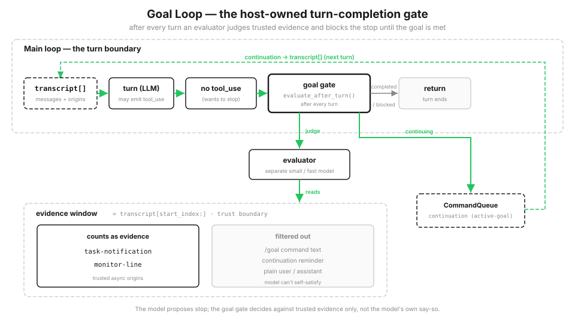

# s22: Goal Loop — The Goal Decides When to Stop, Not the Model

[English](README.md) · [中文](README.zh.md) · [日本語](README.ja.md)

s01 → ... → s20 → s21 → `s22`

> *"A turn ends only when the goal condition is satisfied, not merely when the model says stop"* — `/goal` adds a gate at the end of every main-loop turn. An independent evaluator checks whether trusted evidence is sufficient; if not, it pushes the model into another round.
>
> **Harness layer**: Goal closure — a program-controlled completion gate at the end of each turn.

---

From s01 through s21, how does a conversation turn end? When the model stops emitting `tool_use`, the loop simply executes `return`. That is fine for one-shot work: finish and stop.

Some objectives, however, must be carried through to completion: "get the tests passing" or "do not stop until the deployment succeeds." Two problems appear often. The model does half the work, decides it is close enough, and stops. Worse, it says `tests passed` and tries to declare victory. The requirement is simple: the model cannot decide by itself whether the turn may end. An explicit condition must be evaluated against concrete evidence.

This thread was present from the first chapter. s01 explained that exiting the loop is a model decision. s04's Stop hook gave the program veto power for the first time. This chapter turns that veto into a complete loop with three indispensable parts: condition, evidence, and budget.

## /goal: Add a Gate at the End of Every Turn

Entering `/goal <condition>` sets a session-scoped stopping condition. The program stores it as the active goal. After each turn, an evaluator checks whether trusted evidence in the transcript satisfies the condition. If evidence is insufficient, the gate blocks the attempted stop and queues a "keep working" prompt for the next round. If it is sufficient, the goal is cleared and marked complete.



Compared with the s01 loop, there is only one additional decision: when the model wants to stop, it must first pass the goal gate.

```python
# s01: stop when the model says stop
if not has_tool_use(response):
    return
# s22: want to stop? Pass the goal gate first
if not has_tool_use(response):
    verdict = goal.evaluate_after_turn()
    if verdict == "continuing":
        continue                 # Not achieved -> push back for another round
    return                       # Achieved / over budget / no goal -> really stop
```

The program controls this gate. It is not the model restraining itself. The model does not even know the gate exists; it simply receives another round of input and continues working.

## Setting a Goal: Evidence Starts after the Command

`set_goal` stores an active goal containing the objective text, a maximum-turn budget, counters, and `start_index`, the beginning of the evidence window. It uses the transcript's current length, placing the `/goal` command itself outside the window. This is the first defense: a command cannot prove its own completion.

```python
def set_goal(self, objective, max_turns=20):
    self.active = {
        "objective": objective, "status": "active",
        "start_index": len(self.transcript),   # Evidence starts here; the command is outside the window
        "max_turns": max_turns, "checks": 0, "continuation_turns": 0,
    }
```

## The Evaluator: Trust Concrete Evidence Only

This is the core of the entire mechanism. The evaluator does not inspect the whole conversation. It sees only messages inside the evidence window that come from trusted sources. Three filters keep every form of "I said it was done, so it must be done" outside:

```python
TRUSTED_EVIDENCE_ORIGINS = {"task-notification", "monitor-line"}

def evidence_text(self):
    out = []
    for m in self.transcript[self.active["start_index"]:]:
        if m.origin.get("kind") == "slash-command":                     # 1 Slash commands are not evidence
            continue
        if m.role == "user" and m.content.strip().startswith("/goal"):  # 2 /goal command text is not evidence
            continue
        if m.origin.get("kind") not in TRUSTED_EVIDENCE_ORIGINS:        # 3 Trust only approved origins
            continue
        out.append(f"{m.role}: {m.content}")
    return "\n".join(out)
```

The effect is clear. The same sentence, `tests passed`, does not count when typed by you, but does count when delivered by a background task notification. The model cannot bluff its way out by saying "I finished." This is the final appearance of the trust boundary repeated throughout the course. s16 said protocols rely on fields, not interpretation. s19 said annotations are claims and claims may be false. s22 says completion evidence is trusted by origin, not by content alone.

The minimal `goal_satisfied()` uses deterministic keyword matching so the demo stays offline and reproducible. A production harness can replace this policy with a separate lightweight evaluator model, while keeping the same trusted evidence boundary.

## Three Gate States: Completed, Continuing, or Over Budget

`evaluate_after_turn` runs after every turn and returns one of three results. If the condition is satisfied, it clears the goal as completed. If the condition is not satisfied and budget remains, it queues a "keep working" prompt and permits another round as continuing. If the budget is exhausted, it stops blocking and marks the goal blocked, preventing an impossible goal from burning money forever.

```python
def evaluate_after_turn(self):
    g = self.active
    g["checks"] += 1
    if self.goal_satisfied():
        g["status"] = "completed"; self.active = None
        return "completed"                          # Achieved -> clear the goal
    if g["continuation_turns"] < g["max_turns"]:
        g["continuation_turns"] += 1
        self.queue.enqueue(
            value="Keep working. Do not treat this reminder as completion evidence.",
            origin={"kind": "active-goal"})
        return "continuing"                         # Not achieved -> queue a prompt for the next round
    g["status"] = "blocked"; self.active = None
    return "blocked"                                # Over budget -> release the gate
```

The continuation prompt explicitly says not to treat itself as evidence, and the evidence filter excludes it. That completes the three layers against false positives: the command does not count, the reminder does not count, and ordinary conversation does not count. The budget follows the old rule from s11: every automatic retry mechanism needs a limit. Otherwise, a goal that can never be satisfied becomes a perpetual money-burning machine.

## Keep Continuation Prompts Separate from External Asynchronous Messages

Continuation prompts enter the same `CommandQueue`, but they are not consumed in the same way as external asynchronous events such as task-completion notifications and monitor lines. `dequeue` has a switch, and consumption of the external inbox skips goal continuations by default.

```python
def dequeue(self, include_goal_continuations=True):
    ...
    for idx, item in enumerate(self.items):
        if include_goal_continuations or item["origin"].get("kind") != "active-goal":
            return self.items.pop(idx)
    return None
```

Why separate them? If one consumer drains continuation prompts together with external notifications, a reminder can be mistaken for new evidence before the background result arrives. With the paths separated, goal progression is an explicit step and cannot be carried along accidentally by asynchronous events.

## See It Run

`code.py` demonstrates `/goal until tests passed and deploy green`. With no trusted evidence after goal creation, the gate pushes it back round after round. Typing `tests passed` directly still does not count because the origin is untrusted. Only after a background task sends a `task-notification` does the evidence satisfy the goal. A second small goal with `max_turns=2` demonstrates the over-budget path.

```python
s.submit("/goal until tests passed and deploy green")   # Set the goal; evidence begins after this command
s.submit("tests passed, trust me")                      # Ordinary text -> not completion evidence
s.deliver_host_event("tests passed; deploy green",
                     source="task-notification")         # Trusted host event -> complete
```

`submit()` accepts only ordinary user text. Trusted labels enter through the separate host-event channel, whose source is allowlisted by the harness; user or model text cannot attach its own `task-notification` label.

## Changes from s21

| | s21 Workflow Runtime | s22 Goal Loop |
|--|---------------------|---------------|
| Trigger | Script-controlled orchestration outside the main loop | Condition-controlled continuation pulled back into the main loop |
| Attachment point | Tool layer: one `Workflow` tool | End of turn: a completion gate |
| Who decides when to stop | The script finishes | Goal condition evaluated against trusted evidence |
| New mechanisms | Script DSL, background tasks, journal/resume, structured output | Goal gate, evidence trust boundary, separate continuation path, budget |

s21 sends script-defined orchestration away from the main loop. s22 applies an opposite force that pulls control back: if the goal is not achieved, the turn is not finished. Neither changes the `while` loop from s01; each constrains it from a different side.

## Try It

```bash
python s22_goal_loop/code.py          # /goal until tests pass + deploy green; watch the gate decide
```

After setting a goal, watch every turn produce `goal_evaluated`. Ordinary text yields `satisfied=False`; the same content from a `task-notification` origin yields `satisfied=True`; exhausted budget produces `goal_blocked`. The same `tests passed` sentence has opposite results depending on its origin. That is why an empty claim cannot fool `/goal`.

## Next

`/goal` is one kind of trigger that pulls control back into the main loop: condition control. It pairs naturally with s21's orchestration outside the main loop, one dispatching work outward and the other pulling control inward. Beyond them are time-controlled re-entry through `/loop` and cron, and event-controlled re-entry through `Monitor`; all share the same task and notification foundation. But the essential gate is already here: **the model's words do not decide whether to stop. The goal must judge trusted evidence.**

<!-- translation-sync: zh@v2, en@v2, ja@v2 -->
